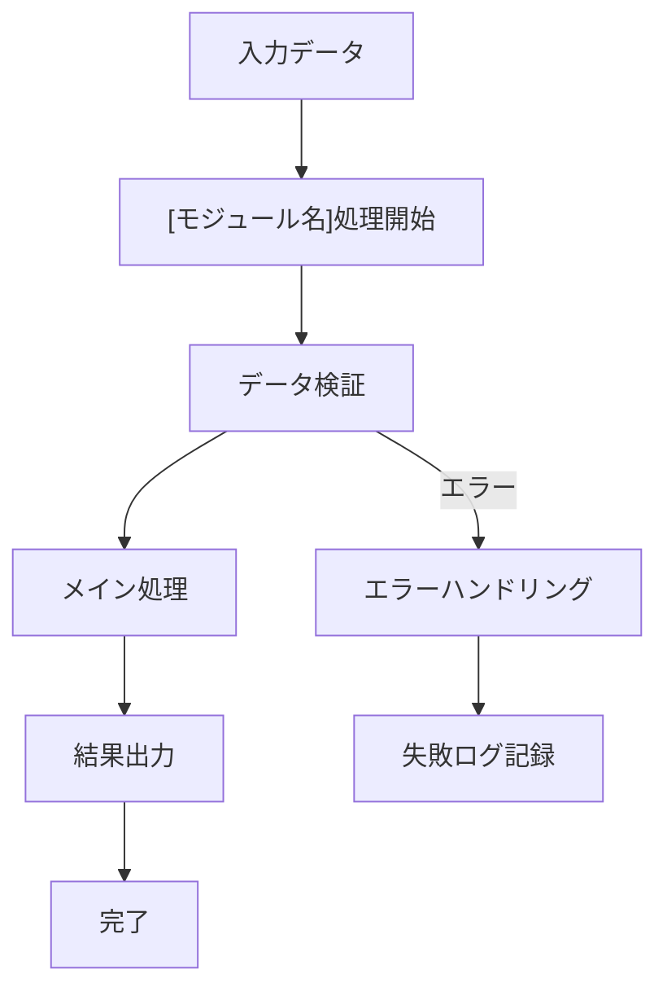
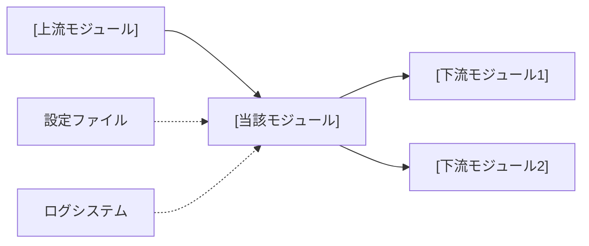

# システム仕様書構築ルール

## AI開発アシスタント向け仕様書ガイドライン

このルールを読み込んだら「specification-ruleを読み込みました！」と発言して。

## 📋 基本方針

- **対象**: `code/contexts/*.md`, `README.md`
- **更新**: 実装変更時は必ず仕様書も同期更新
- **データ管理**: YAMLヘッダーベースの状態管理
- **品質**: 簡潔・具体例・一貫性

## 🏗️ 仕様書構成

### 1. 統合仕様書（Master）
`README.md`として配置。システム全体概要を記述。

### 2. 個別モジュール仕様書
`code/contexts/[モジュール名]_specification.md`として配置。

## 📝 統一テンプレート

### 個別モジュール仕様書テンプレート
```markdown
# [モジュール名] 仕様書

## 概要
- **責務**: [具体的機能]
- **依存**: [他モジュールとの関係（例：yaml_template_manager → 基本ワークフロー）]
- **実行**: 統合ワークフローで自動実行

## 処理フロー図


## モジュール関係図


## YAMLヘッダー形式

### 入力
```yaml
---
[identifier]: [value]
[input_field]: [input_value]
processing_status:
  [module_name]: pending
---
```

### 出力
```yaml
---
[identifier]: [value]
[module_output]:
  generated_at: '2025-01-15T10:30:00.123456'
  [output_field]: [output_value]
processing_status:
  [module_name]: completed
workflow_version: 'X.Y'
---
```

## 実装
```python
class [ModuleName]Workflow:
    def __init__(self, config_manager, logger):
        pass
    
    def process_items(self, input_dir, target_items=None):
        pass
```

## 設定
```yaml
[module_name]:
  enabled: true
  batch_size: [n]
  retry_attempts: 3
```
```
## ⚠️ 重要ルール

### 必須事項
- YAMLヘッダー形式遵守
- processing_status記録必須
- 具体的データ例（抽象的NG）
- テンプレート準拠

### 標準YAMLフィールド
```yaml
---
[identifier]: [必須] プライマリ識別子
processing_status: [必須] 各ステップの状態
  [step1]: completed|pending|failed
  [step2]: completed|pending|failed
last_updated: [自動生成] ISO 8601形式
workflow_version: [自動生成] 'X.Y'
---
```

### データ形式基準
- **日時**: ISO 8601形式
- **複数行**: YAML `|` 記法
- **リスト**: YAML `- item` 記法
- **エンコーディング**: UTF-8

---

**重要**: 実装変更時は仕様書同期更新必須、YAMLヘッダー整合性最優先

