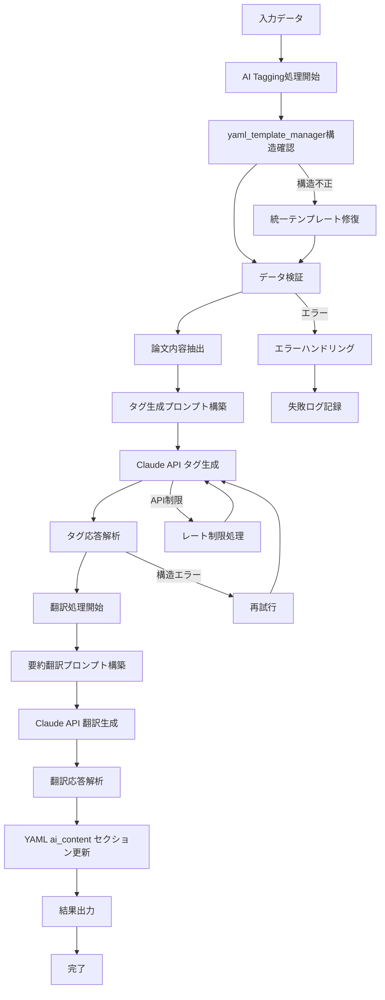
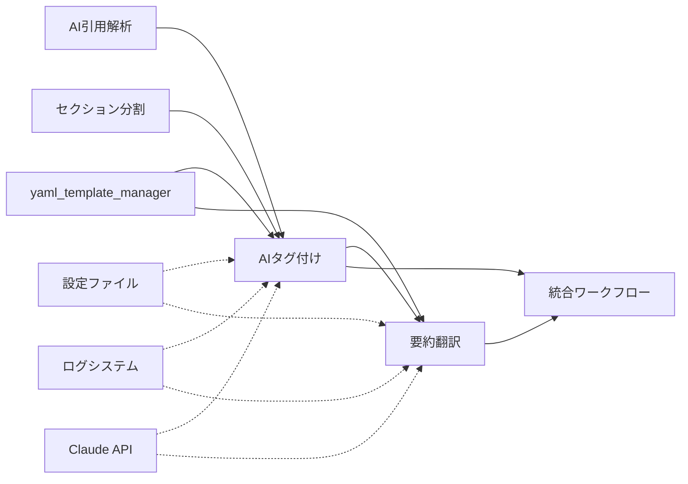

# AI Tagging & Translation機能仕様書

## 概要
- **責務**: Claude 3.5 Haikuを活用した論文の自動タグ生成と要約翻訳機能
- **依存**: yaml_template_manager → ai_citation_support → section_parsing
- **実行**: 統合ワークフローで自動実行

## 処理フロー図


## モジュール関係図


## YAMLヘッダー形式

### 入力（section_parsing処理後）
```yaml
---
# === システムメタデータ ===
citation_key: smith2023test
workflow_version: '3.2'
last_updated: '2025-01-15T10:35:00.123456+00:00'
created_at: '2025-01-15T09:00:00.123456+00:00'

# === 処理状態管理セクション ===
processing_status:
  organize: completed
  sync: completed
  fetch: completed
  ai_citation_support: completed
  section_parsing: completed
  tagger: pending  # ← このモジュールで処理予定
  translate_abstract: pending  # ← このモジュールで処理予定
  ochiai_format: pending
  final_sync: pending

# === Citation Management（前段で設定済み） ===
citation_metadata:
  last_updated: '2025-01-15T10:30:00.123456'
  mapping_version: '2.0'
  source_bibtex: references.bib
  total_citations: 2

citations:
  1:
    citation_key: jones2022biomarkers
    authors: Jones
    title: Advanced Biomarker Techniques in Oncology
    year: 2022
    journal: Nature Medicine
    doi: 10.1038/s41591-022-0456-7

# === Paper Structure（前段で設定済み） ===
paper_structure:
  parsed_at: '2025-01-15T10:35:00.123456'
  total_sections: 5
  sections:
    - title: "Abstract"
      level: 2
      section_type: "abstract"
      start_line: 15
      end_line: 25
      word_count: 250

# === Obsidian互換タグ（最上位必須） ===
tags: []

# === AI Generated Content（このモジュールで処理予定） ===
ai_content:
  abstract_japanese:
    generated_at: null
    content: null
  ochiai_format:
    generated_at: null
    questions:
      what_is_this: null
      what_is_superior: null
      technical_key: null
      validation_method: null
      discussion_points: null
      next_papers: null

execution_summary:
  executed_at: null
  total_execution_time: 0
  steps_executed: []
  steps_summary: {}
  edge_cases: {}

error_history: []
backup_information:
  last_backup_at: null
  backup_location: null
  recovery_available: false
---
```

### 出力（tagger & translate_abstractモジュール処理後）
```yaml
---
# === システムメタデータ ===
citation_key: smith2023test
workflow_version: '3.2'
last_updated: '2025-01-15T11:20:00.123456+00:00'
created_at: '2025-01-15T09:00:00.123456+00:00'

# === 処理状態管理セクション ===
processing_status:
  organize: completed
  sync: completed
  fetch: completed
  ai_citation_support: completed
  section_parsing: completed
  tagger: completed  # ← このモジュールで更新
  translate_abstract: completed  # ← このモジュールで更新
  ochiai_format: pending
  final_sync: pending

# === Citation Management（前段で設定済み、変更なし） ===
citation_metadata:
  last_updated: '2025-01-15T10:30:00.123456'
  mapping_version: '2.0'
  source_bibtex: references.bib
  total_citations: 2

citations:
  1:
    citation_key: jones2022biomarkers
    authors: Jones
    title: Advanced Biomarker Techniques in Oncology
    year: 2022
    journal: Nature Medicine
    doi: 10.1038/s41591-022-0456-7

# === Paper Structure（前段で設定済み、変更なし） ===
paper_structure:
  parsed_at: '2025-01-15T10:35:00.123456'
  total_sections: 5
  sections:
    - title: "Abstract"
      level: 2
      section_type: "abstract"
      start_line: 15
      end_line: 25
      word_count: 250

# === Obsidian互換タグ（最上位、このモジュールで更新） ===
tags:
  - oncology
  - biomarkers
  - cancer_research
  - machine_learning
  - KRT13
  - EGFR
  - immunotherapy
  - clinical_trials
  - rna_seq
  - apoptosis
  - western_blot
  - flow_cytometry
  - breast_cancer
  - prognosis
  - survival_analysis

# === AI Generated Content（このモジュールで更新） ===
ai_content:
  abstract_japanese:
    generated_at: '2025-01-15T11:20:00.123456'
    content: |
      本研究では、がん研究における先進的なバイオマーカー技術について報告する。
      KRT13およびEGFR遺伝子の発現パターンを機械学習アルゴリズムを用いて解析し、
      診断精度の向上を達成した。500例の組織サンプルを用いた後向き研究により、
      従来の免疫組織化学的手法と比較して95%の診断精度を実現した。
  ochiai_format:
    generated_at: null
    questions:
      what_is_this: null
      what_is_superior: null
      technical_key: null
      validation_method: null
      discussion_points: null
      next_papers: null

# === 他セクション（このモジュールでは変更なし） ===
execution_summary:
  executed_at: null
  total_execution_time: 0
  steps_executed: []
  steps_summary: {}
  edge_cases: {}

error_history: []
backup_information:
  last_backup_at: null
  backup_location: null
  recovery_available: false
---
```

## 実装
```python
class TaggerWorkflow:
    def __init__(self, config_manager, logger):
        self.config_manager = config_manager
        self.logger = logger.get_logger('TaggerWorkflow')
        self.claude_client = ClaudeAPIClient(config_manager, logger)
        
    def process_items(self, input_dir, target_items=None):
        """論文の一括タグ生成処理"""
        status_manager = StatusManager(self.config_manager, self.logger)
        papers_needing_processing = status_manager.get_papers_needing_processing(
            input_dir, 'tagger', target_items
        )
        
        for paper_path in papers_needing_processing:
            try:
                tags = self.generate_tags_single(paper_path)
                self.update_yaml_with_tags(paper_path, tags)
                status_manager.update_status(input_dir, paper_path, 'tagger', 'completed')
            except Exception as e:
                self.logger.error(f"Failed to generate tags for {paper_path}: {e}")
                status_manager.update_status(input_dir, paper_path, 'tagger', 'failed')

class TranslateAbstractWorkflow:
    def __init__(self, config_manager, logger):
        self.config_manager = config_manager
        self.logger = logger.get_logger('TranslateAbstractWorkflow')
        self.claude_client = ClaudeAPIClient(config_manager, logger)
        
    def process_items(self, input_dir, target_items=None):
        """論文の一括要約翻訳処理"""
        status_manager = StatusManager(self.config_manager, self.logger)
        papers_needing_processing = status_manager.get_papers_needing_processing(
            input_dir, 'translate_abstract', target_items
        )
        
        for paper_path in papers_needing_processing:
            try:
                translation = self.translate_abstract_single(paper_path)
                self.update_yaml_with_translation(paper_path, translation)
                status_manager.update_status(input_dir, paper_path, 'translate_abstract', 'completed')
            except Exception as e:
                self.logger.error(f"Failed to translate abstract for {paper_path}: {e}")
                status_manager.update_status(input_dir, paper_path, 'translate_abstract', 'failed')
```

## 設定
```yaml
ai_generation:
  default_model: "claude-3-5-haiku-20241022"
  tagger:
    enabled: true
    batch_size: 8
    parallel_processing: true
    tag_count_range: [10, 20]
    retry_attempts: 3
    request_delay: 0.5
    error_handling:
      validate_tag_format: true
      backup_on_generation_failure: true
      fallback_to_manual_tags: false
      rate_limit_handling: true
    backup_strategy:
      backup_before_tag_update: true
      keep_generation_history: true
      preserve_manual_tags: true
  translate_abstract:
    enabled: true
    batch_size: 5
    parallel_processing: true
    retry_attempts: 3
    request_delay: 0.8
    error_handling:
      validate_translation_quality: true
      backup_on_translation_failure: true
      preserve_original_on_error: true
      handle_encoding_errors: true
    backup_strategy:
      backup_before_translation: true
      keep_translation_versions: true
      preserve_original_abstract: true
```

## タグ生成機能

### 論文コンテンツ抽出方式
- **抽出対象**: YAMLヘッダーのpaper_structureプロパティを使用
- **対象セクション**: introduction, results, discussion セクションのみ
- **抽出方法**: paper_structure内のsection_type判定とstart_line/end_line範囲による正確な抽出
- **文字数制限**: なし（全文を使用）
- **前提条件**: section_parsing処理が完了済み

### タグ生成ルール
- **言語**: 英語のみ
- **形式**: スネークケース（例: machine_learning, cancer_research）
- **遺伝子名**: Gene symbol形式（例: KRT13, EGFR, TP53）
- **数量**: 10-20個程度
- **内容**: 論文理解に重要なキーワード

### プロンプト設計
```
以下の学術論文の主要セクション（Introduction, Results, Discussion）から、10-20個のタグを生成してください。

ルール:
- 英語でのタグ生成
- スネークケース形式（例: machine_learning, cancer_research）
- 遺伝子名はgene symbol（例: KRT13, EGFR, TP53）
- 論文理解に重要なキーワードを抽出
- 研究分野、技術、疾患、遺伝子、手法などを含む
- 専門性と一般性のバランスを考慮

論文の主要セクション:
{paper_content}

生成されたタグ（JSON配列形式で返答）:
```

### 実装詳細
```python
def extract_paper_content(self, paper_path: str) -> str:
    """
    paper_structure を使用してintroduction, results, discussionセクションを抽出
    
    Args:
        paper_path: 論文ファイルパス
        
    Returns:
        str: 抽出されたセクションコンテンツ（全文）
    """
    # YAMLヘッダー解析
    processor = YAMLHeaderProcessor(self.config_manager, self.integrated_logger)
    yaml_data, markdown_content = processor.parse_yaml_header(Path(paper_path))
    
    # paper_structure 取得
    paper_structure = yaml_data.get('paper_structure', {})
    sections = paper_structure.get('sections', [])
    
    # 対象セクション（introduction, results, discussion）の抽出
    target_section_types = ['introduction', 'results', 'discussion']
    extracted_sections = []
    
    markdown_lines = markdown_content.split('\n')
    
    for section in sections:
        section_type = section.get('section_type')
        if section_type in target_section_types:
            start_line = section.get('start_line', 0)
            end_line = section.get('end_line', len(markdown_lines))
            
            # セクション内容抽出（行範囲ベース）
            section_content = '\n'.join(markdown_lines[start_line-1:end_line])
            extracted_sections.append(f"## {section.get('title', section_type.title())}\n{section_content}")
    
    return '\n\n'.join(extracted_sections)
```

## 要約翻訳機能

### 翻訳品質要件
- **自然性**: 学術論文として適切な日本語表現
- **正確性**: 専門用語の適切な翻訳
- **一貫性**: 同一論文内での用語統一
- **完全性**: 原文の情報量保持

### プロンプト設計
```
以下の学術論文のabstractを自然で正確な日本語に翻訳してください。

要件:
- 学術論文として適切な日本語表現
- 専門用語の正確な翻訳
- 原文の情報量を保持

Original Abstract:
{abstract_content}
```

## 実装仕様

### ワークフロークラス
各機能は独立したワークフロークラスとして実装されます。

### プロンプト設計

#### タグ生成プロンプト
```
以下の学術論文の主要セクション（Introduction, Results, Discussion）から、10-20個のタグを生成してください。

ルール:
- 英語でのタグ生成
- スネークケース形式（例: machine_learning, cancer_research）
- 遺伝子名はgene symbol（例: KRT13, EGFR, TP53）
- 論文理解に重要なキーワードを抽出
- 研究分野、技術、疾患、遺伝子、手法などを含む
- 専門性と一般性のバランスを考慮

論文の主要セクション:
{paper_content}

生成されたタグ（JSON配列形式で返答）:
```

#### 翻訳プロンプト
```
以下の学術論文のabstractを自然で正確な日本語に翻訳してください。

要件:
- 学術論文として適切な日本語表現
- 専門用語の正確な翻訳
- 原文の情報量を保持
- 読みやすく理解しやすい文章

Original Abstract:
{abstract_content}
```

## 設定項目

### バッチ処理設定
```yaml
ai_generation:
  default_model: "claude-3-5-haiku-20241022"
  tagger:
    enabled: true
    batch_size: 8                # Haikuの高速処理により最適化
    parallel_processing: true
    tag_count_range: [10, 20]
    retry_attempts: 3
    request_delay: 0.5           # Haikuの高速応答により短縮
  translate_abstract:
    enabled: true
    batch_size: 5                # Haikuの高速処理により最適化
    parallel_processing: true
    retry_attempts: 3
    request_delay: 0.8           # Haikuの高速応答により短縮
```

### API設定
```yaml
claude_api:
  model: "claude-3-5-haiku-20241022"
  api_key: "your-api-key"
  timeout: 30
  max_retries: 3
```

## エラーハンドリング

### API エラー対応
- **レート制限**: 自動ウェイト・リトライ
- **ネットワークエラー**: 指数バックオフリトライ
- **認証エラー**: エラーログ記録と処理停止
- **リクエスト制限**: バッチサイズ調整

### データ検証
- **タグ形式チェック**: 命名規則違反の修正
- **翻訳品質チェック**: 極端に短い翻訳の再処理
- **文字エンコーディング**: UTF-8エラーの処理

## 使用例

### 統合ワークフローでの使用（推奨）
```bash
# デフォルト実行（AI機能含む）
PYTHONPATH=code/py uv run python code/py/main.py run-integrated

# AI機能無効化
PYTHONPATH=code/py uv run python code/py/main.py run-integrated --disable-ai-features
```

### 個別実行（デバッグ用）
```bash
# タグ生成のみ
PYTHONPATH=code/py uv run python code/py/main.py tagger

# 翻訳のみ
PYTHONPATH=code/py uv run python code/py/main.py translate-abstract
```

## 品質保証

### 自動検証項目
- タグ数の適切性（10-20個）
- タグ形式の正確性（スネークケース）
- 翻訳の完全性（極端な短縮の回避）
- 日本語エンコーディングの正確性

### 手動確認推奨項目
- 専門用語の翻訳正確性
- 学術的表現の適切性
- 論文内容との整合性 