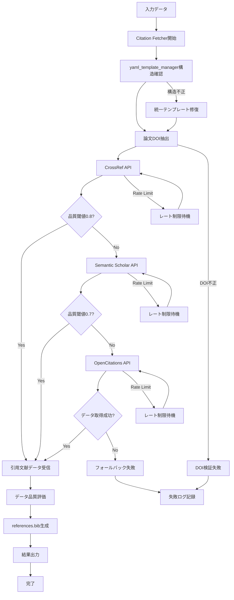
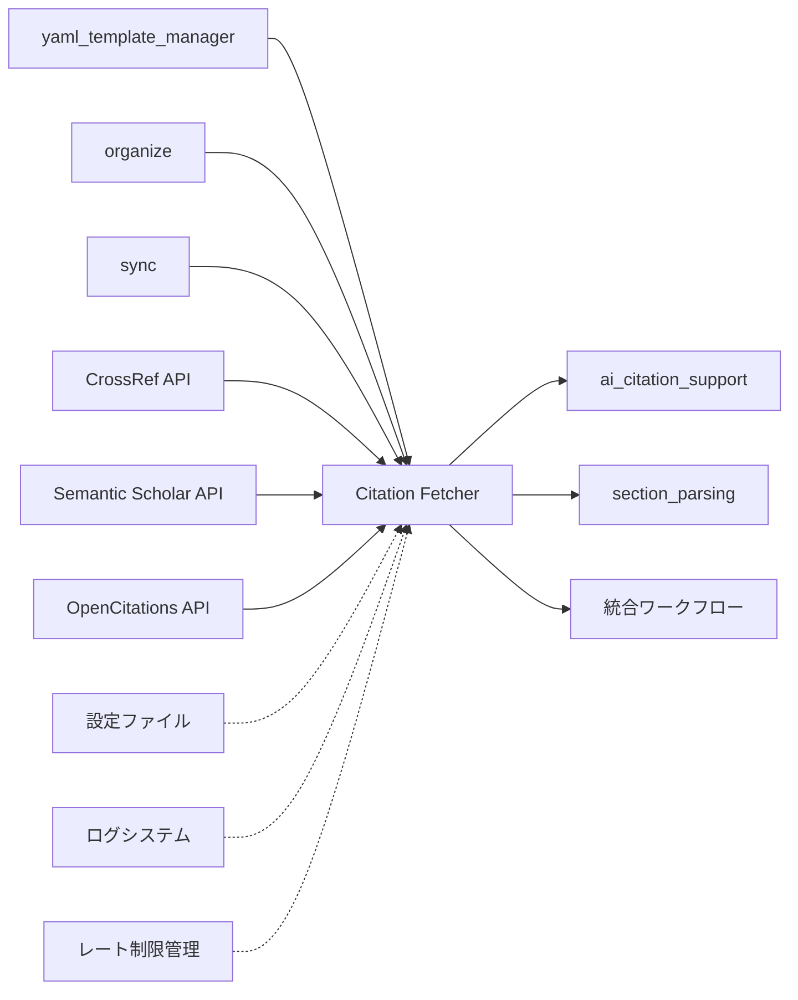

# 引用文献取得システム仕様書

## 概要
- **責務**: 対象論文のDOI情報を基に外部APIから引用文献情報を取得し、各論文サブディレクトリにBibTeX形式で保存
- **依存**: yaml_template_manager → organize → sync → fetch
- **実行**: 統合ワークフローで自動実行
- **コード収納場所**: `code/py/modules/citation_fetcher/`

## 処理フロー図


## モジュール関係図


## YAMLヘッダー形式

### 入力（統一テンプレート準拠）
```yaml
---
# === システムメタデータ ===
citation_key: smith2023test
workflow_version: '3.2'
last_updated: '2025-01-15T09:30:00.123456+00:00'
created_at: '2025-01-15T09:00:00.123456+00:00'

# === 処理状態管理セクション ===
processing_status:
  organize: completed
  sync: completed
  fetch: pending  # ← このモジュールで処理予定
  section_parsing: pending
  ai_citation_support: pending
  tagger: pending
  translate_abstract: pending
  ochiai_format: pending
  final_sync: pending

# === 論文基本情報（organize/syncで設定済み） ===
title: "Advanced Biomarker Techniques in Oncology"
doi: "10.1038/s41591-023-1234-5"
source: "https://example.com/paper"
created: 2025-01-15

# === Citation Management（初期状態） ===
citation_metadata:
  last_updated: null
  mapping_version: null
  source_bibtex: null
  total_citations: 0

citations: {}

# === 他セクション（このモジュールでは変更なし） ===
paper_structure:
  parsed_at: null
  total_sections: 0
  sections: []
  section_types_found: []

tags: []

ai_content:
  abstract_japanese:
    generated_at: null
    content: null
  ochiai_format:
    generated_at: null
    questions:
      what_is_this: null
      what_is_superior: null
      technical_key: null
      validation_method: null
      discussion_points: null
      next_papers: null

execution_summary:
  executed_at: null
  total_execution_time: 0
  steps_executed: []
  steps_summary: {}
  edge_cases: {}

error_history: []
backup_information:
  last_backup_at: null
  backup_location: null
  recovery_available: false
---
```

### 出力（fetch処理完了後）
```yaml
---
# === システムメタデータ（更新） ===
citation_key: smith2023test
workflow_version: '3.2'
last_updated: '2025-01-15T10:45:00.123456+00:00'
created_at: '2025-01-15T09:00:00.123456+00:00'

# === 処理状態管理セクション（更新） ===
processing_status:
  organize: completed
  sync: completed
  fetch: completed  # ← 完了に更新
  section_parsing: pending
  ai_citation_support: pending
  tagger: pending
  translate_abstract: pending
  ochiai_format: pending
  final_sync: pending

# === 論文基本情報（変更なし） ===
title: "Advanced Biomarker Techniques in Oncology"
doi: "10.1038/s41591-023-1234-5"
source: "https://example.com/paper"
created: 2025-01-15

# === Citation Management（このモジュールで更新） ===
citation_metadata:
  last_updated: '2025-01-15T10:45:00.123456'
  fetch_completed_at: '2025-01-15T10:45:00.123456'
  primary_api_used: 'crossref'
  fallback_apis_used: []
  total_references_found: 45
  quality_score: 0.92
  references_bib_path: 'smith2023test/references.bib'
  api_statistics:
    crossref_requests: 1
    semantic_scholar_requests: 0
    opencitations_requests: 0
    total_requests: 1
    success_rate: 1.0

# === 他セクション（このモジュールでは変更なし） ===
citations: {}

paper_structure:
  parsed_at: null
  total_sections: 0
  sections: []
  section_types_found: []

tags: []

ai_content:
  abstract_japanese:
    generated_at: null
    content: null
  ochiai_format:
    generated_at: null
    questions:
      what_is_this: null
      what_is_superior: null
      technical_key: null
      validation_method: null
      discussion_points: null
      next_papers: null

execution_summary:
  executed_at: null
  total_execution_time: 0
  steps_executed: []
  steps_summary: {}
  edge_cases: {}

error_history: []
backup_information:
  last_backup_at: null
  backup_location: null
  recovery_available: false
---
```

## 実装
```python
class CitationFetcherWorkflow:
    def __init__(self, config_manager, logger):
        self.config_manager = config_manager
        self.logger = logger.get_logger('CitationFetcherWorkflow')
        
        # API クライアント初期化
        self.crossref_client = CrossRefAPIClient(config_manager, logger)
        self.semantic_scholar_client = SemanticScholarAPIClient(config_manager, logger)
        self.opencitations_client = OpenCitationsAPIClient(config_manager, logger)
        
        # レート制限管理
        self.rate_limiter = RateLimiter(config_manager, logger)
        
        # データ品質評価
        self.quality_evaluator = DataQualityEvaluator(config_manager, logger)
        
        # 統計情報管理
        self.statistics = CitationStatistics()
        
    def process_items(self, input_dir, target_items=None):
        """論文の一括引用文献取得処理"""
        status_manager = StatusManager(self.config_manager, self.logger)
        papers_needing_processing = status_manager.get_papers_needing_processing(
            input_dir, 'fetch', target_items
        )
        
        for paper_path in papers_needing_processing:
            try:
                # DOI抽出
                doi = self.extract_doi_from_paper(paper_path)
                if not doi:
                    self.logger.warning(f"No DOI found for {paper_path}, skipping citation fetch")
                    status_manager.update_status(input_dir, paper_path, 'fetch', 'skipped')
                    continue
                
                # 引用文献取得（フォールバック戦略）
                citation_data = self.fetch_citations_with_fallback(doi)
                
                if citation_data:
                    # references.bib生成
                    references_bib_path = self.generate_references_bib(paper_path, citation_data)
                    
                    # YAMLヘッダー更新
                    self.update_yaml_with_fetch_results(paper_path, citation_data, references_bib_path)
                    
                    status_manager.update_status(input_dir, paper_path, 'fetch', 'completed')
                else:
                    self.logger.error(f"Failed to fetch citations for {paper_path}")
                    status_manager.update_status(input_dir, paper_path, 'fetch', 'failed')
                    
            except Exception as e:
                self.logger.error(f"Failed to process citations for {paper_path}: {e}")
                status_manager.update_status(input_dir, paper_path, 'fetch', 'failed')
    
    def fetch_citations_with_fallback(self, doi: str) -> Dict[str, Any]:
        """フォールバック戦略による引用文献取得"""
        apis = [
            ('crossref', self.crossref_client, 0.8, 10),  # (name, client, quality_threshold, rate_limit)
            ('semantic_scholar', self.semantic_scholar_client, 0.7, 1),
            ('opencitations', self.opencitations_client, 0.5, 5)
        ]
        
        for api_name, client, quality_threshold, rate_limit in apis:
            try:
                # レート制限チェック
                self.rate_limiter.wait_if_needed(api_name, rate_limit)
                
                # API呼び出し
                data = client.fetch_citations(doi)
                
                if data:
                    # データ品質評価
                    quality_score = self.quality_evaluator.evaluate(data)
                    
                    if quality_score >= quality_threshold:
                        self.statistics.record_success(api_name, quality_score)
                        self.logger.info(f"Successfully fetched citations from {api_name} (quality: {quality_score:.2f})")
                        return {
                            'data': data,
                            'api_used': api_name,
                            'quality_score': quality_score,
                            'statistics': self.statistics.get_summary()
                        }
                    else:
                        self.logger.warning(f"Low quality data from {api_name} (quality: {quality_score:.2f}), trying fallback")
                        
            except APIError as e:
                self.logger.warning(f"API error from {api_name}: {e}, trying fallback")
                self.statistics.record_failure(api_name, str(e))
            except Exception as e:
                self.logger.error(f"Unexpected error from {api_name}: {e}")
                self.statistics.record_failure(api_name, str(e))
        
        return None
    
    def generate_references_bib(self, paper_path: str, citation_data: Dict[str, Any]) -> str:
        """references.bibファイル生成"""
        from pathlib import Path
        
        paper_dir = Path(paper_path).parent
        references_bib_path = paper_dir / "references.bib"
        
        # BibTeX形式でデータを保存
        bibtex_content = self._convert_to_bibtex(citation_data['data'])
        
        with open(references_bib_path, 'w', encoding='utf-8') as f:
            f.write(bibtex_content)
        
        self.logger.info(f"Generated references.bib: {references_bib_path}")
        return str(references_bib_path)
    
    def update_yaml_with_fetch_results(self, paper_path: str, citation_data: Dict[str, Any], 
                                     references_bib_path: str):
        """YAMLヘッダーにfetch結果を記録"""
        yaml_header, content = self.yaml_processor.parse_yaml_header(paper_path)
        
        # citation_metadataセクション更新
        current_time = datetime.now().isoformat()
        yaml_header['citation_metadata'] = {
            'last_updated': current_time,
            'fetch_completed_at': current_time,
            'primary_api_used': citation_data['api_used'],
            'total_references_found': len(citation_data['data']),
            'quality_score': citation_data['quality_score'],
            'references_bib_path': Path(references_bib_path).name,
            'api_statistics': citation_data['statistics']
        }
        
        # processing_status更新
        yaml_header['processing_status']['fetch'] = 'completed'
        yaml_header['last_updated'] = current_time
        
        # ファイル保存
        self.yaml_processor.save_yaml_header(paper_path, yaml_header, content)


class CrossRefAPIClient:
    def __init__(self, config_manager, logger):
        self.config_manager = config_manager
        self.logger = logger.get_logger('CrossRefAPIClient')
        self.base_url = "https://api.crossref.org"
        
    def fetch_citations(self, doi: str) -> List[Dict[str, Any]]:
        """CrossRef APIから引用文献を取得"""
        pass


class SemanticScholarAPIClient:
    def __init__(self, config_manager, logger):
        self.config_manager = config_manager
        self.logger = logger.get_logger('SemanticScholarAPIClient')
        self.base_url = "https://api.semanticscholar.org"
        self.api_key = os.getenv('SEMANTIC_SCHOLAR_API_KEY')
        
    def fetch_citations(self, doi: str) -> List[Dict[str, Any]]:
        """Semantic Scholar APIから引用文献を取得"""
        pass


class OpenCitationsAPIClient:
    def __init__(self, config_manager, logger):
        self.config_manager = config_manager
        self.logger = logger.get_logger('OpenCitationsAPIClient')
        self.base_url = "https://opencitations.net/index/api/v1"
        
    def fetch_citations(self, doi: str) -> List[Dict[str, Any]]:
        """OpenCitations APIから引用文献を取得"""
        pass


class DataQualityEvaluator:
    def __init__(self, config_manager, logger):
        self.config_manager = config_manager
        self.logger = logger.get_logger('DataQualityEvaluator')
        
    def evaluate(self, citation_data: List[Dict[str, Any]]) -> float:
        """引用文献データの品質スコア計算"""
        if not citation_data:
            return 0.0
        
        total_score = 0.0
        for citation in citation_data:
            score = 0.0
            
            # 必須フィールドの存在チェック（各0.2点）
            required_fields = ['title', 'authors', 'year', 'doi', 'journal']
            for field in required_fields:
                if citation.get(field):
                    score += 0.2
            
            total_score += score
        
        return total_score / len(citation_data)


class RateLimiter:
    def __init__(self, config_manager, logger):
        self.config_manager = config_manager
        self.logger = logger.get_logger('RateLimiter')
        self.last_request_times = {}
        
    def wait_if_needed(self, api_name: str, requests_per_second: int):
        """レート制限に基づく待機制御"""
        current_time = time.time()
        min_interval = 1.0 / requests_per_second
        
        if api_name in self.last_request_times:
            elapsed = current_time - self.last_request_times[api_name]
            if elapsed < min_interval:
                wait_time = min_interval - elapsed
                self.logger.debug(f"Rate limiting: waiting {wait_time:.2f}s for {api_name}")
                time.sleep(wait_time)
        
        self.last_request_times[api_name] = time.time()


class CitationStatistics:
    def __init__(self):
        self.api_requests = {}
        self.success_counts = {}
        self.failure_counts = {}
        self.quality_scores = {}
        
    def record_success(self, api_name: str, quality_score: float):
        """成功記録"""
        self.api_requests[api_name] = self.api_requests.get(api_name, 0) + 1
        self.success_counts[api_name] = self.success_counts.get(api_name, 0) + 1
        
        if api_name not in self.quality_scores:
            self.quality_scores[api_name] = []
        self.quality_scores[api_name].append(quality_score)
        
    def record_failure(self, api_name: str, error_message: str):
        """失敗記録"""
        self.api_requests[api_name] = self.api_requests.get(api_name, 0) + 1
        self.failure_counts[api_name] = self.failure_counts.get(api_name, 0) + 1
        
    def get_summary(self) -> Dict[str, Any]:
        """統計サマリー取得"""
        summary = {}
        for api_name in self.api_requests:
            requests = self.api_requests[api_name]
            successes = self.success_counts.get(api_name, 0)
            failures = self.failure_counts.get(api_name, 0)
            
            summary[f"{api_name}_requests"] = requests
            summary[f"{api_name}_successes"] = successes
            summary[f"{api_name}_failures"] = failures
            summary[f"{api_name}_success_rate"] = successes / requests if requests > 0 else 0.0
            
            if api_name in self.quality_scores and self.quality_scores[api_name]:
                summary[f"{api_name}_avg_quality"] = sum(self.quality_scores[api_name]) / len(self.quality_scores[api_name])
        
        return summary
```

## 設定
```yaml
citation_fetcher:
  enabled: true
  
  # API設定
  apis:
    crossref:
      enabled: true
      base_url: "https://api.crossref.org"
      rate_limit: 10  # requests per second
      quality_threshold: 0.8
      timeout: 30
      retry_attempts: 3
      
    semantic_scholar:
      enabled: true
      base_url: "https://api.semanticscholar.org"
      rate_limit: 1  # requests per second
      quality_threshold: 0.7
      timeout: 30
      retry_attempts: 3
      api_key_env: "SEMANTIC_SCHOLAR_API_KEY"
      
    opencitations:
      enabled: true
      base_url: "https://opencitations.net/index/api/v1"
      rate_limit: 5  # requests per second  
      quality_threshold: 0.5
      timeout: 30
      retry_attempts: 3
  
  # フォールバック設定
  fallback_strategy:
    enabled: true
    stop_on_first_success: true
    quality_threshold_override: false
    
  # データ品質設定
  quality_evaluation:
    enabled: true
    required_fields: ['title', 'authors', 'year']
    preferred_fields: ['doi', 'journal', 'volume', 'pages']
    minimum_quality_score: 0.5
    
  # 出力設定
  output:
    bibtex_format: "standard"
    encoding: "utf-8"
    backup_on_failure: true
    validate_bibtex_syntax: true
    
  # エラーハンドリング
  error_handling:
    continue_on_api_failure: true
    log_failed_dois: true
    retry_failed_papers: false
    max_retry_attempts: 3
```

## フォールバック戦略

### API優先順位
1. **CrossRef API** (第一選択)
   - レート制限: 10 req/sec
   - 品質閾値: 0.8
   - 特徴: 包括的なメタデータ、高い信頼性

2. **Semantic Scholar API** (第二選択)
   - レート制限: 1 req/sec  
   - 品質閾値: 0.7
   - 特徴: 学術論文特化、AI研究分野強い
   - 要件: API Key必要（SEMANTIC_SCHOLAR_API_KEY）

3. **OpenCitations API** (最終フォールバック)
   - レート制限: 5 req/sec
   - 品質閾値: 0.5
   - 特徴: オープンアクセス、基本情報のみ

### 品質スコア計算
```python
def calculate_quality_score(citation_data):
    score = 0.0
    for citation in citation_data:
        # 必須フィールド（各0.2点）
        required_fields = ['title', 'authors', 'year', 'doi', 'journal']
        for field in required_fields:
            if citation.get(field):
                score += 0.2
    
    return score / len(citation_data)
```

### エラーハンドリング

#### API特有例外
```python
class CrossRefError(APIError):
    """CrossRef API特有エラー"""
    pass

class SemanticScholarError(APIError):
    """Semantic Scholar API特有エラー"""
    pass

class OpenCitationsError(APIError):
    """OpenCitations API特有エラー"""
    pass

class DataQualityError(ProcessingError):
    """データ品質エラー"""
    pass
```

#### レート制限処理
- 各API別の制限値管理
- 指数バックオフ戦略
- 制限超過時の自動待機

#### 失敗時対応
1. **API障害**: 次のAPIにフォールバック
2. **品質不足**: 品質閾値未満時は次のAPIを試行
3. **全API失敗**: エラーログ記録、処理スキップ

## 出力仕様

### references.bib形式
```bibtex
@article{smith2023oncology,
  number={1},
  title={Advanced Biomarker Techniques in Oncology},
  author={Smith, John and Doe, Jane},
  journal={Nature Medicine},
  volume={29},
  pages={123--135},
  year={2023},
  publisher={Nature Publishing Group},
  doi={10.1038/s41591-023-1234-5}
}

@article{jones2022biomarkers,
  number={2},
  title={Biomarker Discovery in Cancer Research},
  author={Jones, Alice and Brown, Bob},
  journal={Science},
  volume={375},
  pages={456--468},
  year={2022},
  publisher={American Association for the Advancement of Science},
  doi={10.1126/science.abcd1234}
}
```

**引用文献番号仕様**:
- **number フィールド**: 1から始まる引用文献番号を自動付与
- **順序**: 論文タイトルのアルファベット順で番号を付与
- **形式**: `number={N}` として各BibTeXエントリーの最初に配置
- **連番管理**: 同一references.bib内で重複なし・連続番号を保証

### ディレクトリ構造
```
Clippings/
├── smith2023test/
│   ├── smith2023test.md
│   └── references.bib          # ← このモジュールで生成
├── jones2022biomarkers/
│   ├── jones2022biomarkers.md
│   └── references.bib          # ← このモジュールで生成
```

## パフォーマンス仕様

### 処理時間目標
- **小規模論文** (引用文献 < 50): 5-10秒/論文
- **中規模論文** (引用文献 50-100): 10-20秒/論文  
- **大規模論文** (引用文献 > 100): 20-60秒/論文

### メモリ使用量
- **最大メモリ使用量**: 100MB以下/論文
- **並行処理**: レート制限により順次処理

### 信頼性指標
- **API成功率**: CrossRef 95%以上、Semantic Scholar 90%以上
- **品質スコア**: 平均0.8以上（CrossRef使用時）
- **フォールバック成功率**: 98%以上（全API総合） 