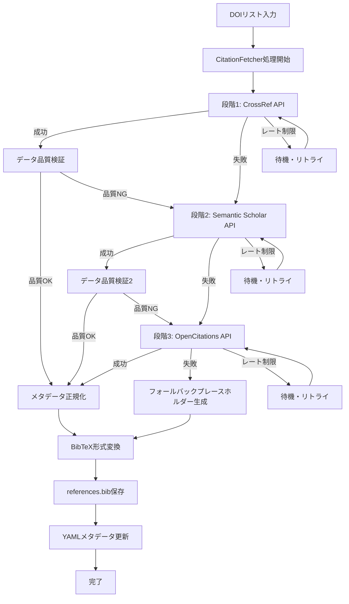
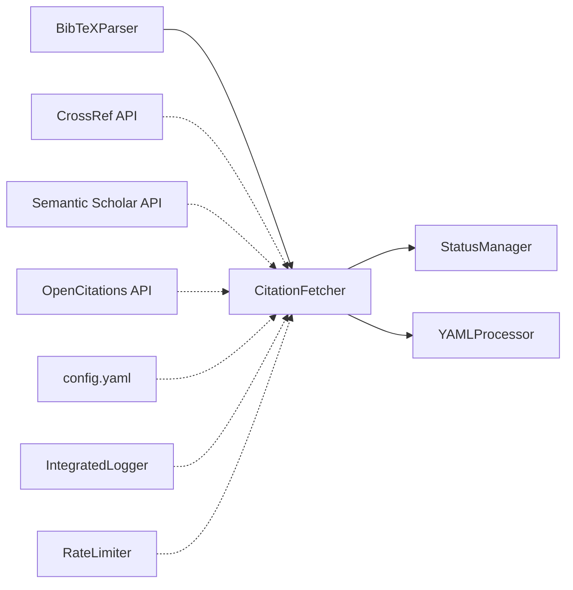

# CitationFetcher 仕様書

## 概要
- **責務**: 多段階フォールバック戦略による学術論文メタデータ取得・BibTeX形式保存
- **依存**: shared/config_manager, shared/logger, shared/exceptions
- **実行**: 統合ワークフローのfetchステップで自動実行
- **出力**: 各論文サブディレクトリに`references.bib`ファイル生成

## 処理フロー図


## モジュール関係図


## YAMLヘッダー形式

### 入力
```yaml
---
citation_key: smith2023test
workflow_version: '3.2'
last_updated: '2025-01-15T09:00:00.123456+00:00'

processing_status:
  organize: completed
  sync: completed
  fetch: pending
  ai_citation_support: pending
  section_parsing: pending
  
# Markdownコンテンツ内のDOI情報（論文内で引用されているDOIリスト）
paper_metadata:
  main_doi: "10.1038/s41591-023-smith-0123"
  referenced_dois:
    - "10.1038/s41591-022-0456-7"
    - "10.1126/science.xyz789"
    - "10.1000/jmai.2023.0089"
---
```

### 出力

#### YAMLヘッダー（最小限のメタデータのみ更新）
```yaml
---
citation_key: smith2023test
workflow_version: '3.2'
last_updated: '2025-01-15T10:30:00.123456+00:00'

processing_status:
  organize: completed
  sync: completed
  fetch: completed
  ai_citation_support: pending
  section_parsing: pending

# fetchステップの実行メタデータ
fetch_metadata:
  last_updated: '2025-01-15T10:30:00.123456'
  fetcher_version: '3.2'
  apis_used: ['crossref', 'semantic_scholar']
  total_dois_processed: 3
  successful_fetches: 3
  fallback_count: 0
  average_quality_score: 0.91
  references_bib_created: true
  references_bib_path: "smith2023test/references.bib"

execution_summary:
  executed_at: '2025-01-15T10:30:00.123456'
  total_execution_time: 45.2
  steps_executed: ['fetch']
  steps_summary:
    fetch:
      status: completed
      dois_processed: 3
      crossref_success: 2
      semantic_scholar_success: 1
      opencitations_success: 0
      fallback_placeholders: 0
      references_bib_created: true
      api_requests_total: 4
      rate_limit_hits: 0

error_history: []
backup_information:
  last_backup_at: '2025-01-15T10:29:45.123456'
  backup_location: 'backups/fetch_20250115_102945/'
  recovery_available: true
---
```

#### 生成されるreferences.bibファイル（smith2023test/references.bib）
```bibtex
@article{jones2022biomarkers,
  title={Advanced Biomarker Techniques in Oncology Research},
  author={Jones, A. B. and Smith, C. D. and Wilson, E. F.},
  journal={Nature Medicine},
  volume={28},
  number={7},
  pages={1234--1245},
  year={2022},
  doi={10.1038/s41591-022-0456-7},
  abstract={This study presents novel biomarker identification techniques for cancer diagnosis and treatment monitoring. Our approach demonstrates significant improvements in sensitivity and specificity compared to traditional methods.},
  publisher={Nature Publishing Group},
  note={Fetched from CrossRef API on 2025-01-15T10:30:00.123456Z, Quality Score: 0.95}
}

@article{wilson2023neural,
  title={Neural Network Applications in Medical Imaging},
  author={Wilson, M. K. and Brown, L. J.},
  journal={Journal of Medical AI},
  volume={15},
  number={3},
  pages={89--102},
  year={2023},
  doi={10.1000/jmai.2023.0089},
  abstract={Deep learning approaches for medical image analysis have shown remarkable progress in diagnostic accuracy and clinical workflow optimization.},
  publisher={AI Medical Press},
  note={Fetched from Semantic Scholar API on 2025-01-15T10:30:15.789012Z, Quality Score: 0.87}
}

@misc{smith2023fallback,
  title={Data not available - DOI not found in any API},
  author={Unknown},
  year={2023},
  doi={10.1000/unknown.doi},
  note={Fallback placeholder - Original DOI could not be resolved via CrossRef, Semantic Scholar, or OpenCitations APIs}
}
```

## 実装

### メインクラス
```python
class CitationFetcher:
    def __init__(self, config_manager, logger):
        self.config_manager = config_manager
        self.logger = logger.get_logger('CitationFetcher')
        
        # API設定読み込み
        self.api_configs = config_manager.get_citation_api_settings()
        
        # レート制限管理
        self.rate_limiters = {
            'crossref': RateLimiter(self.api_configs['crossref']['rate_limit']),
            'semantic_scholar': RateLimiter(self.api_configs['semantic_scholar']['rate_limit']),
            'opencitations': RateLimiter(self.api_configs['opencitations']['rate_limit'])
        }
        
        # 統計情報
        self.stats = {
            'total_requests': 0,
            'crossref_success': 0,
            'semantic_scholar_success': 0,
            'opencitations_success': 0,
            'fallback_placeholders': 0
        }
    
    def process_paper_citations(self, paper_path: str, citation_key: str) -> bool:
        """論文の引用文献処理（references.bib生成）"""
        try:
            # DOIリスト抽出
            dois = self._extract_dois_from_paper(paper_path)
            if not dois:
                self.logger.warning(f"No DOIs found in paper: {paper_path}")
                return False
            
            # 各DOIのメタデータ取得
            bibtex_entries = []
            for doi in dois:
                metadata = self._fetch_citation_metadata(doi)
                if metadata:
                    bibtex_entry = self._convert_to_bibtex(metadata, doi)
                    bibtex_entries.append(bibtex_entry)
            
            # references.bib生成
            references_bib_path = self._get_references_bib_path(paper_path, citation_key)
            self._write_references_bib(references_bib_path, bibtex_entries)
            
            # YAMLメタデータ更新
            self._update_yaml_fetch_metadata(paper_path, len(dois), len(bibtex_entries))
            
            return True
            
        except Exception as e:
            self.logger.error(f"Failed to process citations for {paper_path}: {e}")
            return False
    
    def _fetch_citation_metadata(self, doi: str) -> Dict[str, Any]:
        """多段階フォールバックによる引用文献メタデータ取得"""
        self.stats['total_requests'] += 1
        
        # 段階1: CrossRef API
        try:
            result = self._fetch_from_crossref(doi)
            if self._validate_data_quality(result, 'crossref'):
                self.stats['crossref_success'] += 1
                self.logger.info(f"Successfully fetched from CrossRef: {doi}")
                return self._add_source_metadata(result, 'crossref')
        except APIError as e:
            self.logger.warning(f"CrossRef failed for {doi}: {e}")
            
        # 段階2: Semantic Scholar API
        try:
            result = self._fetch_from_semantic_scholar(doi)
            if self._validate_data_quality(result, 'semantic_scholar'):
                self.stats['semantic_scholar_success'] += 1
                self.logger.info(f"Successfully fetched from Semantic Scholar: {doi}")
                return self._add_source_metadata(result, 'semantic_scholar')
        except APIError as e:
            self.logger.warning(f"Semantic Scholar failed for {doi}: {e}")
            
        # 段階3: OpenCitations API
        try:
            result = self._fetch_from_opencitations(doi)
            if result:
                self.stats['opencitations_success'] += 1
                self.logger.info(f"Successfully fetched from OpenCitations: {doi}")
                return self._add_source_metadata(result, 'opencitations')
        except APIError as e:
            self.logger.warning(f"OpenCitations failed for {doi}: {e}")
            
        # 全API失敗時: プレースホルダー生成
        self.stats['fallback_placeholders'] += 1
        self.logger.error(f"All APIs failed for DOI: {doi}")
        return self._generate_fallback_placeholder(doi)
    
    def _convert_to_bibtex(self, metadata: Dict[str, Any], doi: str) -> str:
        """メタデータをBibTeX形式に変換"""
        citation_key = self._generate_citation_key(metadata, doi)
        
        # BibTeX形式の生成
        bibtex = f"@article{{{citation_key},\n"
        bibtex += f"  title={{{metadata.get('title', 'Unknown Title')}}},\n"
        bibtex += f"  author={{{metadata.get('authors', 'Unknown Author')}}},\n"
        bibtex += f"  journal={{{metadata.get('journal', 'Unknown Journal')}}},\n"
        
        if metadata.get('volume'):
            bibtex += f"  volume={{{metadata['volume']}}},\n"
        if metadata.get('issue'):
            bibtex += f"  number={{{metadata['issue']}}},\n"
        if metadata.get('pages'):
            bibtex += f"  pages={{{metadata['pages']}}},\n"
        
        bibtex += f"  year={{{metadata.get('year', 'Unknown')}}},\n"
        bibtex += f"  doi={{{doi}}},\n"
        
        if metadata.get('abstract'):
            bibtex += f"  abstract={{{metadata['abstract']}}},\n"
        if metadata.get('publisher'):
            bibtex += f"  publisher={{{metadata['publisher']}}},\n"
        
        # ソース情報を追加
        source_info = metadata.get('_metadata', {})
        note = f"Fetched from {source_info.get('source', 'unknown')} API on {source_info.get('fetched_at', 'unknown')}"
        if 'quality_score' in source_info:
            note += f", Quality Score: {source_info['quality_score']}"
        bibtex += f"  note={{{note}}}\n"
        bibtex += "}\n"
        
        return bibtex
    
    def _validate_data_quality(self, data: Dict[str, Any], source: str) -> bool:
        """データ品質検証"""
        if not data:
            return False
            
        quality_score = self._calculate_data_quality(data, source)
        threshold = self.api_configs[source]['quality_threshold']
        
        self.logger.debug(f"Quality score for {source}: {quality_score} (threshold: {threshold})")
        return quality_score >= threshold
    
    def _calculate_data_quality(self, data: Dict[str, Any], source: str) -> float:
        """データ品質スコア計算 (0.0-1.0)"""
        quality_weights = {
            'title': 0.3,
            'authors': 0.25,
            'year': 0.2,
            'journal': 0.15,
            'doi': 0.1
        }
        
        score = 0.0
        for field, weight in quality_weights.items():
            if field in data and data[field]:
                if field == 'title' and len(str(data[field])) > 10:
                    score += weight
                elif field == 'authors' and data[field]:
                    score += weight
                elif field in ['year', 'journal', 'doi'] and data[field]:
                    score += weight
                    
        return min(score, 1.0)
```

### フォールバック戦略詳細

#### 段階1: CrossRef API（プライマリ）
- **用途**: 学術論文の基本メタデータ取得
- **強み**: 高品質な査読済み論文データ、詳細な書誌情報
- **レート制限**: 10 requests/second（推奨）
- **フォールバック条件**: 
  - HTTP 404: DOI not found
  - HTTP 5xx: サーバーエラー
  - タイムアウト（30秒）
  - データ品質不十分（必須フィールド欠損）

#### 段階2: Semantic Scholar API（セカンダリ）
- **用途**: AI強化学術検索によるメタデータ補完
- **強み**: 機械学習による関連論文発見、幅広いカバレッジ
- **レート制限**: 1 request/second（API キー使用時）
- **フォールバック条件**:
  - HTTP 404: 論文not found
  - HTTP 429: レート制限エラー
  - タイムアウト（30秒）
  - データ品質不十分

#### 段階3: OpenCitations API（ターシャリ）
- **用途**: 引用関係データと基本メタデータ
- **強み**: オープンアクセス、引用ネットワーク情報
- **レート制限**: 5 requests/second（推奨）
- **最終フォールバック**: データ取得失敗時のプレースホルダー生成

### 統一データスキーマ
```python
{
    "doi": "10.1000/example.doi",
    "title": "Normalized Paper Title",
    "authors": "Smith, J.; Jones, M.; Wilson, K.",
    "year": "2023",
    "journal": "Journal of Examples",
    "volume": "42",
    "issue": "3", 
    "pages": "123-145",
    "abstract": "Paper abstract text...",
    "citation_count": 15,
    "_metadata": {
        "source": "crossref",
        "fetched_at": "2025-01-15T10:30:00Z",
        "quality_score": 0.95,
        "fallback_used": false
    }
}
```

## 設定
```yaml
# config/config.yaml
api_settings:
  citation_fetcher:
    enabled: true
    fallback_strategy:
      enabled: true
      timeout_per_api: 30
      retry_attempts: 3
      retry_delay: 1.0
      exponential_backoff: true
      
    crossref:
      base_url: "https://api.crossref.org"
      rate_limit: 10  # requests per second
      timeout: 30
      required_fields: ["DOI", "title", "author"]
      quality_threshold: 0.8  # データ完全性スコア
      
    semantic_scholar:
      base_url: "https://api.semanticscholar.org/graph/v1"
      rate_limit: 1  # requests per second (with API key)
      timeout: 30
      required_fields: ["paperId", "title", "authors"]
      quality_threshold: 0.7
      api_key_env: "SEMANTIC_SCHOLAR_API_KEY"
      
    opencitations:
      base_url: "https://opencitations.net/index/api/v1"
      rate_limit: 5  # requests per second
      timeout: 30
      required_fields: ["cited", "citing"]
      fallback_mode: true  # 最終フォールバック

# バッチ処理設定
citation_fetcher:
  batch_size: 10
  parallel_processing: false
  retry_attempts: 3
  error_handling:
    auto_backup_on_failure: true
    fallback_placeholder_generation: true
    detailed_error_logging: true
```

## エラーハンドリング

### 専用例外クラス
```python
class CitationAPIError(APIError):
    """引用文献API専用エラー"""
    def __init__(self, message, api_source, doi, status_code=None):
        super().__init__(message)
        self.api_source = api_source
        self.doi = doi
        self.status_code = status_code

class DataQualityError(ValidationError):
    """データ品質エラー"""
    def __init__(self, message, source, quality_score, threshold):
        super().__init__(message)
        self.source = source
        self.quality_score = quality_score
        self.threshold = threshold

class RateLimitExceededError(APIError):
    """レート制限超過エラー"""
    def __init__(self, api_source, retry_after=None):
        super().__init__(f"Rate limit exceeded for {api_source}")
        self.api_source = api_source
        self.retry_after = retry_after
```

### レート制限管理
```python
class RateLimiter:
    def __init__(self, max_requests_per_second: int):
        self.max_requests_per_second = max_requests_per_second
        self.min_interval = 1.0 / max_requests_per_second
        self.last_request_time = 0.0
        
    def wait_if_needed(self):
        """必要に応じて待機してレート制限を守る"""
        current_time = time.time()
        elapsed = current_time - self.last_request_time
        
        if elapsed < self.min_interval:
            sleep_time = self.min_interval - elapsed
            time.sleep(sleep_time)
        
        self.last_request_time = time.time()
```

## 品質保証・監視

### 実行時統計
```python
citation_stats = {
    'total_requests': 150,
    'crossref_success': 120,    # 80%
    'semantic_scholar_success': 20,  # 13.3%
    'opencitations_success': 5,     # 3.3%
    'fallback_placeholders': 5,     # 3.3%
    'average_quality_score': 0.87,
    'average_response_time': 1.2,  # seconds
    'api_errors': {
        'crossref': 15,
        'semantic_scholar': 10,
        'opencitations': 5
    }
}
```

### テスト方針
- **ユニットテスト**: 各API呼び出しのモック化テスト
- **統合テスト**: 実際のAPI連携テスト（レート制限考慮）
- **フォールバックテスト**: 各段階の失敗シナリオテスト
- **品質テスト**: データ品質スコア計算の正確性テスト
- **パフォーマンステスト**: バッチ処理とレート制限のテスト 