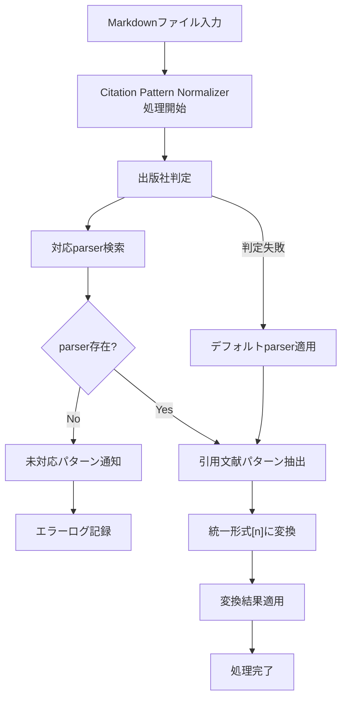
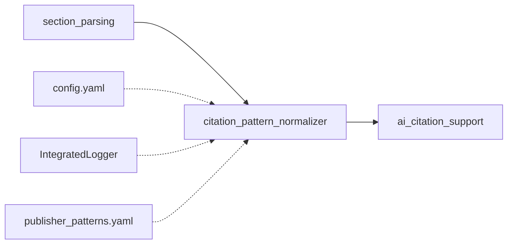

# Citation Pattern Normalizer 仕様書

## 概要
- **責務**: 出版社別の引用文献表記を統一形式[n]に正規化
- **依存**: section_parsing（セクション解析後）、shared_modules（config/logger/utils）
- **実行**: 統合ワークフローで自動実行
- **コード収納場所**: [code/py/modules/citation_pattern_normalizer/]

## 処理フロー図


## モジュール関係図


## YAMLヘッダー形式

### 入力
```yaml
---
citation_key: takenakaW2023J.Radiat.Res.Tokyo
title: "Effects of radiation exposure on cellular mechanisms"
publisher: "Oxford Academic"
doi: "10.1093/jrr/rrz123"
content: |
  Research shows that radiation affects cells¹². Previous studies²,³,⁴ indicate...
processing_status:
  section_parsing: completed
  citation_pattern_normalizer: pending
---
```

### 出力
```yaml
---
citation_key: takenakaW2023J.Radiat.Res.Tokyo
title: "Effects of radiation exposure on cellular mechanisms"
publisher: "Oxford Academic"
doi: "10.1093/jrr/rrz123"
content: |
  Research shows that radiation affects cells[1,2]. Previous studies[2,3,4] indicate...
citation_normalization:
  generated_at: '2025-01-15T10:30:00.123456'
  publisher_detected: "Oxford Academic"
  parser_used: "oxford_academic_parser"
  patterns_normalized: 
    - original: "¹²"
      normalized: "[1,2]"
      position: 45
    - original: "²,³,⁴"
      normalized: "[2,3,4]"
      position: 78
  total_citations_normalized: 2
processing_status:
  citation_pattern_normalizer: completed
workflow_version: 'X.Y'
---
```

## 実装
```python
class CitationPatternNormalizerWorkflow:
    def __init__(self, config_manager, logger):
        self.config = config_manager
        self.logger = logger
        self.publisher_parsers = self._load_publisher_parsers()
    
    def process_items(self, input_dir, target_items=None):
        """引用文献パターン正規化処理"""
        pass
    
    def detect_publisher(self, content, metadata):
        """出版社判定"""
        pass
    
    def normalize_citations(self, content, publisher):
        """引用文献表記統一"""
        pass
    
    def register_new_parser(self, publisher, pattern_config):
        """新parserパターン登録"""
        pass
```

## 設定

### config/config.yaml
```yaml
citation_pattern_normalizer:
  enabled: true
  batch_size: 20
  retry_attempts: 3
  publisher_detection:
    auto_detect: true
    fallback_parser: "generic_parser"
  notification:
    unsupported_pattern_alert: true
    new_parser_suggestion: true
```

### config/publisher_patterns.yaml（新規作成）
```yaml
# 出版社別引用文献パターン定義
parsers:
  oxford_academic:
    detection:
      doi_prefixes: ["10.1093"]
      journal_keywords: ["Oxford", "OUP"]
    patterns:
      - regex: "([¹²³⁴⁵⁶⁷⁸⁹⁰]+)"
        replacement: "[{numbers}]"
        description: "上付き数字単体"
      - regex: "([¹²³⁴⁵⁶⁷⁸⁹⁰]+),([¹²³⁴⁵⁶⁷⁸⁹⁰]+)"
        replacement: "[{numbers}]"
        description: "上付き数字カンマ区切り"
  
  elsevier:
    detection:
      doi_prefixes: ["10.1016"]
      journal_keywords: ["Elsevier"]
    patterns:
      - regex: "\\((\\d+)\\)"
        replacement: "[{number}]"
        description: "括弧付き数字"
      - regex: "\\((\\d+),(\\d+)\\)"
        replacement: "[{numbers}]"
        description: "括弧付きカンマ区切り"
  
  nature:
    detection:
      doi_prefixes: ["10.1038"]
      journal_keywords: ["Nature"]
    patterns:
      - regex: "\\b(\\d+)\\b"
        replacement: "[{number}]"
        description: "単体数字"
  
  generic:
    detection:
      fallback: true
    patterns:
      - regex: "\\b(\\d+)\\b"
        replacement: "[{number}]"
        description: "汎用数字パターン"
```

## Publisher Pattern管理

### 出版社判定ロジック
1. **DOI prefix**: 10.1093（Oxford）、10.1016（Elsevier）等
2. **Journal名**: Nature、Science等の固有名詞
3. **Citation pattern**: 特徴的なパターンから逆引き
4. **Manual override**: YAMLヘッダーでpublisher指定

### 拡張性設計
1. **動的parser追加**: 新publisher_patterns.yamlエントリで対応
2. **パターン学習**: 未対応パターン検出時の候補提案
3. **設定hot-reload**: 実行中のparser設定更新対応
4. **統計記録**: パターン成功率・失敗パターン記録

## エラーハンドリング

### 未対応パターン処理
```yaml
unsupported_citation_patterns:
  - pattern: "ref(1,2)"
    file: "smithJ2024Nature.md"
    publisher: "Nature Publishing"
    suggested_regex: "ref\\((\\d+(?:,\\d+)*)\\)"
    occurrence_count: 3
```

### 通知システム
- **ログレベル**: WARN（未対応パターン検出）
- **アラート**: 新parserパターン追加提案
- **統計**: 正規化成功率レポート