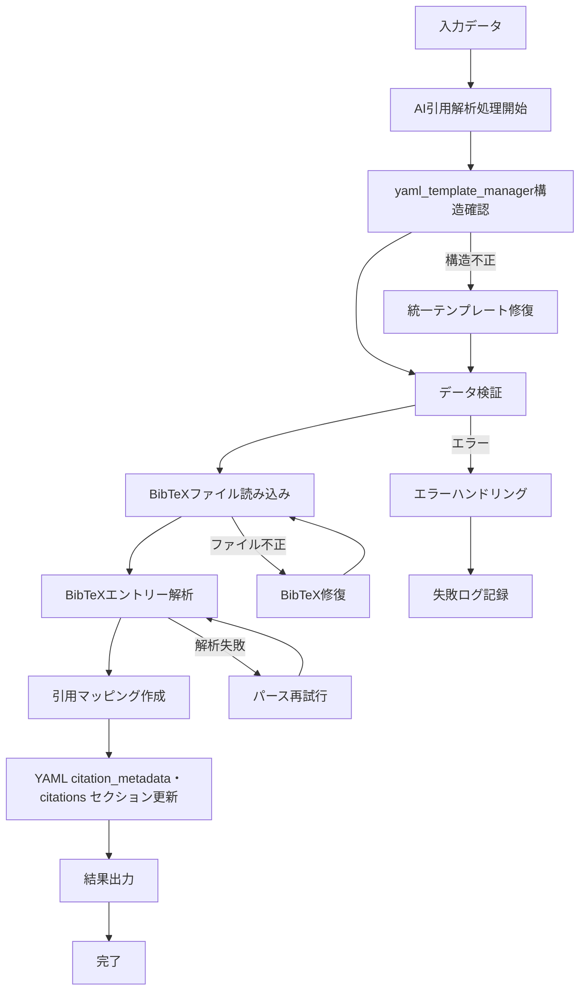
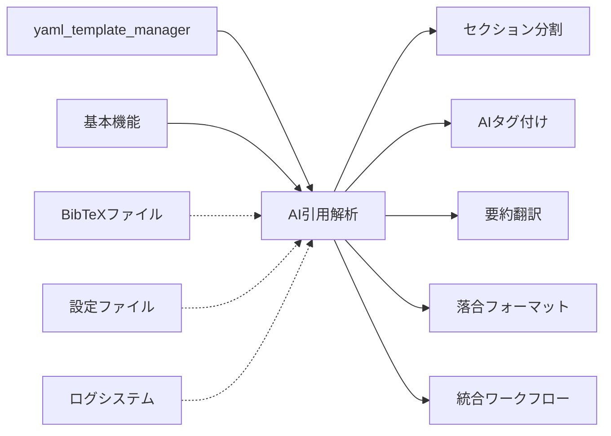

# AI理解支援引用文献パーサー機能仕様書

## 概要
- **責務**: references.bibの内容をYAMLヘッダーに統合しAI理解支援機能を提供
- **依存**: yaml_template_manager → organize → sync → fetch
- **実行**: 統合ワークフローで自動実行

## 処理フロー図


## モジュール関係図


## YAMLヘッダー形式

### 入力（統一テンプレート準拠）
```yaml
---
# === システムメタデータ ===
citation_key: smith2023test
workflow_version: '3.2'
last_updated: '2025-01-15T09:30:00.123456+00:00'
created_at: '2025-01-15T09:00:00.123456+00:00'

# === 処理状態管理セクション ===
processing_status:
  organize: completed
  sync: completed
  fetch: completed
  ai_citation_support: pending
  section_parsing: pending
  tagger: pending
  translate_abstract: pending
  ochiai_format: pending
  final_sync: pending

# === モジュール専用セクション ===
citation_metadata:
  last_updated: null
  mapping_version: null
  source_bibtex: null
  total_citations: 0

citations: {}

# === Obsidian互換タグ（最上位必須） ===
tags: []

paper_structure:
  parsed_at: null
  total_sections: 0
  sections: []
  section_types_found: []

ai_content:
  abstract_japanese:
    generated_at: null
    content: null
  ochiai_format:
    generated_at: null
    questions:
      what_is_this: null
      what_is_superior: null
      technical_key: null
      validation_method: null
      discussion_points: null
      next_papers: null

execution_summary:
  executed_at: null
  total_execution_time: 0
  steps_executed: []
  steps_summary: {}
  edge_cases: {}

error_history: []
backup_information:
  last_backup_at: null
  backup_location: null
  recovery_available: false
---
```

### 出力（ai_citation_supportモジュール処理後）
```yaml
---
# === システムメタデータ ===
citation_key: smith2023test
workflow_version: '3.2'
last_updated: '2025-01-15T10:30:00.123456+00:00'
created_at: '2025-01-15T09:00:00.123456+00:00'

# === 処理状態管理セクション ===
processing_status:
  organize: completed
  sync: completed
  fetch: completed
  ai_citation_support: completed  # ← このモジュールで更新
  section_parsing: pending
  tagger: pending
  translate_abstract: pending
  ochiai_format: pending
  final_sync: pending

# === Citation Management（このモジュールで更新） ===
citation_metadata:
  last_updated: '2025-01-15T10:30:00.123456'
  mapping_version: '2.0'
  source_bibtex: references.bib
  total_citations: 2

citations:
  1:
    citation_key: smith2023test
    authors: Smith
    title: Novel Method for Cancer Cell Analysis
    year: 2023
    journal: Cancer Research
    doi: 10.1158/0008-5472.CAN-23-0123
  2:
    citation_key: jones2022biomarkers
    authors: Jones
    title: Advanced Biomarker Techniques in Oncology
    year: 2022
    journal: Nature Medicine
    doi: 10.1038/s41591-022-0456-7

# === Obsidian互換タグ（最上位必須） ===
tags: []

# === 他セクション（このモジュールでは変更なし） ===
paper_structure:
  parsed_at: null
  total_sections: 0
  sections: []
  section_types_found: []

ai_content:
  abstract_japanese:
    generated_at: null
    content: null
  ochiai_format:
    generated_at: null
    questions:
      what_is_this: null
      what_is_superior: null
      technical_key: null
      validation_method: null
      discussion_points: null
      next_papers: null

execution_summary:
  executed_at: null
  total_execution_time: 0
  steps_executed: []
  steps_summary: {}
  edge_cases: {}

error_history: []
backup_information:
  last_backup_at: null
  backup_location: null
  recovery_available: false
---
```

## 実装
```python
class AICitationSupportWorkflow:
    def __init__(self, config_manager, logger):
        self.config_manager = config_manager
        self.logger = logger.get_logger('AICitationSupportWorkflow')
        self.bibtex_parser = BibTeXParser(logger.get_logger('BibTeXParser'))
        
    def process_items(self, input_dir, target_items=None):
        """論文の一括AI理解支援処理"""
        status_manager = StatusManager(self.config_manager, self.logger)
        papers_needing_processing = status_manager.get_papers_needing_processing(
            input_dir, 'ai_citation_support', target_items
        )
        
        # BibTeXファイルを読み込み
        bibtex_file = self.config_manager.get_bibtex_file()
        bibtex_entries = self.bibtex_parser.parse_file(bibtex_file)
        
        for paper_path in papers_needing_processing:
            try:
                citation_mapping = self.create_citation_mapping(bibtex_entries)
                self.update_yaml_with_citations(paper_path, citation_mapping)
                status_manager.update_status(input_dir, paper_path, 'ai_citation_support', 'completed')
            except Exception as e:
                self.logger.error(f"Failed to add citation support for {paper_path}: {e}")
                status_manager.update_status(input_dir, paper_path, 'ai_citation_support', 'failed')
    
    def create_citation_mapping(self, bibtex_entries):
        """BibTeXエントリーから引用マッピングを作成"""
        citations = {}
        citation_metadata = {
            'last_updated': datetime.now().isoformat(),
            'mapping_version': '2.0',
            'source_bibtex': 'references.bib',
            'total_citations': len(bibtex_entries)
        }
        
        for index, (citation_key, entry) in enumerate(bibtex_entries.items(), 1):
            citations[index] = {
                'citation_key': citation_key,
                'title': entry.get('title', ''),
                'authors': entry.get('author', ''),
                'year': entry.get('year', ''),
                'journal': entry.get('journal', ''),
                'doi': entry.get('doi', '')
            }
            
        return {
            'citation_metadata': citation_metadata,
            'citations': citations
        }
```

## 設定
```yaml
ai_citation_support:
  enabled: true
  mapping_version: "2.0"
  preserve_existing_citations: true
  update_existing_mapping: true
  batch_size: 10
  retry_attempts: 3
  error_handling:
    validate_bibtex_before_processing: true
    backup_on_mapping_failure: true
    retry_on_api_errors: true
    max_retry_attempts: 3
  backup_strategy:
    backup_before_citation_integration: true
    keep_mapping_history: true
    backup_bibtex_source: true
```

## マッピングルール

### シンプルマッピング原則
1. **順序保持**: references.bibのエントリー順序をそのまま維持
2. **重複包含**: 重複エントリーも含めて全て処理（BibTeXファイルの構造保持）
3. **1:1対応**: BibTeXエントリー番号 = 引用番号（1から開始）
4. **プレースホルダーなし**: 存在しないエントリーに対する自動生成なし

### データ一貫性
- `total_citations` = BibTeXファイルのエントリー数
- `citations` の最大キー = `total_citations`
- 欠番なし（1からtotal_citationsまで連続）

## テスト仕様

### マッピング作成テスト
マッピング機能の正確性とデータ一貫性を検証します。

### 重複処理テスト
重複を含むBibTeXファイルでも全エントリーを正確に処理することを確認します。