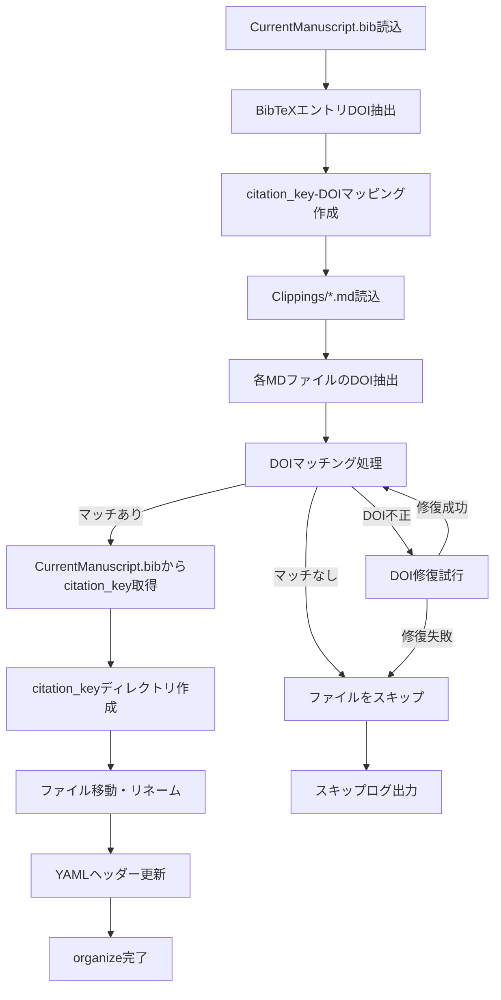
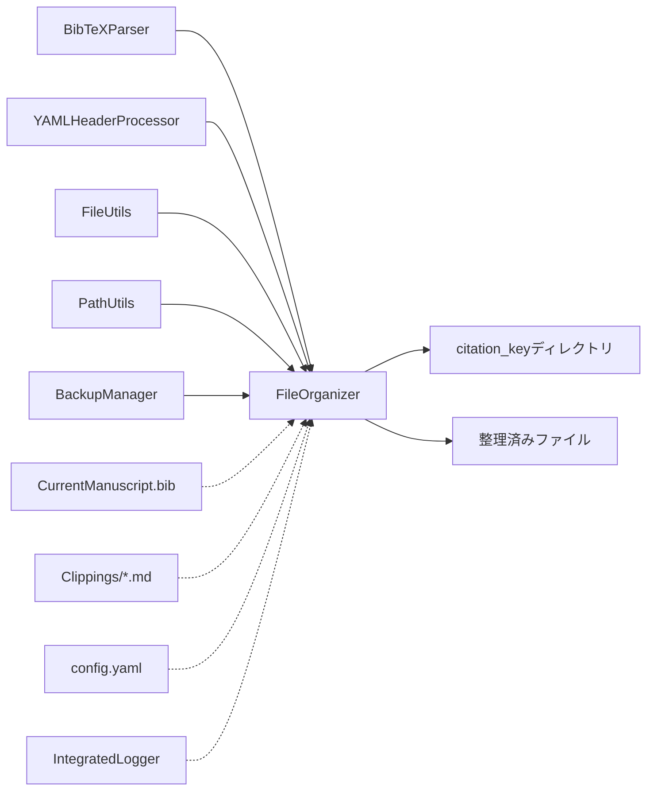

# FileOrganizer（organize機能）仕様書

## 概要
- **責務**: CurrentManuscript.bibとClippings/*.mdのDOIマッチングによるファイル整理
- **依存**: shared_modules/config_manager, shared_modules/logger, shared_modules/exceptions, shared_modules/bibtex_parser
- **実行**: 統合ワークフローのorganizeステップで自動実行
- **出力**: citation_keyベースのディレクトリ構造への整理
- **コード収納場所**: `code/py/modules/file_organizer/`

## 処理フロー図


## モジュール関係図


## DOIベースマッチングシステム

### 1. CurrentManuscript.bibの解析
```python
# BibTeXエントリから全DOI情報を抽出
bibtex_entries = bibtex_parser.parse_file("CurrentManuscript.bib")
doi_mapping = {}
for entry_key, entry_data in bibtex_entries.items():
    if 'doi' in entry_data:
        doi_mapping[entry_data['doi']] = entry_key
```

### 2. Clippings/*.mdファイルの解析
```python
# 各MarkdownファイルのYAMLヘッダーからDOI情報を抽出
for md_file in clippings_files:
    yaml_header, content = yaml_processor.parse_yaml_header(md_file)
    file_doi = yaml_header.get('doi')
    if file_doi:
        markdown_dois[md_file] = file_doi
```

### 3. DOIマッチング処理
```python
# CurrentManuscript.bibのDOIとClippings/*.mdのDOIを照合
matched_papers = []
for md_file, md_doi in markdown_dois.items():
    if md_doi in doi_mapping:
        citation_key = doi_mapping[md_doi]
        matched_papers.append({
            'file_path': md_file,
            'doi': md_doi,
            'citation_key': citation_key
        })
```

### 4. citation_key決定
- マッチした論文については、CurrentManuscript.bibから対応するcitation_keyを取得
- ファイル名やヘッダーからの推測は行わない
- 信頼できるソースとしてCurrentManuscript.bibを使用

## YAMLヘッダー形式

### 入力（処理前）
```yaml
---
title: "KRT13 promotes stemness and drives metastasis in breast cancer"
doi: "10.1186/s13058-022-01502-6"
source: "https://breast-cancer-research.biomedcentral.com/articles/10.1186/s13058-022-01502-6"
created: 2025-06-09
---
```

### 出力（organize処理後）
```yaml
---
title: "KRT13 promotes stemness and drives metastasis in breast cancer"
doi: "10.1186/s13058-022-01502-6"
source: "https://breast-cancer-research.biomedcentral.com/articles/10.1186/s13058-022-01502-6"
created: 2025-06-09
citation_key: "yinL2022BreastCancerRes"  # CurrentManuscript.bibから取得
workflow_version: '3.2'
last_updated: '2025-06-14T13:29:04.960887'
processing_status:
  organize: completed
  sync: pending
  fetch: pending
  section_parsing: pending
  ai_citation_support: pending
  tagger: pending
  translate_abstract: pending
  ochiai_format: pending
  final_sync: pending
---
```

## 処理例

### CurrentManuscript.bib
```bibtex
@article{yinL2022BreastCancerRes,
  title = {{{KRT13}} Promotes Stemness and Drives Metastasis in Breast Cancer through a Plakoglobin/c-{{Myc}} Signaling Pathway},
  author = {Yin, Lijuan and Li, Qinlong and ...},
  year = {2022},
  journal = {Breast Cancer Research},
  doi = {10.1186/s13058-022-01502-6},
  ...
}
```

### Clippings/KRT13 promotes stemness....md
```yaml
---
title: "KRT13 promotes stemness and drives metastasis in breast cancer"
doi: "10.1186/s13058-022-01502-6"  # ← マッチング対象
---
```

### 処理結果
```
DOIマッチング成功: 10.1186/s13058-022-01502-6
citation_key取得: yinL2022BreastCancerRes (CurrentManuscript.bibから)
ディレクトリ作成: Clippings/yinL2022BreastCancerRes/
ファイル移動: Clippings/yinL2022BreastCancerRes/yinL2022BreastCancerRes.md
```

## エッジケース処理

### 1. missing_in_clippings
- **定義**: CurrentManuscript.bibに記載されているがClippingsディレクトリに対応するDOIを持つ.mdファイルが存在しない論文
- **処理方針**: DOI情報表示のみ、処理スキップ
- **ログレベル**: WARNING

### 2. orphaned_in_clippings  
- **定義**: Clippingsディレクトリに存在するがCurrentManuscript.bibに対応するDOIが記載されていない.mdファイル
- **処理方針**: 論文情報表示のみ、処理スキップ
- **ログレベル**: WARNING

### 3. no_doi_in_markdown
- **定義**: ClippingsディレクトリのMarkdownファイルにDOI情報が存在しない
- **処理方針**: ファイル情報表示のみ、処理スキップ
- **ログレベル**: WARNING

### 4. duplicate_doi
- **定義**: 同一DOIを持つ複数のMarkdownファイルが存在
- **処理方針**: 最初のファイルのみ処理、他はスキップ
- **ログレベル**: WARNING

## 実装

### FileOrganizerクラス
```python
class FileOrganizer:
    """
    DOIマッチングベースのファイル整理クラス
    """
    
    def __init__(self, config_manager: ConfigManager, logger: IntegratedLogger):
        self.config_manager = config_manager
        self.logger = logger.get_logger('FileOrganizer')
        self.bibtex_parser = BibTeXParser(logger.get_logger('BibTeXParser'))
        self.yaml_processor = YAMLHeaderProcessor(config_manager, logger)
        
    def organize_workspace(self, workspace_path: str, bibtex_file: str, 
                          clippings_dir: str) -> Dict[str, Any]:
        """
        ワークスペース全体のorganize処理
        
        Args:
            workspace_path: ワークスペースパス
            bibtex_file: CurrentManuscript.bibファイルパス
            clippings_dir: Clippingsディレクトリパス
            
        Returns:
            Dict[str, Any]: 処理結果サマリー
        """
        
    def _create_doi_mapping(self, bibtex_file: str) -> Dict[str, str]:
        """CurrentManuscript.bibからDOI-citation_keyマッピングを作成"""
        
    def _extract_markdown_dois(self, clippings_dir: str) -> Dict[str, str]:
        """Clippings/*.mdからDOI情報を抽出"""
        
    def _match_papers_by_doi(self, doi_mapping: Dict[str, str], 
                            markdown_dois: Dict[str, str]) -> List[Dict]:
        """DOIベースでの論文マッチング"""
        
    def _organize_matched_paper(self, paper_info: Dict) -> bool:
        """マッチした論文の整理処理"""
```

### 主要メソッド

#### organize_workspace()
ワークスペース全体のorganize処理を実行。DOIマッチングから整理完了まで一括処理。

#### _create_doi_mapping()
CurrentManuscript.bibを解析し、DOI → citation_keyのマッピング辞書を作成。

#### _extract_markdown_dois()
Clippings/*.mdファイルを走査し、各ファイルのDOI情報を抽出。

#### _match_papers_by_doi()
DOIマッピングとMarkdownファイルのDOI情報を照合し、処理対象論文リストを生成。

#### _organize_matched_paper()
マッチした個別論文の整理処理（ディレクトリ作成、ファイル移動、YAMLヘッダー更新）。

## 設定システム

### config.yaml設定例
```yaml
workflows:
  organize:
    create_backup: true
    handle_duplicates: true
    update_yaml_header: true
    doi_matching:
      case_sensitive: false
      normalize_doi: true
      fallback_strategies: []
    directory_naming:
      safe_characters_only: true
      max_length: 100
    collision_handling:
      strategy: "timestamp_suffix"
      max_attempts: 10
```

## エラー処理

### 専用例外クラス
```python
class OrganizeError(ProcessingError):
    """organize処理専用例外"""
    pass

class DOIMatchingError(OrganizeError):
    """DOIマッチング処理エラー"""
    pass

class CitationKeyError(OrganizeError):
    """citation_key関連エラー"""
    pass
```

### エラーハンドリング戦略
1. **DOI不正**: 正規化・修復を試行
2. **ファイル衝突**: タイムスタンプ付きリネーム
3. **権限エラー**: 詳細ログ出力とスキップ
4. **YAML破損**: 修復試行、失敗時はスキップ

## テスト仕様

### ユニットテスト
- DOIマッチング機能
- citation_key抽出機能
- ディレクトリ作成機能
- ファイル移動機能
- YAMLヘッダー更新機能
- エッジケース処理

### 統合テスト
- 実際のBibTeXファイルとMarkdownファイルを使用
- エンドツーエンドの整理処理
- エラー回復機能
- バックアップ・復元機能

## パフォーマンス要件

### 処理速度
- 100ファイル以下: 10秒以内
- 1000ファイル以下: 60秒以内
- 大量ファイル: プログレス表示

### メモリ使用量
- DOIマッピング: メモリ効率的な辞書構造
- ファイル処理: ストリーミング処理
- バックアップ: 必要時のみ作成

## 依存関係

### 必須モジュール
- `shared.bibtex_parser`: BibTeX解析
- `shared.yaml_header_processor`: YAMLヘッダー処理
- `shared.file_utils`: ファイル操作
- `shared.path_utils`: パス処理
- `shared.backup_manager`: バックアップ管理

### 設定依存
- `config.yaml`: organize設定
- `workspace_path`: ワークスペースパス
- `bibtex_file`: CurrentManuscript.bibパス
- `clippings_dir`: Clippingsディレクトリパス

## 統合ワークフローとの連携

### 実行タイミング
- 統合ワークフローの最初のステップ
- 他のステップの前提条件

### 状態管理
- 各論文のYAMLヘッダーで`processing_status.organize: completed`を設定
- 後続ステップでの処理対象決定に使用

### エラー時の動作
- organize失敗時は後続ステップをスキップ
- 部分的な成功は許可（一部ファイルのみ処理）
- 詳細なエラーレポート生成 