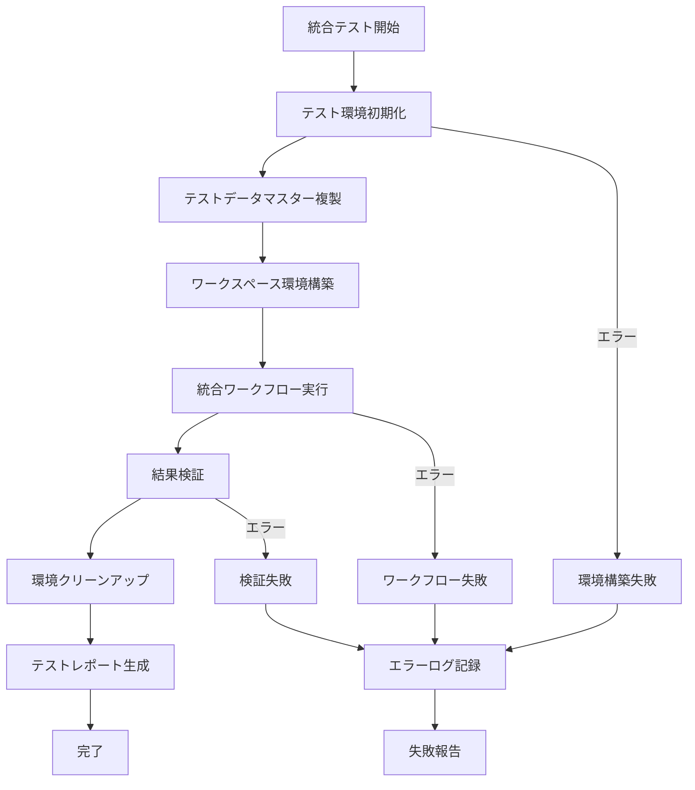
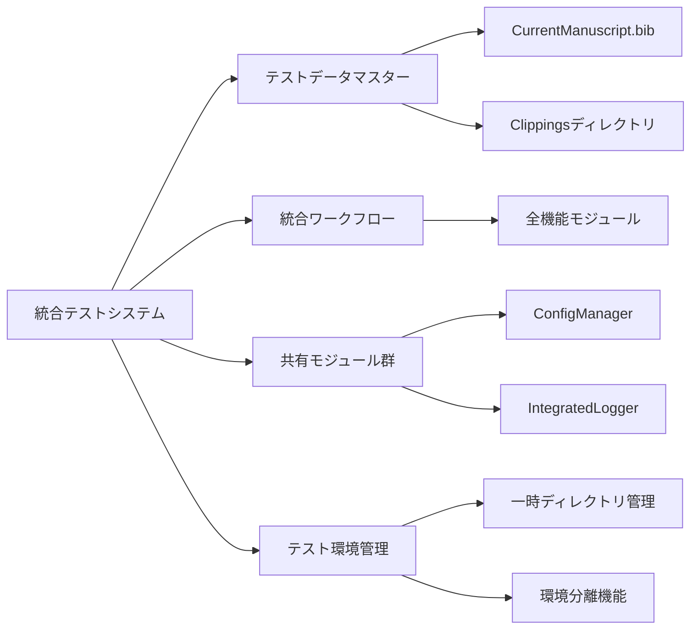

# 統合テストシステム 仕様書

## 概要
- **責務**: エンドツーエンドテスト実行による品質保証・リグレッション防止・実際のワークスペース環境での動作検証
- **依存**: 共有モジュール（ConfigManager, IntegratedLogger）、全機能モジュール、テストデータマスター
- **実行**: TDD開発サイクルの統合テストフェーズで自動実行

## 処理フロー図


## モジュール関係図


## アーキテクチャ設計

### 統合テストシステム構成
```
code/integrated_test/
├── __init__.py
├── integrated_test_runner.py      # メインテストランナー
├── test_environment_manager.py    # テスト環境管理
├── test_data_manager.py           # テストデータ管理
├── workflow_validator.py          # ワークフロー検証
├── result_analyzer.py             # 結果分析
└── reports/                       # テストレポート出力
    ├── test_results.json
    ├── coverage_report.html
    └── performance_metrics.json
```

### Pythonベース実行システム
```
code/scripts/
├── __init__.py
├── run_integrated_test.py          # 統合テスト実行スクリプト
└── test_utils.py                   # テストユーティリティ
```

## YAMLヘッダー形式

### テスト実行前設定
```yaml
---
test_session_id: "integration_test_20250115_103000"
test_type: "full_integration"
test_environment:
  workspace_path: "/tmp/ObsClippingsManager_IntegratedTest_20250115_103000"
  isolated: true
  auto_cleanup: true
test_data_source: "code/test_data_master"
expected_processing_steps:
  - organize
  - sync
  - fetch
  - ai_citation_support
  - ai_tagging_translation
test_config:
  enable_ai_features: true
  dry_run: false
  force_execution: false
---
```

### テスト実行結果
```yaml
---
test_session_id: "integration_test_20250115_103000"
test_execution:
  started_at: '2025-01-15T10:30:00.123456'
  completed_at: '2025-01-15T10:35:45.789012'
  duration_seconds: 345.665556
  status: "passed"
test_results:
  total_items_processed: 3
  successful_items: 3
  failed_items: 0
  processing_status:
    organize: "completed"
    sync: "completed" 
    fetch: "completed"
    ai_citation_support: "completed"
    ai_tagging_translation: "completed"
validation_results:
  yaml_headers_valid: true
  file_structure_correct: true
  citation_data_complete: true
  ai_outputs_generated: true
performance_metrics:
  average_processing_time_per_item: 115.22
  memory_usage_peak_mb: 256.8
  api_calls_made: 12
environment_info:
  python_version: "3.12.0"
  workflow_version: "3.2"
  test_data_version: "master"
---
```

## 実装

### 統合テストランナー
```python
class IntegratedTestRunner:
    def __init__(self, config_manager, logger):
        self.config_manager = config_manager
        self.logger = logger
        self.test_env_manager = TestEnvironmentManager(config_manager, logger)
        self.data_manager = TestDataManager(config_manager, logger)
        self.workflow_validator = WorkflowValidator(config_manager, logger)
        self.result_analyzer = ResultAnalyzer(config_manager, logger)
    
    def run_full_integration_test(self, test_options=None):
        """完全統合テスト実行"""
        pass
    
    def run_regression_test(self, specific_modules=None):
        """リグレッションテスト実行"""
        pass
    
    def run_performance_test(self, benchmark_data=None):
        """パフォーマンステスト実行"""
        pass

class TestEnvironmentManager:
    def __init__(self, config_manager, logger):
        self.config_manager = config_manager
        self.logger = logger
    
    def create_isolated_environment(self, test_session_id):
        """分離されたテスト環境作成"""
        pass
    
    def setup_test_workspace(self, workspace_path, test_data_path):
        """テストワークスペース構築"""
        pass
    
    def cleanup_environment(self, workspace_path, force=False):
        """テスト環境クリーンアップ"""
        pass

class WorkflowValidator:
    def __init__(self, config_manager, logger):
        self.config_manager = config_manager
        self.logger = logger
    
    def validate_processing_results(self, workspace_path):
        """処理結果の妥当性検証"""
        pass
    
    def validate_yaml_headers(self, clippings_dir):
        """YAMLヘッダー形式検証"""
        pass
    
    def validate_file_structure(self, workspace_path):
        """ファイル構造検証"""
        pass
```

### メイン実行スクリプト
```python
# code/scripts/run_integrated_test.py
import click
from pathlib import Path
from code.py.modules.shared.config_manager import ConfigManager
from code.py.modules.shared.logger import IntegratedLogger
from code.integrated_test.integrated_test_runner import IntegratedTestRunner

@click.command()
@click.option('--test-type', default='full', 
              type=click.Choice(['full', 'regression', 'performance']),
              help='統合テストの種類')
@click.option('--reset-environment', is_flag=True,
              help='テスト環境の強制リセット')
@click.option('--keep-environment', is_flag=True,
              help='テスト完了後の環境保持（デバッグ用）')
@click.option('--specific-modules', 
              help='特定モジュールのみテスト（カンマ区切り）')
@click.option('--disable-ai-features', is_flag=True,
              help='AI機能を無効化してテスト実行')
@click.option('--verbose', is_flag=True,
              help='詳細ログ出力')
@click.option('--report-format', default='json',
              type=click.Choice(['json', 'html', 'text']),
              help='テストレポート形式')
def run_integrated_test(test_type, reset_environment, keep_environment,
                       specific_modules, disable_ai_features, verbose, report_format):
    """統合テスト実行コマンド"""
    # 実装内容
    pass

if __name__ == '__main__':
    run_integrated_test()
```

## 設定

### 統合テスト設定（config/config.yaml）
```yaml
integrated_testing:
  enabled: true
  test_environment:
    base_path: "/tmp"
    prefix: "ObsClippingsManager_IntegratedTest"
    auto_cleanup: true
    isolation_level: "full"
  test_data:
    master_path: "code/test_data_master"
    backup_original: true
    validation_enabled: true
  test_execution:
    timeout_seconds: 600
    retry_on_failure: false
    parallel_execution: false
  ai_features:
    test_with_mock_api: true
    api_timeout_seconds: 30
    fallback_mode: true
  performance_monitoring:
    enabled: true
    memory_threshold_mb: 512
    execution_time_threshold_seconds: 300
  reporting:
    detailed_logs: true
    generate_coverage_report: true
    export_metrics: true
    report_formats: ["json", "html"]
```

## テストデータ管理

### テストデータマスター構造
```
code/test_data_master/          # 固定マスターデータ（Git管理）
├── CurrentManuscript.bib       # 4 BibTeXエントリ（意図的不整合含む）
└── Clippings/                  # 3 Markdownファイル
    ├── KRT13 is upregulated in pancreatic cancer stem-like cells and associated with radioresistance.md
    ├── KRT13 promotes stemness and drives metastasis in breast cancer through a plakoglobinc-Myc signaling pathway.md
    └── Keratin Profiling by Single-Cell RNA-Sequencing Identifies Human Prostate Stem Cell Lineage Hierarchy and Cancer Stem-Like Cells.md
```

### テスト実行環境（自動生成）
```
/tmp/ObsClippingsManager_IntegratedTest_{timestamp}/
├── CurrentManuscript.bib       # マスターからコピー
├── Clippings/                  # マスターからコピー
├── backups/                    # 自動生成されるバックアップ
├── logs/                       # テスト実行ログ
└── .test_session_info.yaml     # テストセッション情報
```

## TDD開発サイクル統合

### 開発フロー統合
```bash
# 1. ユニットテスト実行（必須）
uv run code/unittest/run_all_tests.py

# 2. 統合テスト実行（推奨）
uv run python code/scripts/run_integrated_test.py --test-type full

# 3. 特定モジュールの統合テスト
uv run python code/scripts/run_integrated_test.py --test-type regression --specific-modules citation_fetcher,file_organizer

# 4. AI機能無効化テスト（API制限時）
uv run python code/scripts/run_integrated_test.py --disable-ai-features

# 5. デバッグ用テスト（環境保持）
uv run python code/scripts/run_integrated_test.py --keep-environment --verbose
```

### PROGRESS.md連携
- 統合テスト成功時：該当ステップを`[完了]`に更新
- 統合テスト失敗時：該当ステップを`[問題]`に更新、課題記録
- 新機能追加時：統合テストケース追加・実行

## エッジケーステスト設計

### テストケース分類
1. **正常系統合テスト**
   - 完全なワークフロー実行
   - 全機能連携確認
   - パフォーマンス測定

2. **異常系統合テスト**
   - API接続エラーハンドリング
   - ファイルアクセス権限エラー
   - 不正なYAMLヘッダー処理

3. **エッジケーステスト**
   - BibTeX ↔ Clippings不整合処理
   - 大量ファイル処理
   - 特殊文字含有ファイル名

4. **リグレッションテスト**
   - 既存機能への影響確認
   - バージョン間互換性
   - 設定変更の影響範囲

## 実行方法

### 基本実行
```bash
# 完全統合テスト
uv run python code/scripts/run_integrated_test.py

# 環境リセット後実行
uv run python code/scripts/run_integrated_test.py --reset-environment

# 特定モジュールテスト
uv run python code/scripts/run_integrated_test.py --test-type regression --specific-modules ai_features

# デバッグモード
uv run python code/scripts/run_integrated_test.py --verbose --keep-environment
```

### CI/CD統合
```bash
# 自動テスト実行（CI環境）
uv run python code/scripts/run_integrated_test.py --test-type full --report-format json --disable-ai-features

# パフォーマンステスト
uv run python code/scripts/run_integrated_test.py --test-type performance --report-format html
```

## 品質保証機能

### テスト結果検証
- YAMLヘッダー形式準拠確認
- ファイル整理結果検証
- 引用文献データ完整性確認
- AI生成データ品質評価

### パフォーマンス監視
- メモリ使用量追跡
- 実行時間測定
- API呼び出し回数監視
- ディスク使用量確認

### 自動クリーンアップ
- テスト環境の完全削除
- 一時ファイル除去
- ログファイル整理
- メモリリーク防止

---

**重要**: 統合テストはテスト専用の一時ディレクトリで実行し、本番環境への影響を完全に回避します。TDD開発サイクルとの連携により、品質保証と開発効率の両立を実現します。 