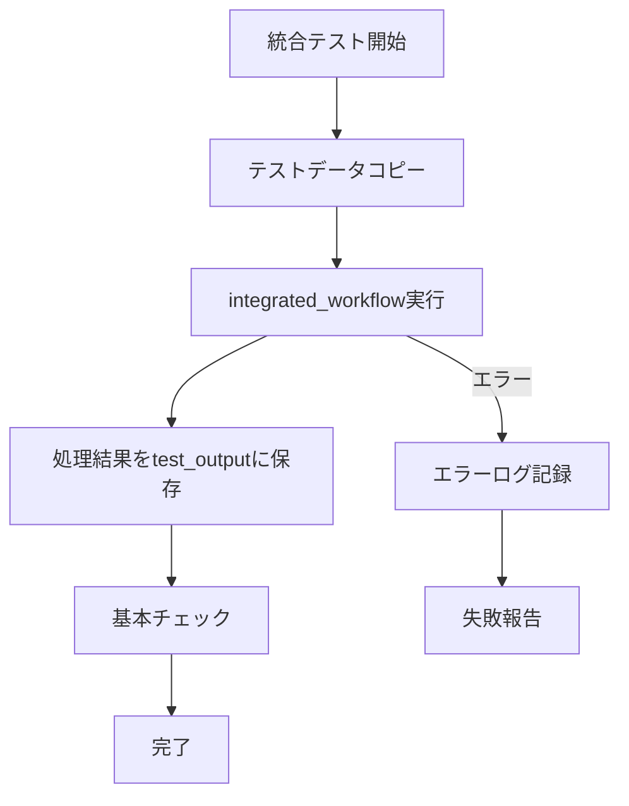

# 統合テストシステム 仕様書

## 概要
- **目的**: 現在実装中のintegrated_workflowをテストデータで実際に実行して動作確認する
- **責務**: テストデータコピー → integrated_workflow実行 → 処理結果確認
- **出力**: test_outputディレクトリに処理前後のデータを保存してユーザーが確認可能

## 処理フロー


## ディレクトリ構造

### 入力：テストデータマスター
```
code/test_data_master/
├── CurrentManuscript.bib          # テスト用BibTeX
└── Clippings/                     # テスト用クリッピング
    ├── paper1.md
    ├── paper2.md  
    └── paper3.md
```

### 出力：テスト結果
```
test_output/
└── latest/                        # 最新のテスト実行結果
    ├── before/                    # 処理前データ（テストデータのコピー）
    │   ├── CurrentManuscript.bib
    │   └── Clippings/
    ├── after/                     # 処理後データ（integrated_workflow実行後）
    │   ├── CurrentManuscript.bib
    │   └── Clippings/
    └── test_result.yaml           # テスト実行結果
```

## 実装

### シンプル統合テストランナー
```python
class SimpleIntegratedTestRunner:
    def __init__(self, config_manager, logger):
        self.config_manager = config_manager
        self.logger = logger.get_logger("integrated_test")
        self.test_data_path = Path("code/test_data_master")
        self.output_path = Path("test_output/latest")
    
    def run_test(self):
        """シンプルな統合テスト実行"""
        try:
            # 1. 出力ディレクトリ準備
            self._prepare_output_directory()
            
            # 2. テストデータコピー（before）
            self._copy_test_data()
            
            # 3. integrated_workflow実行
            result = self._run_integrated_workflow()
            
            # 4. 処理後データ保存（after）
            self._save_after_data()
            
            # 5. 基本チェック
            check_result = self._basic_check()
            
            # 6. 結果保存
            self._save_test_result(result, check_result)
            
            self.logger.info("統合テスト完了")
            return True
            
        except Exception as e:
            self.logger.error(f"統合テスト失敗: {e}")
            self._save_error_result(str(e))
            return False
    
    def _prepare_output_directory(self):
        """出力ディレクトリ準備"""
        if self.output_path.exists():
            shutil.rmtree(self.output_path)
        
        self.output_path.mkdir(parents=True, exist_ok=True)
        (self.output_path / "before").mkdir(exist_ok=True)
        (self.output_path / "after").mkdir(exist_ok=True)
    
    def _copy_test_data(self):
        """テストデータをbeforeディレクトリにコピー"""
        before_path = self.output_path / "before"
        
        # CurrentManuscript.bibをコピー
        bib_source = self.test_data_path / "CurrentManuscript.bib"
        if bib_source.exists():
            shutil.copy2(bib_source, before_path / "CurrentManuscript.bib")
        
        # Clippingsディレクトリをコピー
        clippings_source = self.test_data_path / "Clippings"
        if clippings_source.exists():
            shutil.copytree(clippings_source, before_path / "Clippings")
    
    def _run_integrated_workflow(self):
        """integrated_workflowを実行"""
        workspace_path = self.output_path / "before"
        
        try:
            # IntegratedWorkflowクラスが実装されている場合は、それを使用
            from code.py.modules.workflows.integrated_workflow import IntegratedWorkflow
            
            workflow = IntegratedWorkflow(self.config_manager, self.logger)
            result = workflow.execute(workspace_path)
            
            return {
                'status': 'success',
                'modules_executed': result.get('modules_executed', []),
                'files_processed': result.get('files_processed', 0)
            }
            
        except ImportError:
            # IntegratedWorkflowクラスが未実装の場合は、現在実装済みの機能を順次実行
            modules_executed = []
            files_processed = 0
            
            # 現在実装済みの機能を順次実行
            try:
                # organize機能
                from code.py.modules.workflows.file_organizer import FileOrganizer
                organizer = FileOrganizer(self.config_manager, self.logger)
                clippings_dir = workspace_path / "Clippings"
                
                if clippings_dir.exists():
                    md_files = list(clippings_dir.glob("*.md"))
                    for md_file in md_files:
                        organizer.organize_file(md_file, clippings_dir)
                    modules_executed.append('file_organizer')
                    files_processed = len(md_files)
            except ImportError:
                pass
            
            # 他の実装済み機能があれば順次追加
            # TODO: 新しいモジュールが実装されたら追加
            
            return {
                'status': 'success',
                'modules_executed': modules_executed,
                'files_processed': files_processed
            }
    
    def _save_after_data(self):
        """処理後データをafterディレクトリに保存"""
        before_path = self.output_path / "before"
        after_path = self.output_path / "after"
        
        # beforeディレクトリの内容をafterにコピー（処理後の状態）
        shutil.copytree(before_path, after_path, dirs_exist_ok=True)
    
    def _basic_check(self):
        """基本的なチェックを実行"""
        before_path = self.output_path / "before"
        after_path = self.output_path / "after"
        
        checks = {
            'before_data_exists': before_path.exists(),
            'after_data_exists': after_path.exists(),
            'clippings_processed': False
        }
        
        # Clippingsディレクトリに処理結果があるかチェック
        after_clippings = after_path / "Clippings"
        if after_clippings.exists():
            # サブディレクトリが作成されているかチェック（file_organizerの結果）
            subdirs = [d for d in after_clippings.iterdir() if d.is_dir()]
            checks['clippings_processed'] = len(subdirs) > 0
        
        return checks
    
    def _save_test_result(self, execution_result, check_result):
        """テスト結果を保存"""
        result = {
            'test_execution': {
                'timestamp': datetime.now().isoformat(),
                'status': 'success',
                'execution_result': execution_result,
                'basic_checks': check_result
            }
        }
        
        result_file = self.output_path / "test_result.yaml"
        with open(result_file, 'w', encoding='utf-8') as f:
            yaml.dump(result, f, default_flow_style=False, allow_unicode=True)
    
    def _save_error_result(self, error_msg):
        """エラー結果を保存"""
        result = {
            'test_execution': {
                'timestamp': datetime.now().isoformat(),
                'status': 'failed',
                'error': error_msg
            }
        }
        
        result_file = self.output_path / "test_result.yaml"
        with open(result_file, 'w', encoding='utf-8') as f:
            yaml.dump(result, f, default_flow_style=False, allow_unicode=True)
```

### 実行スクリプト
```python
# code/scripts/run_integrated_test.py

#!/usr/bin/env python3
"""シンプル統合テスト実行スクリプト"""

import sys
from pathlib import Path

# プロジェクトルートをPythonパスに追加
project_root = Path(__file__).parent.parent.parent
sys.path.insert(0, str(project_root))

from code.py.modules.shared.config_manager import ConfigManager
from code.py.modules.shared.integrated_logger import IntegratedLogger
from code.integrated_test.simple_integrated_test_runner import SimpleIntegratedTestRunner

def main():
    """統合テスト実行"""
    try:
        # 設定とログ初期化
        config_manager = ConfigManager()
        logger = IntegratedLogger(config_manager)
        
        # 統合テスト実行
        test_runner = SimpleIntegratedTestRunner(config_manager, logger)
        success = test_runner.run_test()
        
        if success:
            print("✅ 統合テスト成功")
            print("📁 結果確認: test_output/latest/")
            return 0
        else:
            print("❌ 統合テスト失敗") 
            print("📁 エラー詳細: test_output/latest/test_result.yaml")
            return 1
            
    except Exception as e:
        print(f"❌ 統合テスト実行エラー: {e}")
        return 1

if __name__ == "__main__":
    exit(main())
```

## 実行方法

### 基本実行
```bash
# 統合テスト実行
cd /home/user/proj/ObsClippingsManager
uv run python code/scripts/run_integrated_test.py
```

### 結果確認
```bash
# 処理前後の比較
ls -la test_output/latest/before/
ls -la test_output/latest/after/

# テスト結果確認
cat test_output/latest/test_result.yaml

# 処理前後の差分確認
diff -r test_output/latest/before/ test_output/latest/after/
```

## 設定

### 統合テスト設定（config/config.yaml）
```yaml
integrated_testing:
  enabled: true
  test_data_source: "code/test_data_master"
  output_directory: "test_output"
  auto_cleanup: false
```

---

**重要**: このシンプルな統合テストシステムは、テストデータをコピーして現在実装中のintegrated_workflowを実際に実行し、処理結果をtest_outputディレクトリで確認できる最小限の機能を提供します。実装が進むにつれて、_run_integrated_workflow()メソッドを更新していけば、常に最新の機能をテストできます。 