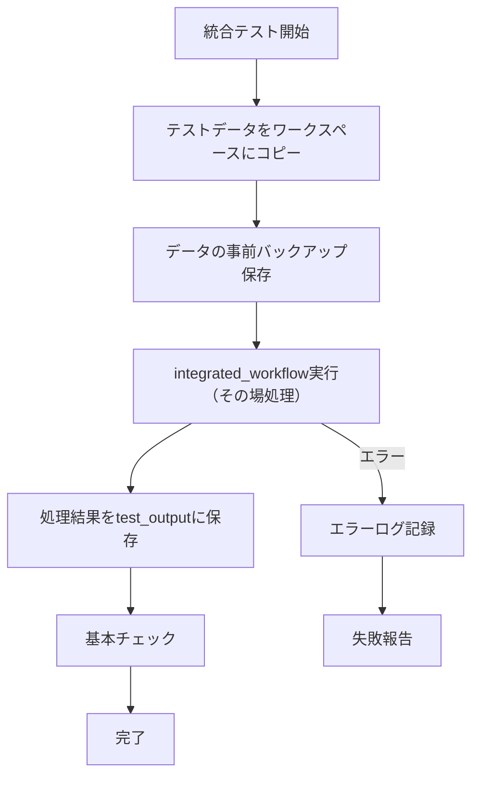

# 統合テストシステム 仕様書

## 概要
- **目的**: 現在実装中のintegrated_workflowをテストデータで実際に実行して動作確認する
- **責務**: テストデータコピー → integrated_workflow実行 → 処理結果確認
- **出力**: test_outputディレクトリに処理前のデータバックアップと処理結果を保存してユーザーが確認可能

## 処理フロー


## AI機能制御オプション（開発用）

### 概要
- **目的**: 開発時のAPI利用料金削減のため、AI機能の個別有効化/無効化を可能にする
- **原則**: デフォルトは全機能実行（本番環境への影響なし）
- **対象**: Claude 3.5 Haiku API使用機能（enhanced-tagger、enhanced-translate、ochiai-format）

### 制御対象AI機能
| 機能 | モジュール | API使用 | 制御可能 |
|------|-----------|---------|----------|
| enhanced-tagger | TaggerWorkflow | Claude 3.5 Haiku | ✅ |
| enhanced-translate | TranslationWorkflow | Claude 3.5 Haiku | ✅ |
| ochiai-format | OchiaiFormatWorkflow | Claude 3.5 Haiku | ✅ |
| organize | FileOrganizer | なし | ❌（常時実行） |
| sync | SyncChecker | なし | ❌（常時実行） |
| fetch | CitationFetcher | なし | ❌（常時実行） |
| section_parsing | SectionParsingWorkflow | なし | ❌（常時実行） |
| ai_citation_support | AICitationSupportWorkflow | なし | ❌（常時実行） |

### コマンドライン引数仕様
```bash
# デフォルト実行（全機能有効）
uv run python code/scripts/run_integrated_test.py

# AI機能全体無効化
uv run python code/scripts/run_integrated_test.py --disable-ai

# 個別AI機能制御
uv run python code/scripts/run_integrated_test.py --disable-tagger
uv run python code/scripts/run_integrated_test.py --disable-translate
uv run python code/scripts/run_integrated_test.py --disable-ochiai

# 複数AI機能制御
uv run python code/scripts/run_integrated_test.py --disable-tagger --disable-translate

# 特定AI機能のみ有効化（他のAI機能は無効）
uv run python code/scripts/run_integrated_test.py --enable-only-tagger
uv run python code/scripts/run_integrated_test.py --enable-only-translate
uv run python code/scripts/run_integrated_test.py --enable-only-ochiai
```

### 実装詳細

#### コマンドライン引数処理
```python
import argparse

def parse_arguments():
    parser = argparse.ArgumentParser(description="統合テスト実行")
    
    # AI機能制御オプション（開発用）
    ai_group = parser.add_argument_group('AI機能制御オプション（開発用）')
    ai_group.add_argument('--disable-ai', action='store_true',
                         help='すべてのAI機能を無効化（API利用料金削減）')
    ai_group.add_argument('--disable-tagger', action='store_true',
                         help='enhanced-tagger機能を無効化')
    ai_group.add_argument('--disable-translate', action='store_true',
                         help='enhanced-translate機能を無効化')
    ai_group.add_argument('--disable-ochiai', action='store_true',
                         help='ochiai-format機能を無効化')
    
    # 特定AI機能のみ有効化オプション
    exclusive_group = ai_group.add_mutually_exclusive_group()
    exclusive_group.add_argument('--enable-only-tagger', action='store_true',
                                help='enhanced-tagger機能のみ有効化')
    exclusive_group.add_argument('--enable-only-translate', action='store_true',
                                help='enhanced-translate機能のみ有効化')
    exclusive_group.add_argument('--enable-only-ochiai', action='store_true',
                                help='ochiai-format機能のみ有効化')
    
    return parser.parse_args()
```

#### AI機能制御ロジック
```python
class AIFeatureController:
    """AI機能の有効/無効制御"""
    
    def __init__(self, args):
        self.args = args
        self._validate_arguments()
    
    def _validate_arguments(self):
        """引数の整合性チェック"""
        # enable-only と disable の同時指定チェック
        enable_only_flags = [self.args.enable_only_tagger, 
                           self.args.enable_only_translate, 
                           self.args.enable_only_ochiai]
        
        if any(enable_only_flags) and (self.args.disable_ai or 
                                      self.args.disable_tagger or 
                                      self.args.disable_translate or 
                                      self.args.disable_ochiai):
            raise ValueError("--enable-only-* と --disable-* オプションは同時指定できません")
    
    def is_tagger_enabled(self) -> bool:
        """enhanced-tagger機能が有効かチェック"""
        if self.args.disable_ai or self.args.disable_tagger:
            return False
        if self.args.enable_only_translate or self.args.enable_only_ochiai:
            return False
        return True  # デフォルト有効
    
    def is_translate_enabled(self) -> bool:
        """enhanced-translate機能が有効かチェック"""
        if self.args.disable_ai or self.args.disable_translate:
            return False
        if self.args.enable_only_tagger or self.args.enable_only_ochiai:
            return False
        return True  # デフォルト有効
    
    def is_ochiai_enabled(self) -> bool:
        """ochiai-format機能が有効かチェック"""
        if self.args.disable_ai or self.args.disable_ochiai:
            return False
        if self.args.enable_only_tagger or self.args.enable_only_translate:
            return False
        return True  # デフォルト有効
    
    def get_summary(self) -> str:
        """現在の設定サマリー"""
        enabled_features = []
        if self.is_tagger_enabled():
            enabled_features.append("enhanced-tagger")
        if self.is_translate_enabled():
            enabled_features.append("enhanced-translate")
        if self.is_ochiai_enabled():
            enabled_features.append("ochiai-format")
        
        if not enabled_features:
            return "AI機能: すべて無効（API利用料金削減モード）"
        elif len(enabled_features) == 3:
            return "AI機能: すべて有効（デフォルト動作）"
        else:
            return f"AI機能: {', '.join(enabled_features)} のみ有効"
```

### 統合ワークフロー連携

#### SimpleIntegratedTestRunner拡張
```python
class SimpleIntegratedTestRunner:
    def __init__(self, config_manager, logger, ai_controller=None):
        self.config_manager = config_manager
        self.logger = logger.get_logger("integrated_test")
        self.ai_controller = ai_controller or AIFeatureController(argparse.Namespace())
        self.test_data_path = Path("code/test_data_master")
        self.output_path = Path("test_output/latest")
    
    def run_test(self):
        """シンプルな統合テスト実行"""
        try:
            # 1. 出力ディレクトリ準備
            self._prepare_output_directory()
            
            # 2. テストデータをワークスペースにコピー
            self._copy_test_data_to_workspace()
            
            # 3. 処理前データをバックアップ
            self._backup_original_data()
            
            # 4. integrated_workflow実行（その場処理）
            result = self._run_integrated_workflow()
            
            # 5. 基本チェック
            check_result = self._basic_check()
            
            # 6. 結果保存
            self._save_test_result(result, check_result)
            
            self.logger.info("統合テスト完了")
            return True
            
        except Exception as e:
            self.logger.error(f"統合テスト失敗: {e}")
            self._save_error_result(str(e))
            return False
    
    def _prepare_output_directory(self):
        """出力ディレクトリ準備"""
        if self.output_path.exists():
            shutil.rmtree(self.output_path)
        
        self.output_path.mkdir(parents=True, exist_ok=True)
        (self.output_path / "workspace").mkdir(exist_ok=True)
        (self.output_path / "backup").mkdir(exist_ok=True)
    
    def _copy_test_data_to_workspace(self):
        """テストデータをワークスペースにコピー"""
        workspace_path = self.output_path / "workspace"
        
        # CurrentManuscript.bibをコピー
        bib_source = self.test_data_path / "CurrentManuscript.bib"
        if bib_source.exists():
            shutil.copy2(bib_source, workspace_path / "CurrentManuscript.bib")
        
        # Clippingsディレクトリをコピー
        clippings_source = self.test_data_path / "Clippings"
        if clippings_source.exists():
            shutil.copytree(clippings_source, workspace_path / "Clippings")
    
    def _backup_original_data(self):
        """処理前データをバックアップ"""
        workspace_path = self.output_path / "workspace"
        backup_path = self.output_path / "backup"
        
        # ワークスペースの内容をバックアップ
        shutil.copytree(workspace_path, backup_path, dirs_exist_ok=True)
    
    def _run_integrated_workflow(self):
        """integrated_workflowを実行（AI機能制御対応）"""
        workspace_path = self.output_path / "workspace"
        
        # AI機能設定をログ出力
        self.logger.info(f"統合テスト実行設定: {self.ai_controller.get_summary()}")
        
        try:
            # IntegratedWorkflowクラスにAI機能制御を渡す
            from code.py.modules.workflows.integrated_workflow import IntegratedWorkflow
            
            workflow = IntegratedWorkflow(
                config_manager=self.config_manager, 
                logger=self.logger,
                ai_feature_controller=self.ai_controller  # AI機能制御を渡す
            )
            result = workflow.execute(workspace_path)
            
            return {
                'status': 'success',
                'modules_executed': result.get('modules_executed', []),
                'files_processed': result.get('files_processed', 0),
                'ai_features_used': result.get('ai_features_used', [])
            }
            
        except ImportError:
            # 現在の実装済み機能での制御対応
            return self._run_current_implementations_with_ai_control()
    
    def _basic_check(self):
        """基本的なチェックを実行"""
        workspace_path = self.output_path / "workspace"
        backup_path = self.output_path / "backup"
        
        checks = {
            'workspace_exists': workspace_path.exists(),
            'backup_exists': backup_path.exists(),
            'clippings_processed': False
        }
        
        # Clippingsディレクトリに処理結果があるかチェック
        workspace_clippings = workspace_path / "Clippings"
        if workspace_clippings.exists():
            # サブディレクトリが作成されているかチェック（file_organizerの結果）
            subdirs = [d for d in workspace_clippings.iterdir() if d.is_dir()]
            checks['clippings_processed'] = len(subdirs) > 0
        
        return checks
    
    def _save_test_result(self, execution_result, check_result):
        """テスト結果を保存"""
        result = {
            'test_execution': {
                'timestamp': datetime.now().isoformat(),
                'status': 'success',
                'execution_result': execution_result,
                'basic_checks': check_result
            }
        }
        
        result_file = self.output_path / "test_result.yaml"
        with open(result_file, 'w', encoding='utf-8') as f:
            yaml.dump(result, f, default_flow_style=False, allow_unicode=True)
    
    def _save_error_result(self, error_msg):
        """エラー結果を保存"""
        result = {
            'test_execution': {
                'timestamp': datetime.now().isoformat(),
                'status': 'failed',
                'error': error_msg
            }
        }
        
        result_file = self.output_path / "test_result.yaml"
        with open(result_file, 'w', encoding='utf-8') as f:
            yaml.dump(result, f, default_flow_style=False, allow_unicode=True)
```

### 本番環境保護仕様

#### デフォルト動作保証
```python
# デフォルト（引数なし）の場合、全機能有効
def get_default_ai_controller():
    """本番環境用のデフォルトAI制御（全機能有効）"""
    return AIFeatureController(argparse.Namespace(
        disable_ai=False,
        disable_tagger=False,
        disable_translate=False,
        disable_ochiai=False,
        enable_only_tagger=False,
        enable_only_translate=False,
        enable_only_ochiai=False
    ))
```

#### 実行時確認メッセージ
```python
def log_execution_mode(self):
    """実行モードをログ出力（安全確認）"""
    if not any([self.args.disable_ai, self.args.disable_tagger, 
               self.args.disable_translate, self.args.disable_ochiai,
               self.args.enable_only_tagger, self.args.enable_only_translate,
               self.args.enable_only_ochiai]):
        self.logger.info("🚀 本番モード: 全機能有効（デフォルト動作）")
    else:
        self.logger.info("🔧 開発モード: AI機能制御が適用されています")
        self.logger.info(f"   設定: {self.get_summary()}")
```

### テスト結果記録拡張

#### test_result.yaml拡張
```yaml
test_execution:
  timestamp: "2024-01-15T10:30:00"
  status: "success"
  ai_feature_control:  # 新規追加
    mode: "development"  # または "production"
    enabled_features: ["enhanced-tagger"]
    disabled_features: ["enhanced-translate", "ochiai-format"]
    api_cost_savings: true
  execution_result:
    # ... 既存の実行結果 ...
```

## 実行方法（拡張版）

### 開発時実行例
```bash
# 全AI機能無効化（最大コスト削減）
uv run python code/scripts/run_integrated_test.py --disable-ai

# タグ機能のみテスト
uv run python code/scripts/run_integrated_test.py --enable-only-tagger

# 翻訳・要約機能を無効化
uv run python code/scripts/run_integrated_test.py --disable-translate --disable-ochiai
```

### 本番実行（変更なし）
```bash
# デフォルト実行（全機能有効）
uv run python code/scripts/run_integrated_test.py
```

---

**重要な設計原則**:
1. **デフォルト保護**: 引数なしの場合は必ず全機能有効（本番環境安全性）
2. **開発用特化**: AI機能制御オプションは明確に開発用と明記
3. **設定透明性**: 実行時に現在の設定を必ずログ出力
4. **本番影響なし**: 本番のintegrated_workflowには一切影響しない設計

## ディレクトリ構造

### 入力：テストデータマスター
```
code/test_data_master/
├── CurrentManuscript.bib          # テスト用BibTeX
└── Clippings/                     # テスト用クリッピング
    ├── paper1.md
    ├── paper2.md  
    └── paper3.md
```

### 出力：テスト結果
```
test_output/
└── latest/                        # 最新のテスト実行結果
    ├── workspace/                 # 実際の処理ワークスペース
    │   ├── CurrentManuscript.bib
    │   └── Clippings/             # integrated_workflowがその場で処理
    ├── backup/                    # 処理前データのバックアップ
    │   ├── CurrentManuscript.bib
    │   └── Clippings/
    └── test_result.yaml           # テスト実行結果
```

## 実装

### シンプル統合テストランナー
```python
class SimpleIntegratedTestRunner:
    def __init__(self, config_manager, logger):
        self.config_manager = config_manager
        self.logger = logger.get_logger("integrated_test")
        self.test_data_path = Path("code/test_data_master")
        self.output_path = Path("test_output/latest")
    
    def run_test(self):
        """シンプルな統合テスト実行"""
        try:
            # 1. 出力ディレクトリ準備
            self._prepare_output_directory()
            
            # 2. テストデータをワークスペースにコピー
            self._copy_test_data_to_workspace()
            
            # 3. 処理前データをバックアップ
            self._backup_original_data()
            
            # 4. integrated_workflow実行（その場処理）
            result = self._run_integrated_workflow()
            
            # 5. 基本チェック
            check_result = self._basic_check()
            
            # 6. 結果保存
            self._save_test_result(result, check_result)
            
            self.logger.info("統合テスト完了")
            return True
            
        except Exception as e:
            self.logger.error(f"統合テスト失敗: {e}")
            self._save_error_result(str(e))
            return False
    
    def _prepare_output_directory(self):
        """出力ディレクトリ準備"""
        if self.output_path.exists():
            shutil.rmtree(self.output_path)
        
        self.output_path.mkdir(parents=True, exist_ok=True)
        (self.output_path / "workspace").mkdir(exist_ok=True)
        (self.output_path / "backup").mkdir(exist_ok=True)
    
    def _copy_test_data_to_workspace(self):
        """テストデータをワークスペースにコピー"""
        workspace_path = self.output_path / "workspace"
        
        # CurrentManuscript.bibをコピー
        bib_source = self.test_data_path / "CurrentManuscript.bib"
        if bib_source.exists():
            shutil.copy2(bib_source, workspace_path / "CurrentManuscript.bib")
        
        # Clippingsディレクトリをコピー
        clippings_source = self.test_data_path / "Clippings"
        if clippings_source.exists():
            shutil.copytree(clippings_source, workspace_path / "Clippings")
    
    def _backup_original_data(self):
        """処理前データをバックアップ"""
        workspace_path = self.output_path / "workspace"
        backup_path = self.output_path / "backup"
        
        # ワークスペースの内容をバックアップ
        shutil.copytree(workspace_path, backup_path, dirs_exist_ok=True)
    
    def _run_integrated_workflow(self):
        """integrated_workflowを実行（ワークスペース内でその場処理）"""
        workspace_path = self.output_path / "workspace"
        
        try:
            # IntegratedWorkflowクラスが実装されている場合は、それを使用
            from code.py.modules.workflows.integrated_workflow import IntegratedWorkflow
            
            workflow = IntegratedWorkflow(self.config_manager, self.logger)
            result = workflow.execute(workspace_path)
            
            return {
                'status': 'success',
                'modules_executed': result.get('modules_executed', []),
                'files_processed': result.get('files_processed', 0)
            }
            
        except ImportError:
            # IntegratedWorkflowクラスが未実装の場合は、現在実装済みの機能を順次実行
            modules_executed = []
            files_processed = 0
            
            # 現在実装済みの機能を順次実行
            try:
                # organize機能
                from code.py.modules.workflows.file_organizer import FileOrganizer
                organizer = FileOrganizer(self.config_manager, self.logger)
                clippings_dir = workspace_path / "Clippings"
                
                if clippings_dir.exists():
                    md_files = list(clippings_dir.glob("*.md"))
                    for md_file in md_files:
                        organizer.organize_file(md_file, clippings_dir)
                    modules_executed.append('file_organizer')
                    files_processed = len(md_files)
            except ImportError:
                pass
            
            # 他の実装済み機能があれば順次追加
            # TODO: 新しいモジュールが実装されたら追加
            
            return {
                'status': 'success',
                'modules_executed': modules_executed,
                'files_processed': files_processed
            }
    
    def _basic_check(self):
        """基本的なチェックを実行"""
        workspace_path = self.output_path / "workspace"
        backup_path = self.output_path / "backup"
        
        checks = {
            'workspace_exists': workspace_path.exists(),
            'backup_exists': backup_path.exists(),
            'clippings_processed': False
        }
        
        # Clippingsディレクトリに処理結果があるかチェック
        workspace_clippings = workspace_path / "Clippings"
        if workspace_clippings.exists():
            # サブディレクトリが作成されているかチェック（file_organizerの結果）
            subdirs = [d for d in workspace_clippings.iterdir() if d.is_dir()]
            checks['clippings_processed'] = len(subdirs) > 0
        
        return checks
    
    def _save_test_result(self, execution_result, check_result):
        """テスト結果を保存"""
        result = {
            'test_execution': {
                'timestamp': datetime.now().isoformat(),
                'status': 'success',
                'execution_result': execution_result,
                'basic_checks': check_result
            }
        }
        
        result_file = self.output_path / "test_result.yaml"
        with open(result_file, 'w', encoding='utf-8') as f:
            yaml.dump(result, f, default_flow_style=False, allow_unicode=True)
    
    def _save_error_result(self, error_msg):
        """エラー結果を保存"""
        result = {
            'test_execution': {
                'timestamp': datetime.now().isoformat(),
                'status': 'failed',
                'error': error_msg
            }
        }
        
        result_file = self.output_path / "test_result.yaml"
        with open(result_file, 'w', encoding='utf-8') as f:
            yaml.dump(result, f, default_flow_style=False, allow_unicode=True)
```

### 実行スクリプト
```python
# code/scripts/run_integrated_test.py

#!/usr/bin/env python3
"""シンプル統合テスト実行スクリプト"""

import sys
from pathlib import Path

# プロジェクトルートをPythonパスに追加
project_root = Path(__file__).parent.parent.parent
sys.path.insert(0, str(project_root))

from code.py.modules.shared.config_manager import ConfigManager
from code.py.modules.shared.integrated_logger import IntegratedLogger
from code.integrated_test.simple_integrated_test_runner import SimpleIntegratedTestRunner

def main():
    """統合テスト実行"""
    try:
        # 設定とログ初期化
        config_manager = ConfigManager()
        logger = IntegratedLogger(config_manager)
        
        # 統合テスト実行
        test_runner = SimpleIntegratedTestRunner(config_manager, logger)
        success = test_runner.run_test()
        
        if success:
            print("✅ 統合テスト成功")
            print("📁 結果確認: test_output/latest/")
            return 0
        else:
            print("❌ 統合テスト失敗") 
            print("📁 エラー詳細: test_output/latest/test_result.yaml")
            return 1
            
    except Exception as e:
        print(f"❌ 統合テスト実行エラー: {e}")
        return 1

if __name__ == "__main__":
    exit(main())
```

## 実行方法

### 基本実行
```bash
# 統合テスト実行
cd /home/user/proj/ObsClippingsManager
uv run python code/scripts/run_integrated_test.py
```

### 結果確認
```bash
# 処理ワークスペース確認
ls -la test_output/latest/workspace/

# 処理前データバックアップ確認
ls -la test_output/latest/backup/

# テスト結果確認
cat test_output/latest/test_result.yaml

# 処理前後の差分確認
diff -r test_output/latest/backup/ test_output/latest/workspace/
```

## 設定

### 統合テスト設定（config/config.yaml）
```yaml
integrated_testing:
  enabled: true
  test_data_source: "code/test_data_master"
  output_directory: "test_output"
  auto_cleanup: false
```

---

**重要**: このシンプルな統合テストシステムは、テストデータをワークスペースにコピーして現在実装中のintegrated_workflowを実際にその場で実行し、処理結果をtest_outputディレクトリで確認できる最小限の機能を提供します。実装が進むにつれて、_run_integrated_workflow()メソッドを更新していけば、常に最新の機能をテストできます。 