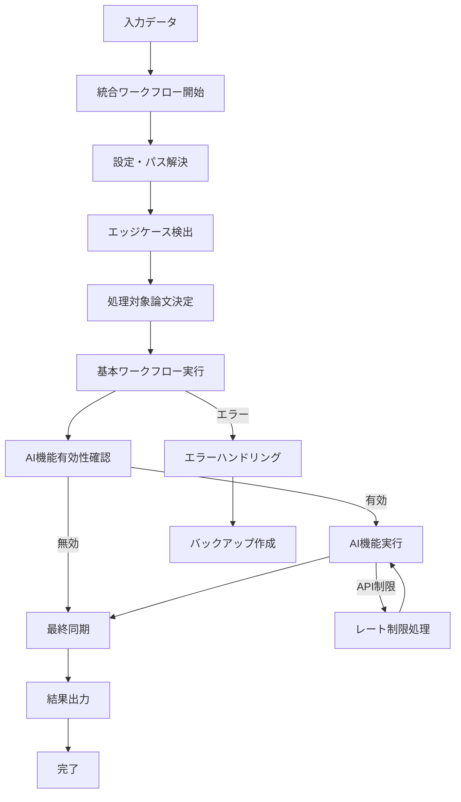
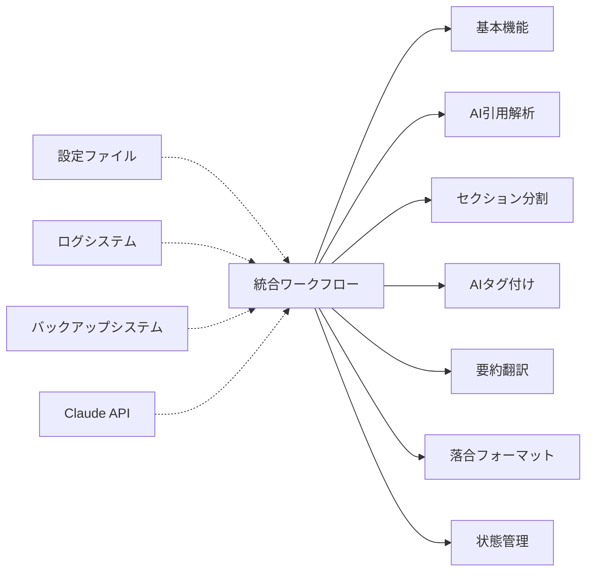

# 統合ワークフロー仕様書

## 概要
- **責務**: 全処理ステップを単一コマンドで実行する統合システム
- **依存**: 全モジュール（統合制御）
- **実行**: デフォルト有効（AI機能含む）

## 処理フロー図


## モジュール関係図


## YAMLヘッダー形式

### 入力（ワークスペース・実行パラメータ）
```yaml
---
# === ワークスペース設定 ===
workspace_configuration:
  workspace_path: "/home/user/ManuscriptsManager"
  bibtex_file: "CurrentManuscript.bib"
  clippings_dir: "Clippings"
  output_dir: "Clippings"

# === 実行パラメータ ===
execution_parameters:
  force_reprocess: false
  disable_ai_features: false
  target_papers: null
  show_plan: false
  dry_run: false
  
# === システム情報 ===
system_info:
  workflow_version: '3.2'
  execution_mode: 'integrated'
  start_time: '2025-01-15T12:00:00.123456+00:00'
---
```

### 出力（統合ワークフロー実行結果）
```yaml
---
# === ワークスペース設定（実行時確定） ===
workspace_configuration:
  workspace_path: "/home/user/ManuscriptsManager"
  bibtex_file: "CurrentManuscript.bib"
  clippings_dir: "Clippings"
  output_dir: "Clippings"
  resolved_paths:
    bibtex_absolute: "/home/user/ManuscriptsManager/CurrentManuscript.bib"
    clippings_absolute: "/home/user/ManuscriptsManager/Clippings"

# === 実行パラメータ（確定値） ===
execution_parameters:
  force_reprocess: false
  disable_ai_features: false
  target_papers: ["smith2023test", "jones2022biomarkers", "davis2023neural"]
  show_plan: false
  dry_run: false

# === システム情報 ===
system_info:
  workflow_version: '3.2'
  execution_mode: 'integrated'
  start_time: '2025-01-15T12:00:00.123456+00:00'
  end_time: '2025-01-15T12:03:00.654321+00:00'

# === 実行結果サマリー（統合ワークフロー専用） ===
integrated_execution_summary:
  executed_at: '2025-01-15T12:00:00.123456'
  total_papers_processed: 3
  total_execution_time: 180.5
  overall_status: 'completed'
  
  steps_executed:
    - organize
    - sync
    - fetch
    - section_parsing
    - ai_citation_support
    - tagger
    - translate_abstract
    - ochiai_format
    - final_sync
    
  steps_summary:
    organize:
      status: completed
      papers_processed: 3
      execution_time: 15.2
      files_reorganized: 3
    sync:
      status: completed
      papers_processed: 3
      execution_time: 8.1
      sync_operations: 6
    ai_citation_support:
      status: completed
      papers_processed: 3
      execution_time: 25.3
      citations_processed: 8
    tagger:
      status: completed
      papers_processed: 3
      execution_time: 42.7
      ai_requests: 3
      tags_generated: 45
    translate_abstract:
      status: completed
      papers_processed: 3
      execution_time: 38.9
      ai_requests: 3
      translations_generated: 3
    ochiai_format:
      status: completed
      papers_processed: 3
      execution_time: 51.3
      ai_requests: 3
      summaries_generated: 3
    final_sync:
      status: completed
      papers_processed: 3
      execution_time: 12.0
      final_validations: 3

# === エッジケース処理結果 ===
edge_cases_handling:
  detected_issues:
    missing_in_clippings: 2
    orphaned_in_clippings: 1
    yaml_repair_needed: 0
  resolution_actions:
    files_created: 2
    files_moved: 0
    headers_repaired: 0
  post_resolution_status: 'resolved'

# === エラー・警告記録 ===
execution_log:
  errors: []
  warnings: 
    - "smith2023test: Abstract section shorter than expected"
  performance_metrics:
    peak_memory_usage: "45.2 MB"
    api_requests_total: 9
    api_rate_limit_hits: 0

# === バックアップ情報 ===
backup_summary:
  backups_created: 6
  backup_location: "backups/integrated_20250115_120000/"
  total_backup_size: "2.3 MB"
  recovery_points_available: true
---
```

## 実装
```python
class IntegratedWorkflow:
    def __init__(self, config_manager, logger):
        self.config_manager = config_manager
        self.logger = logger.get_logger('IntegratedWorkflow')
        self.status_manager = StatusManager(config_manager, logger)
        
        # 各ワークフローモジュールを初期化
        self.organize_workflow = OrganizeWorkflow(config_manager, logger)
        self.sync_workflow = SyncWorkflow(config_manager, logger)
        self.fetch_workflow = FetchWorkflow(config_manager, logger)
        self.section_parsing_workflow = SectionParsingWorkflow(config_manager, logger)
        self.ai_citation_support_workflow = AICitationSupportWorkflow(config_manager, logger)
        self.tagger_workflow = TaggerWorkflow(config_manager, logger)
        self.translate_workflow = TranslateAbstractWorkflow(config_manager, logger)
        self.ochiai_workflow = OchiaiFormatWorkflow(config_manager, logger)
        
    def execute_integrated_workflow(self, force_reprocess=False, disable_ai_features=False, 
                                  target_papers=None, show_plan=False):
        """統合ワークフローの実行"""
        start_time = time.time()
        execution_results = {
            'status': 'running',
            'executed_steps': [],
            'skipped_steps': [],
            'failed_steps': [],
            'total_papers_processed': 0,
            'execution_time': 0,
            'edge_cases': {}
        }
        
        try:
            # 1. 設定とパスの解決
            workspace_path = self.config_manager.get_workspace_path()
            bibtex_file = self.config_manager.get_bibtex_file()
            clippings_dir = self.config_manager.get_clippings_dir()
            
            # 2. エッジケース検出と処理対象論文決定
            valid_papers, edge_cases = self._detect_edge_cases_and_get_valid_papers(
                bibtex_file, clippings_dir
            )
            execution_results['edge_cases'] = edge_cases
            execution_results['total_papers_processed'] = len(valid_papers)
            
            if show_plan:
                self._show_execution_plan(valid_papers, disable_ai_features)
                return execution_results
            
            # 3. 順次ワークフロー実行
            workflow_steps = [
                ('organize', self.organize_workflow),
                ('sync', self.sync_workflow),
                ('fetch', self.fetch_workflow),
                ('section_parsing', self.section_parsing_workflow),
                ('ai_citation_support', self.ai_citation_support_workflow),
            ]
            
            # AI機能ステップ（無効化されていない場合のみ）
            if not disable_ai_features:
                ai_steps = [
                    ('tagger', self.tagger_workflow),
                    ('translate_abstract', self.translate_workflow),
                    ('ochiai_format', self.ochiai_workflow),
                ]
                workflow_steps.extend(ai_steps)
            
            # 最終同期
            workflow_steps.append(('final-sync', self.sync_workflow))
            
            # 各ステップを順次実行
            for step_name, workflow in workflow_steps:
                step_start_time = time.time()
                
                try:
                    # ステップ開始前バックアップ作成
                    if self.config_manager.get('integrated_workflow.backup_strategy.create_checkpoint_backups', True):
                        self._create_checkpoint_backup(clippings_dir, step_name)
                    
                    self.logger.info(f"Starting step: {step_name}")
                    workflow.process_items(clippings_dir, valid_papers)
                    
                    step_execution_time = time.time() - step_start_time
                    execution_results['executed_steps'].append({
                        'name': step_name,
                        'status': 'completed',
                        'execution_time': step_execution_time
                    })
                    
                except (ProcessingError, APIError, ValidationError) as e:
                    # 既知のエラー：標準的な処理
                    self.logger.error(f"Step {step_name} failed with known error: {e}")
                    
                    # 失敗時バックアップ作成
                    if self.config_manager.get('integrated_workflow.error_handling.auto_backup_on_failure', True):
                        self._create_failure_backup(clippings_dir, step_name, str(e))
                    
                    execution_results['failed_steps'].append({
                        'name': step_name,
                        'error': str(e),
                        'error_type': type(e).__name__,
                        'error_code': getattr(e, 'error_code', None)
                    })
                    
                    # 重要でないエラーは継続、重要なエラーは中断
                    if isinstance(e, (APIError, ConfigurationError)):
                        break  # 重要なエラーで中断
                    
                except Exception as e:
                    # 未知のエラー：標準例外に変換
                    error = ProcessingError(
                        f"Unexpected error in step {step_name}: {str(e)}",
                        error_code="UNEXPECTED_STEP_ERROR",
                        context={"step": step_name, "execution_time": time.time() - step_start_time}
                    )
                    self.logger.error(f"Step {step_name} failed with unexpected error: {error}")
                    
                    execution_results['failed_steps'].append({
                        'name': step_name,
                        'error': str(error),
                        'error_type': 'ProcessingError',
                        'error_code': error.error_code
                    })
                    break
            
            execution_results['status'] = 'completed'
            
        except Exception as e:
            self.logger.error(f"Integrated workflow failed: {e}")
            execution_results['status'] = 'failed'
            execution_results['error'] = str(e)
        
        finally:
            execution_results['execution_time'] = time.time() - start_time
            
        return execution_results
    
    def _detect_edge_cases_and_get_valid_papers(self, bibtex_file, clippings_dir):
        """エッジケース検出と有効論文リスト取得"""
        # BibTeXエントリー取得
        bibtex_entries = self.bibtex_parser.parse_file(bibtex_file)
        bibtex_keys = set(bibtex_entries.keys())
        
        # Clippingsディレクトリの論文取得
        clippings_keys = set()
        for md_file in glob.glob(os.path.join(clippings_dir, "**/*.md"), recursive=True):
            citation_key = self._extract_citation_key_from_path(md_file)
            if citation_key:
                clippings_keys.add(citation_key)
        
        # エッジケース検出
        missing_in_clippings = bibtex_keys - clippings_keys
        orphaned_in_clippings = clippings_keys - bibtex_keys
        valid_papers = bibtex_keys.intersection(clippings_keys)
        
        edge_cases = {
            'missing_in_clippings': list(missing_in_clippings),
            'orphaned_in_clippings': list(orphaned_in_clippings)
        }
        
        return list(valid_papers), edge_cases
```

## 設定
```yaml
integrated_workflow:
  enabled: true
  default_ai_features: true
  auto_edge_case_detection: true
  parallel_processing: false
  execution_timeout: 3600
  step_timeout: 600
  error_handling:
    auto_backup_on_failure: true
    retry_failed_steps: true
    max_retry_attempts: 3
    rollback_on_critical_failure: true
  backup_strategy:
    create_checkpoint_backups: true
    backup_frequency: "before_each_step"
    keep_execution_logs: true
```

## 基本原理

### 単一コマンド統合
- **すべての機能**を`run-integrated`に集約
- **引数なし実行**でデフォルト動作（AI機能含む）
- **個別設定**は必要時のみ
- **AI理解支援**をデフォルトで有効化

### 状態管理による効率化
- **YAMLヘッダー**による処理状態追跡
- **自動スキップ**で完了済み処理を回避
- **失敗再実行**で必要な処理のみ実施
- **AI機能処理状態**の詳細追跡

### 統一ディレクトリ設定
- **workspace_path**一つでの全パス管理
- **自動導出**による設定シンプル化
- **個別指定**での柔軟性確保

## システム構成

### 処理フロー
```
organize → sync → fetch → section_parsing → ai_citation_support → enhanced-tagger → enhanced-translate → ochiai-format → final-sync
```

### メタデータ自動補完システム
- **デフォルト有効**: 全引用文献に対して自動的にメタデータ補完を実行
- **フォールバック戦略**: CrossRef → Semantic Scholar → OpenAlex → PubMed → OpenCitations
- **完全自動制御**: 十分な情報（title, author, journal, year）が得られた時点で後続API呼び出しを停止
- **API最適化**: 無駄なAPI呼び出しを削減し、効率的な処理を実現

### 依存関係
- 各ステップは**順次実行**
- **前段階完了**後に次段階実行
- **失敗時は後続ステップ停止**
- **AI機能**は**ai-citation-support完了後**に実行

### 状態追跡
- 各論文の`.md`ファイルYAMLヘッダーで状態管理
- ステップごとの処理状態を記録
- 完了/失敗/保留の状態管理
- **AI機能処理状態**の追跡

## 設定システム

### デフォルト設定
```yaml
# config/config.yaml
workspace_path: "/home/user/ManuscriptsManager"

# 自動導出パス
bibtex_file: "{workspace_path}/CurrentManuscript.bib"
clippings_dir: "{workspace_path}/Clippings"
output_dir: "{workspace_path}/Clippings"

# AI機能設定（デフォルト有効）
ai_generation:
  default_model: "claude-3-5-haiku-20241022"
  tagger:
    enabled: true
    batch_size: 8
  translate_abstract:
    enabled: true
    batch_size: 5
  ochiai_format:
    enabled: true
    batch_size: 3
  section_parsing:
    enabled: true
```

### 設定優先順位
1. **コマンドライン引数** (最高優先度)
2. **設定ファイル** (config.yaml)
3. **デフォルト値** (最低優先度)

## IntegratedWorkflow クラス

### クラス設計概要
統合ワークフローを管理する中核クラス。各モジュールを初期化し、順次実行を制御します。

### 主要処理フロー
1. **パス解決**: workspace_pathから全パス自動導出
2. **設定検証**: ファイル存在・エッジケース検出
3. **処理対象決定**: BibTeXとMarkdownの両方に存在する論文のみ
4. **ステップ実行**: 順次処理（前段階完了後に次段階）
5. **状態更新**: 各ステップ完了時の状態記録

## エッジケース処理仕様

### 概要
BibTeXファイルとClippingsディレクトリ間の不整合ケースに対する処理方針を定義します。

### エッジケース定義

#### 1. missing_in_clippings
- **定義**: BibTeXに記載されているがClippingsディレクトリに対応する.mdファイルが存在しない論文
- **処理方針**: **DOI情報表示のみ、処理スキップ**
- **ログレベル**: WARNING
- **表示内容**: Citation key、DOI（利用可能な場合）、クリック可能なDOIリンク

#### 2. orphaned_in_clippings  
- **定義**: Clippingsディレクトリに存在するがBibTeXファイルに記載されていない.mdファイル
- **処理方針**: **論文情報表示のみ、処理スキップ**
- **ログレベル**: WARNING  
- **表示内容**: ファイルパス、Citation key（ファイル名から推定）

### 処理対象論文の決定
エッジケースを除外した処理対象論文リストを生成します。

### 実行結果への影響
```python
execution_results = {
    'status': 'success',
    'executed_steps': [],
    'skipped_steps': [],
    'failed_steps': [],
    'total_papers_processed': 0,
    'skipped_papers': {
        'missing_in_clippings': [],
        'orphaned_in_clippings': []
    },
    'execution_time': 0
}
```

### 表示例
```
📊 Execution Summary:
Total papers in BibTeX: 15
Total markdown files: 12
Valid papers (both sources): 10
Skipped papers: 5
  - Missing markdown files: 3
  - Orphaned markdown files: 2

⚠️  Edge Cases Detected:
Missing markdown files for:
  - smith2023biomarkers (DOI: 10.1038/s41591-023-1234-5)
  - jones2024neural (DOI: 10.1126/science.xyz789)

Orphaned markdown files:
  - old_paper2022/old_paper2022.md
  - test_paper2021/test_paper2021.md
```

## 設計原則

### エッジケース処理の原則
1. **安全性優先**: 不完全なデータでの処理は行わない
2. **情報提供**: 問題の詳細を明確に報告
3. **処理継続**: 一部の問題で全体が停止しない
4. **ユーザビリティ**: DOIリンク等で問題解決を支援

### 情報提供の充実
1. **DOI表示**: 論文特定・取得支援のため
2. **クリック可能リンク**: ターミナルでの直接アクセス支援
3. **明確なメッセージ**: 問題の性質と対応方法の明示
4. **統計情報**: 全体的な処理状況の把握支援

## コマンドライン仕様

### 基本実行
```bash
# デフォルト実行（推奨・AI機能含む）
PYTHONPATH=code/py uv run python code/py/main.py run-integrated

# 実行計画確認
PYTHONPATH=code/py uv run python code/py/main.py run-integrated --show-plan

# 強制再処理
PYTHONPATH=code/py uv run python code/py/main.py run-integrated --force-reprocess
```

### AI機能制御
```bash
# AI機能無効化
PYTHONPATH=code/py uv run python code/py/main.py run-integrated --disable-ai-features

# 特定AI機能のみ無効化
PYTHONPATH=code/py uv run python code/py/main.py run-integrated --disable-tagger --disable-translate-abstract
```

### カスタム設定
```bash
# ワークスペース変更
PYTHONPATH=code/py uv run python code/py/main.py run-integrated --workspace "/path/to/workspace"

# 特定論文のみ処理
PYTHONPATH=code/py uv run python code/py/main.py run-integrated --papers "paper1,paper2,paper3"
```