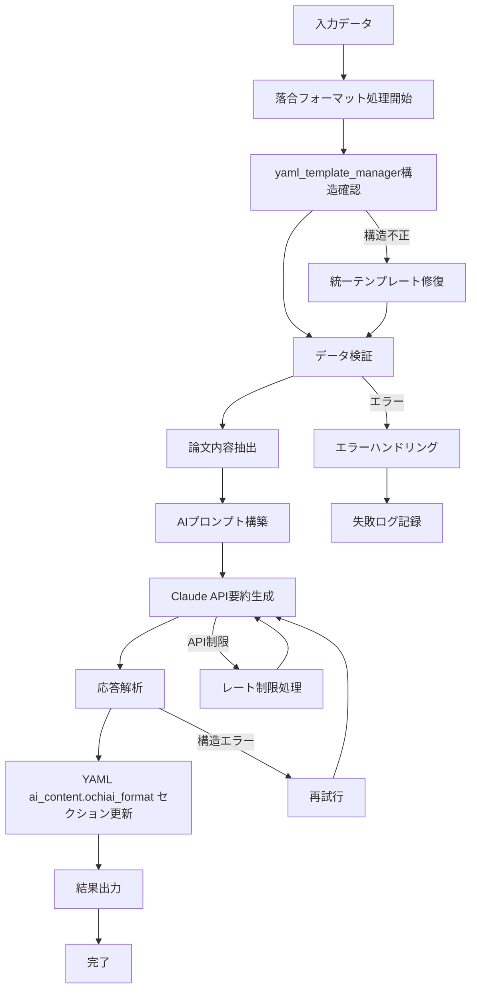
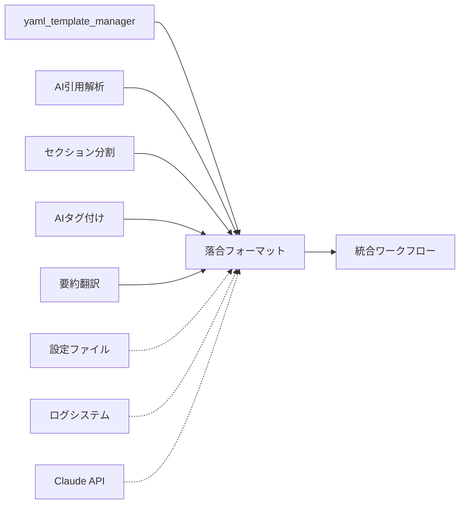

# 落合フォーマット要約機能仕様書

## 概要
- **責務**: 学術論文の落合フォーマット6項目要約を自動生成
- **依存**: yaml_template_manager → ai_citation_support → section_parsing → tagger → translate_abstract
- **実行**: 統合ワークフローで自動実行

## 処理フロー図


## モジュール関係図


## YAMLヘッダー形式

### 入力（tagger & translate_abstract処理後）
```yaml
---
# === システムメタデータ ===
citation_key: smith2023test
workflow_version: '3.2'
last_updated: '2025-01-15T11:20:00.123456+00:00'
created_at: '2025-01-15T09:00:00.123456+00:00'

# === 処理状態管理セクション ===
processing_status:
  organize: completed
  sync: completed
  fetch: completed
  ai_citation_support: completed
  section_parsing: completed
  tagger: completed
  translate_abstract: completed
  ochiai_format: pending  # ← このモジュールで処理予定
  final_sync: pending

# === Citation Management（前段で設定済み） ===
citation_metadata:
  last_updated: '2025-01-15T10:30:00.123456'
  mapping_version: '2.0'
  source_bibtex: references.bib
  total_citations: 2

citations:
  1:
    citation_key: jones2022biomarkers
    authors: Jones
    title: Advanced Biomarker Techniques in Oncology
    year: 2022
    journal: Nature Medicine
    doi: 10.1038/s41591-022-0456-7

# === Paper Structure（前段で設定済み） ===
paper_structure:
  parsed_at: '2025-01-15T10:35:00.123456'
  total_sections: 5
  sections:
    - title: "Abstract"
      level: 2
      section_type: "abstract"
      start_line: 15
      end_line: 25
      word_count: 250
    - title: "Introduction"
      level: 2
      section_type: "introduction"
      start_line: 27
      end_line: 85
      word_count: 1200

# === AI Generated Content（前段で一部設定済み） ===
ai_content:
  tags:
    generated_at: '2025-01-15T11:15:00.123456'
    count: 15
    keywords:
      - oncology
      - biomarkers
      - cancer_research
      - machine_learning
      - KRT13
  abstract_japanese:
    generated_at: '2025-01-15T11:20:00.123456'
    content: |
      本研究では、がん研究における先進的なバイオマーカー技術について報告する。
  ochiai_format:  # ← このモジュールで処理予定
    generated_at: null
    questions:
      what_is_this: null
      what_is_superior: null
      technical_key: null
      validation_method: null
      discussion_points: null
      next_papers: null

execution_summary:
  executed_at: null
  total_execution_time: 0
  steps_executed: []
  steps_summary: {}
  edge_cases: {}

error_history: []
backup_information:
  last_backup_at: null
  backup_location: null
  recovery_available: false
---
```

### 出力（ochiai_formatモジュール処理後）
```yaml
---
# === システムメタデータ ===
citation_key: smith2023test
workflow_version: '3.2'
last_updated: '2025-01-15T11:30:00.123456+00:00'
created_at: '2025-01-15T09:00:00.123456+00:00'

# === 処理状態管理セクション ===
processing_status:
  organize: completed
  sync: completed
  fetch: completed
  ai_citation_support: completed
  section_parsing: completed
  tagger: completed
  translate_abstract: completed
  ochiai_format: completed  # ← このモジュールで更新
  final_sync: pending

# === Citation Management（前段で設定済み、変更なし） ===
citation_metadata:
  last_updated: '2025-01-15T10:30:00.123456'
  mapping_version: '2.0'
  source_bibtex: references.bib
  total_citations: 2

citations:
  1:
    citation_key: jones2022biomarkers
    authors: Jones
    title: Advanced Biomarker Techniques in Oncology
    year: 2022
    journal: Nature Medicine
    doi: 10.1038/s41591-022-0456-7

# === Paper Structure（前段で設定済み、変更なし） ===
paper_structure:
  parsed_at: '2025-01-15T10:35:00.123456'
  total_sections: 5
  sections:
    - title: "Abstract"
      level: 2
      section_type: "abstract"
      start_line: 15
      end_line: 25
      word_count: 250

# === AI Generated Content（このモジュールで落合フォーマット完成） ===
ai_content:
  tags:
    generated_at: '2025-01-15T11:15:00.123456'
    count: 15
    keywords:
      - oncology
      - biomarkers
      - cancer_research
  abstract_japanese:
    generated_at: '2025-01-15T11:20:00.123456'
    content: |
      本研究では、がん研究における先進的なバイオマーカー技術について報告する。
  ochiai_format:  # ← このモジュールで更新
    generated_at: '2025-01-15T11:30:00.123456'
    questions:
      what_is_this: |
        KRT13タンパク質の発現パターンを機械学習で解析し、
        がん診断精度を95%まで向上させた新しいバイオマーカー技術。
        従来の組織診断と比較して診断時間を半分に短縮。
      what_is_superior: |
        既存の免疫組織化学的手法と比較して、AI画像解析による
        客観的定量評価を実現。従来の主観的診断の限界を克服し、
        診断者間のばらつきを大幅に削減した点が革新的。
      technical_key: |
        深層学習ベースのConvolutional Neural Networkを用いて、
        KRT13タンパク質の発現パターンを定量化。Transfer learningと
        data augmentationにより少数サンプルでの高精度学習を実現。
      validation_method: |
        500例の組織サンプルを用いた後向き研究。3名の病理医による
        独立診断を gold standard とし、機械学習モデルの診断精度、
        感度、特異度を統計学的に評価。Cross-validationで再現性確認。
      discussion_points: |
        サンプル数の制限により一般化性能に課題。異なる施設・機器での
        検証が必要。また、稀な組織型への適用可能性は今後の検討課題。
        コスト効果分析も実臨床導入には重要。
      next_papers: |
        1. Jones et al. (2022) - KRT13の分子メカニズム詳細
        2. Davis et al. (2023) - 他のがん種での類似手法
        3. Wilson et al. (2024) - AI診断の臨床実装ガイドライン

# === 他セクション（このモジュールでは変更なし） ===
execution_summary:
  executed_at: null
  total_execution_time: 0
  steps_executed: []
  steps_summary: {}
  edge_cases: {}

error_history: []
backup_information:
  last_backup_at: null
  backup_location: null
  recovery_available: false
---
```

## 実装
```python
class OchiaiFormatWorkflow:
    def __init__(self, config_manager, logger):
        self.config_manager = config_manager
        self.logger = logger.get_logger('OchiaiFormatWorkflow')
        self.claude_client = ClaudeAPIClient(config_manager, logger)
        
    def process_items(self, input_dir, target_items=None):
        """論文の一括落合フォーマット要約処理"""
        status_manager = StatusManager(self.config_manager, self.logger)
        papers_needing_processing = status_manager.get_papers_needing_processing(
            input_dir, 'ochiai_format', target_items
        )
        
        for paper_path in papers_needing_processing:
            try:
                ochiai_summary = self.generate_ochiai_summary_single(paper_path)
                self.update_yaml_with_ochiai(paper_path, ochiai_summary)
                status_manager.update_status(input_dir, paper_path, 'ochiai_format', 'completed')
            except Exception as e:
                self.logger.error(f"Failed to generate Ochiai format for {paper_path}: {e}")
                status_manager.update_status(input_dir, paper_path, 'ochiai_format', 'failed')
    
    def generate_ochiai_summary_single(self, paper_path):
        """単一論文の落合フォーマット要約生成"""
        paper_content = self.extract_paper_content(paper_path)
        prompt = self._build_ochiai_prompt(paper_content)
        response = self.claude_client.send_request(prompt)
        return self._parse_ochiai_response(response)
        
    def extract_paper_content(self, paper_path):
        """論文内容の抽出（セクション分割機能と連携）"""
        yaml_header, content = self._load_paper_with_yaml(paper_path)
        
        if 'paper_structure' in yaml_header:
            # セクション分割済みの場合、重要セクションを抽出
            return self._extract_important_sections(yaml_header, content)
        else:
            # セクション分割されていない場合、全文を使用
            return content
```

## 設定
```yaml
ochiai_format:
  enabled: true
  batch_size: 3
  parallel_processing: true
  retry_attempts: 3
  request_delay: 1.0
  max_content_length: 10000
  enable_section_integration: true
  error_handling:
    validate_ochiai_structure: true
    backup_on_generation_failure: true
    handle_content_too_long: true
    validate_japanese_output: true
    fallback_to_simple_format: true
  backup_strategy:
    backup_before_ochiai_update: true
    keep_generation_attempts: true
    preserve_partial_results: true
    backup_source_content: true
```

## データ構造

### OchiaiFormat
```python
@dataclass
class OchiaiFormat:
    what_is_this: str            # どんなもの？
    what_is_superior: str        # 先行研究と比べてどこがすごい？
    technical_key: str           # 技術や手法のキモはどこ？
    validation_method: str       # どうやって有効だと検証した？
    discussion_points: str       # 議論はある？
    next_papers: str            # 次に読むべき論文は？
    generated_at: str           # 生成日時
```

## セクション分割機能との連携

### 連携が有効な場合
- `paper_structure` YAMLフィールドが存在する場合、セクション別にコンテンツを抽出
- より精密な要約生成が可能

### 連携が無効な場合
- 論文全体を単一コンテンツとして処理
- セクション分割機能が未実行でも動作

## エラーハンドリング

- **コンテンツ長すぎ**: 最大文字数制限による内容要約
- **API制限**: レート制限とプロンプトサイズ制限の対応
- **生成品質不良**: 極端に短い要約の再生成
- **JSON形式エラー**: 形式不正レスポンスの再処理
- **参考文献なし**: 「次に読むべき論文」項目の代替処理

## 品質保証

### 自動検証項目
- 各項目の最小文字数チェック
- JSON形式の妥当性検証
- 日本語文字エンコーディング確認

### 手動確認推奨項目
- 専門用語の翻訳正確性
- 学術的表現の適切性
- 論文内容との整合性

## 使用例

### 統合ワークフローでの使用（推奨）
```bash
# デフォルト実行（落合フォーマット含む）
PYTHONPATH=code/py uv run python code/py/main.py run-integrated

# 落合フォーマット無効化
PYTHONPATH=code/py uv run python code/py/main.py run-integrated --disable-ochiai-format
```

### 個別実行（デバッグ用）
```bash
# 単独実行
PYTHONPATH=code/py uv run python code/py/main.py ochiai-format
``` 