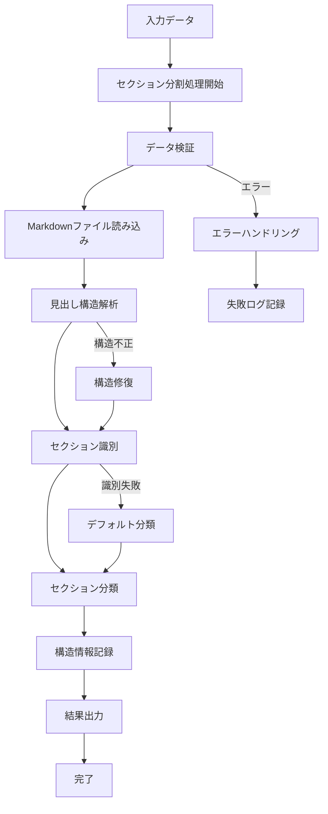
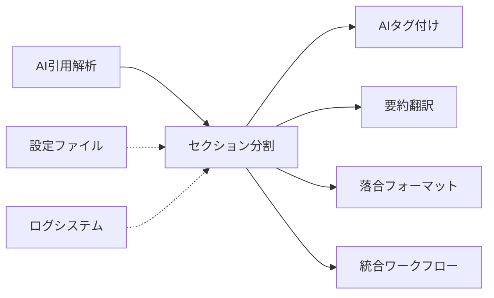

# 論文セクション分割機能仕様書

## 概要
- **責務**: Markdownファイルの見出し構造を解析し学術論文セクションを自動識別・分割
- **依存**: ai_citation_support
- **実行**: 統合ワークフローで自動実行

## 処理フロー図


## モジュール関係図


## YAMLヘッダー形式

### 入力
```yaml
---
citation_key: smith2023test
citation_metadata:
  last_updated: '2025-01-15T10:30:00.123456'
  mapping_version: '2.0'
  source_bibtex: references.bib
  total_citations: 2
citations:
  1:
    authors: Jones
    citation_key: jones2022biomarkers
    doi: 10.1038/s41591-022-0456-7
    journal: Nature Medicine
    title: Advanced Biomarker Techniques in Oncology
    year: 2022
processing_status:
  ai_citation_support: completed
  section_parsing: pending
---
```

### 出力
```yaml
---
citation_key: smith2023test
paper_structure:
  parsed_at: '2025-01-15T10:35:00.123456'
  total_sections: 5
  sections:
    - title: "Abstract" 
      level: 2
      section_type: "abstract"
      start_line: 15
      end_line: 25
      word_count: 250
    - title: "Introduction"
      level: 2  
      section_type: "introduction"
      start_line: 27
      end_line: 85
      word_count: 1200
      subsections:
        - title: "Background"
          level: 3
          start_line: 30
          end_line: 50
          word_count: 400
    - title: "Methods"
      level: 2
      section_type: "methods" 
      start_line: 87
      end_line: 140
      word_count: 1500
    - title: "Results"
      level: 2
      section_type: "results" 
      start_line: 142
      end_line: 200
      word_count: 2100
    - title: "Discussion"
      level: 2
      section_type: "discussion" 
      start_line: 202
      end_line: 250
      word_count: 1800
  section_types_found: ["abstract", "introduction", "methods", "results", "discussion"]
citation_metadata:
  last_updated: '2025-01-15T10:30:00.123456'
  mapping_version: '2.0'
  source_bibtex: references.bib
  total_citations: 2
citations:
  1:
    authors: Jones
    citation_key: jones2022biomarkers
    doi: 10.1038/s41591-022-0456-7
    journal: Nature Medicine
    title: Advanced Biomarker Techniques in Oncology
    year: 2022
processing_status:
  ai_citation_support: completed
  section_parsing: completed
workflow_version: '3.2'
---
```

## 実装
```python
class SectionParsingWorkflow:
    def __init__(self, config_manager, logger):
        self.config_manager = config_manager
        self.logger = logger.get_logger('SectionParsingWorkflow')
        
    def process_items(self, input_dir, target_items=None):
        """論文の一括セクション分割処理"""
        status_manager = StatusManager(self.config_manager, self.logger)
        papers_needing_processing = status_manager.get_papers_needing_processing(
            input_dir, 'section_parsing', target_items
        )
        
        for paper_path in papers_needing_processing:
            try:
                paper_structure = self.parse_sections_single(paper_path)
                self.update_yaml_with_structure(paper_path, paper_structure)
                status_manager.update_status(input_dir, paper_path, 'section_parsing', 'completed')
            except Exception as e:
                self.logger.error(f"Failed to parse sections for {paper_path}: {e}")
                status_manager.update_status(input_dir, paper_path, 'section_parsing', 'failed')
    
    def parse_sections_single(self, paper_path):
        """単一論文のセクション分割処理"""
        content_lines = self._read_markdown_content(paper_path)
        sections = self._extract_sections(content_lines)
        return self._build_paper_structure(sections)
        
    def _extract_sections(self, content_lines):
        """見出し構造からセクションを抽出"""
        sections = []
        current_section = None
        
        for line_num, line in enumerate(content_lines, 1):
            if self._is_heading(line):
                if current_section:
                    current_section['end_line'] = line_num - 1
                    current_section['word_count'] = self._count_words(current_section)
                    sections.append(current_section)
                
                current_section = {
                    'title': self._extract_title(line),
                    'level': self._get_heading_level(line),
                    'section_type': self._identify_section_type(line),
                    'start_line': line_num,
                    'content_lines': []
                }
            elif current_section:
                current_section['content_lines'].append(line)
        
        # 最後のセクションを追加
        if current_section:
            current_section['end_line'] = len(content_lines)
            current_section['word_count'] = self._count_words(current_section)
            sections.append(current_section)
            
        return sections
```

## 設定
```yaml
section_parsing:
  enabled: true
  min_section_words: 50
  max_heading_level: 4
  enable_subsection_analysis: true
  section_type_detection: true
  error_handling:
    handle_malformed_markdown: true
    skip_unrecognized_sections: true
    backup_on_parsing_failure: true
    validate_section_structure: true
  backup_strategy:
    backup_before_structure_update: true
    preserve_original_structure: true
    incremental_section_backups: true
```

## 主要機能
- **見出し構造解析**: ##, ###, #### レベルでの階層的セクション分割
- **セクション分類**: 学術論文の標準構造パターンによる自動分類
- **構造情報記録**: YAMLヘッダーへのセクション情報永続化
- **他機能連携**: AI tagging/translation機能の精度向上支援
- **デフォルト有効**: 統合ワークフローでの自動実行

## セクション識別ルール

### 標準パターン
```python
SECTION_TYPE_PATTERNS = {
    'abstract': ['abstract', 'summary'],
    'introduction': ['introduction', 'intro', 'background'],
    'methods': ['methods', 'methodology', 'materials and methods', 'experimental'],
    'results': ['results', 'findings'],
    'discussion': ['discussion', 'discussion and conclusions'],
    'conclusion': ['conclusion', 'conclusions', 'summary and conclusions'],
    'references': ['references', 'bibliography', 'citations'],
    'acknowledgments': ['acknowledgments', 'acknowledgements', 'thanks']
}
```

### 識別アルゴリズム
1. **見出しレベル検出**: ##, ###, #### の階層構造を解析
2. **タイトル正規化**: 小文字変換・記号除去による前処理
3. **パターンマッチング**: 標準パターンとの部分一致判定
4. **階層構造保持**: 親子関係を維持したツリー構造構築

## エラーハンドリング

- **構造なし論文**: 見出しがない場合は全文を単一セクションとして処理
- **短すぎるセクション**: 最小文字数未満のセクションをスキップ
- **不明セクション**: パターンマッチしないセクションは"unknown"として記録
- **エンコーディングエラー**: UTF-8変換エラーの適切な処理

## 他機能との連携

### AI Tagging機能
- Introduction + Results + Discussionセクションを抽出してタグ生成に使用
- セクション情報により論文の重要部分を正確に特定

### Abstract Translation機能  
- Abstractセクションを正確に抽出して翻訳精度を向上
- セクション境界の明確化により翻訳対象範囲を限定

### 落合フォーマット要約機能
- セクション別内容を利用した精密な6項目要約生成
- 各セクションの内容を適切な質問項目に対応付け

## 使用例

### 統合ワークフローでの使用（推奨）
```bash
# デフォルト実行（セクション分割含む）
PYTHONPATH=code/py uv run python code/py/main.py run-integrated

# セクション分割無効化
PYTHONPATH=code/py uv run python code/py/main.py run-integrated --disable-section-parsing
```

### 個別実行（デバッグ用）
```bash
# 単独実行
PYTHONPATH=code/py uv run python code/py/main.py section-parsing
```