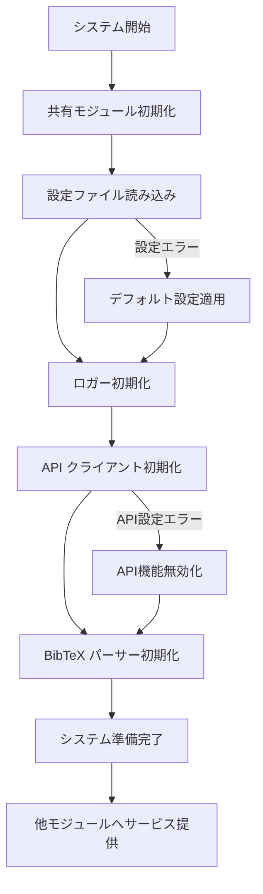
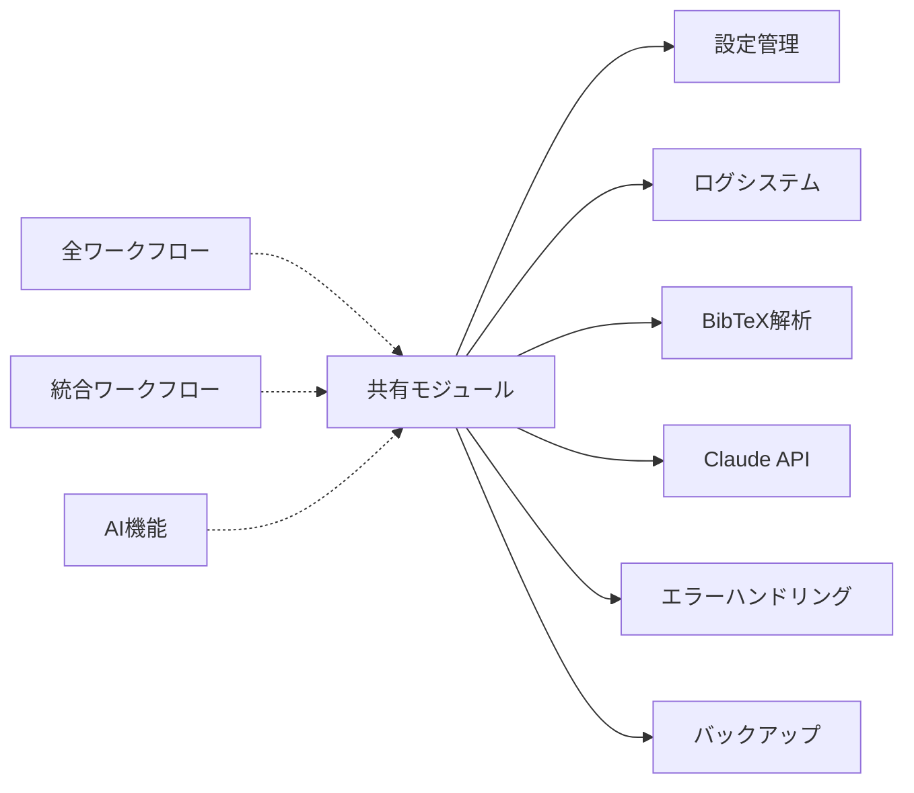

# 共有モジュール仕様書

## 概要
- **責務**: 全システムで使用される基盤機能（設定管理、ログ、BibTeX解析、API通信等）
- **依存**: なし（基盤モジュール）
- **実行**: 全モジュールで共通利用

## 処理フロー図


## モジュール関係図


## YAMLヘッダー形式

### 入力
```yaml
---
# 共有モジュールは設定ベースで動作し、特定のYAMLヘッダー入力は必要ありません
workspace_configuration:
  workspace_path: "/home/user/ManuscriptsManager"
  bibtex_file: "CurrentManuscript.bib"
  clippings_dir: "Clippings"
---
```

### 出力
```yaml
---
# 共有モジュールは基盤機能のため、直接的なYAMLヘッダー出力は行いませんが、
# 他のモジュールのYAMLヘッダー更新をサポートします
configuration_loaded:
  loaded_at: '2025-01-15T10:00:00.123456'
  modules_initialized:
    - config_manager
    - logger
    - bibtex_parser
    - claude_api_client
  api_clients_configured:
    - claude_3_5_haiku
system_status:
  initialization: completed
---
```

## 実装
```python
class ConfigManager:
    def __init__(self, config_file="config/config.yaml"):
        self.config_file = config_file
        self.config = self._load_config()
        
    def _load_config(self):
        """設定ファイルの読み込みとデフォルト値の適用"""
        try:
            with open(self.config_file, 'r', encoding='utf-8') as f:
                config = yaml.safe_load(f) or {}
        except FileNotFoundError:
            config = {}
            
        # デフォルト値の適用
        default_config = self._get_default_config()
        return self._merge_configs(default_config, config)
    
    def get_workspace_path(self):
        """ワークスペースパスの取得"""
        return self.config.get('workspace_path', '/home/user/ManuscriptsManager')
    
    def get_bibtex_file(self):
        """BibTeXファイルパスの自動導出"""
        workspace = self.get_workspace_path()
        return os.path.join(workspace, 'CurrentManuscript.bib')

class IntegratedLogger:
    def __init__(self, log_file="logs/obsclippings.log"):
        self.log_file = log_file
        self.loggers = {}
        self._setup_logging()
        
    def get_logger(self, name):
        """モジュール別ロガーの取得"""
        if name not in self.loggers:
            logger = logging.getLogger(name)
            self.loggers[name] = logger
        return self.loggers[name]
    
    def _setup_logging(self):
        """ログ設定の初期化"""
        os.makedirs(os.path.dirname(self.log_file), exist_ok=True)
        logging.basicConfig(
            level=logging.INFO,
            format='%(asctime)s [%(levelname)s] %(name)s: %(message)s',
            handlers=[
                logging.FileHandler(self.log_file, encoding='utf-8'),
                logging.StreamHandler()
            ]
        )

class BibTeXParser:
    def __init__(self, logger):
        self.logger = logger
        
    def parse_file(self, bibtex_file):
        """BibTeXファイルの解析"""
        try:
            with open(bibtex_file, 'r', encoding='utf-8') as f:
                content = f.read()
            
            # bibtexparserライブラリを使用した解析
            parser = bibtexparser.bib_database.BibDatabase()
            bib_db = bibtexparser.load(f, parser=parser)
            
            return {entry['ID']: entry for entry in bib_db.entries}
        except Exception as e:
            self.logger.error(f"Failed to parse BibTeX file {bibtex_file}: {e}")
            return {}

class ClaudeAPIClient:
    def __init__(self, config_manager, logger):
        self.config_manager = config_manager
        self.logger = logger.get_logger('ClaudeAPIClient')
        self.api_key = os.getenv('ANTHROPIC_API_KEY')
        self.model = "claude-3-5-haiku-20241022"
        
    def send_request(self, prompt, max_retries=3):
        """Claude APIへのリクエスト送信"""
        for attempt in range(max_retries):
            try:
                response = self._make_api_call(prompt)
                return response
            except Exception as e:
                self.logger.warning(f"API request failed (attempt {attempt + 1}): {e}")
                if attempt == max_retries - 1:
                    raise
                time.sleep(2 ** attempt)  # 指数バックオフ
```

## 設定
```yaml
# 基本設定
workspace_path: "/home/user/ManuscriptsManager"

# API設定
api_settings:
  request_delay: 1.0
  max_retries: 3
  timeout: 30

# AI機能設定
ai_generation:
  default_model: "claude-3-5-haiku-20241022"
  api_key_env: "ANTHROPIC_API_KEY"  # .envファイルから読み込み

# ログ設定
logging:
  log_file: "logs/obsclippings.log"
  log_level: "INFO"
  max_file_size: "10MB"
  backup_count: 5

# エラーハンドリング設定
error_handling:
  enabled: true
  capture_context: true
  auto_retry_on_transient_errors: true
  max_retry_attempts: 3
  retry_delay_seconds: 2

# バックアップ設定
backup_settings:
  enabled: true
  auto_backup_before_processing: true
  backup_location: "backups/"
  retention_days: 30
  max_backup_size_mb: 1000
  compress_old_backups: true
```

## モジュール構成
```
modules/shared/
├── config_manager.py      # 統一設定管理システム
├── logger.py             # 統合ログシステム
├── bibtex_parser.py      # BibTeX解析エンジン
├── utils.py              # 共通ユーティリティ
├── exceptions.py         # 階層的例外管理
└── claude_api_client.py  # Claude API統合クライアント
```

## ConfigManager - 統一設定管理

### 基本機能
- **ワークスペース統一管理**: 単一パス設定での全パス自動導出
- **設定階層**: コマンドライン引数 > 設定ファイル > デフォルト値
- **設定検証**: 実行前の設定妥当性チェック
- **AI機能統合**: Claude 3.5 Haiku統一設定

### 設定構造
```yaml
# config/config.yaml（デフォルト設定）
workspace_path: "/home/user/ManuscriptsManager"

# 自動導出設定（内部処理）
bibtex_file: "{workspace_path}/CurrentManuscript.bib"
clippings_dir: "{workspace_path}/Clippings"
output_dir: "{workspace_path}/Clippings"

# API設定
api_settings:
  request_delay: 1.0
  max_retries: 3
  timeout: 30

# AI機能設定（デフォルト有効）
ai_generation:
  default_model: "claude-3-5-haiku-20241022"
  api_key_env: "ANTHROPIC_API_KEY"  # .envファイルから読み込み
  tagger:
    enabled: true
    batch_size: 8
    tag_count_range: [10, 20]
  translate_abstract:
    enabled: true
    batch_size: 5
    preserve_formatting: true
  ochiai_format:
    enabled: true
    batch_size: 3
  section_parsing:
    enabled: true
```

## IntegratedLogger - 統合ログシステム

### 基本機能
- **統一ログ形式**: 全モジュール共通のログフォーマット
- **ファイル出力**: ログファイルへの永続化
- **レベル制御**: debug/info/warning/error
- **モジュール分離**: モジュール別ログ出力

### ログフォーマット
```
2025-01-15 10:30:00 [INFO] IntegratedWorkflow: Starting integrated workflow execution
2025-01-15 10:30:01 [DEBUG] StatusManager: Loading status from /path/to/clippings
2025-01-15 10:30:02 [WARNING] OrganizeWorkflow: Paper smith2023 already organized, skipping
```

## BibTeXParser - BibTeX解析エンジン

### 基本機能
- **ファイル解析**: BibTeXファイルの読み込み・パース
- **エントリ抽出**: 個別論文エントリの取得
- **メタデータ正規化**: タイトル、DOI等の正規化
- **エラーハンドリング**: 構文エラーの適切な処理

### 解析結果形式
```python
{
    "smith2023test": {
        "title": "Example Paper Title",
        "author": "Smith, John and Jones, Mary",
        "year": "2023",
        "doi": "10.1000/example.doi",
        "journal": "Example Journal"
    }
}
```

## CitationFetcher - 引用文献取得システム（参照）

### 基本機能
- **多段階フォールバック**: CrossRef → Semantic Scholar → OpenCitations
- **レート制限管理**: 各API独立の制限制御
- **データ正規化**: 統一フォーマットでのメタデータ出力
- **エラーハンドリング**: API障害・ネットワークエラーの適切な処理

> **詳細仕様**: [citation_fetcher_specification.md](citation_fetcher_specification.md) 参照

## Utils - 共通ユーティリティ

### ファイルシステム操作
安全なファイル操作、パス正規化、ディレクトリ管理機能を提供します。

## 統一例外管理システム

### 標準例外クラス
```python
class ObsClippingsError(Exception):
    """ObsClippingsManager基底例外クラス"""
    def __init__(self, message, error_code=None, context=None):
        super().__init__(message)
        self.error_code = error_code
        self.context = context or {}
        self.timestamp = datetime.now().isoformat()

class ProcessingError(ObsClippingsError):
    """処理エラー（ファイル処理、データ変換等）"""
    pass

class APIError(ObsClippingsError):
    """API関連エラー（Claude API、CrossRef等）"""
    pass

class ConfigurationError(ObsClippingsError):
    """設定エラー（設定ファイル、環境変数等）"""
    pass

class ValidationError(ObsClippingsError):
    """データ検証エラー（YAML形式、BibTeX形式等）"""
    pass
```

### エラーハンドリング標準パターン
```python
def standard_error_handler(func):
    """標準エラーハンドリングデコレータ"""
    def wrapper(*args, **kwargs):
        try:
            return func(*args, **kwargs)
        except ObsClippingsError:
            raise  # 既知のエラーは再送出
        except Exception as e:
            # 未知のエラーを標準形式に変換
            raise ProcessingError(
                f"Unexpected error in {func.__name__}: {str(e)}",
                error_code="UNEXPECTED_ERROR",
                context={"function": func.__name__, "args": args, "kwargs": kwargs}
            )
    return wrapper
```

## 統一バックアップシステム

### BackupManager
```python
class BackupManager:
    def __init__(self, config_manager, logger):
        self.config_manager = config_manager
        self.logger = logger.get_logger('BackupManager')
        self.backup_settings = config_manager.get_backup_settings()
        
    def create_backup(self, file_path, backup_type="auto"):
        """ファイルのバックアップを作成"""
        try:
            if not self.backup_settings.get('enabled', True):
                return None
                
            backup_dir = self._get_backup_directory()
            timestamp = datetime.now().strftime('%Y%m%d_%H%M%S')
            filename = os.path.basename(file_path)
            backup_path = os.path.join(backup_dir, f"{timestamp}_{backup_type}_{filename}")
            
            shutil.copy2(file_path, backup_path)
            self.logger.info(f"Backup created: {backup_path}")
            
            # 古いバックアップの自動削除
            self._cleanup_old_backups(backup_dir)
            return backup_path
            
        except Exception as e:
            raise ProcessingError(f"Failed to create backup for {file_path}: {e}")
    
    def restore_from_backup(self, original_path, backup_path):
        """バックアップからファイルを復元"""
        try:
            shutil.copy2(backup_path, original_path)
            self.logger.info(f"File restored from backup: {original_path}")
        except Exception as e:
            raise ProcessingError(f"Failed to restore from backup: {e}")
```

### 文字列処理
ファイル名正規化、類似度計算、DOI処理等の汎用文字列操作機能を提供します。

### DOI処理
DOI形式の正規化、検証、URL変換等のDOI関連ユーティリティを提供します。

## Exceptions - 階層的例外管理

### 例外階層
```python
class ObsClippingsManagerError(Exception):
    """ベース例外クラス"""
    pass

class ConfigurationError(ObsClippingsManagerError):
    """設定関連エラー"""
    pass

class BibTeXParsingError(ObsClippingsManagerError):
    """BibTeX解析エラー"""
    pass

class WorkflowExecutionError(ObsClippingsManagerError):
    """ワークフロー実行エラー"""
    pass

class APIClientError(ObsClippingsManagerError):
    """API通信エラー"""
    pass

class FileOperationError(ObsClippingsManagerError):
    """ファイル操作エラー"""
    pass
```

### エラーハンドリング戦略
- **階層的処理**: 具体的なエラーから汎用的なエラーへの段階的処理
- **ログ記録**: 全例外の適切なログ出力
- **ユーザー通知**: わかりやすいエラーメッセージの提供
- **復旧処理**: 可能な場合の自動復旧実行

## ClaudeAPIClient - Claude API統合クライアント

### 基本機能
- **API通信**: Claude 3.5 Haikuとの統合通信
- **バッチ処理**: 複数リクエストの並列処理
- **エラーハンドリング**: API制限・ネットワークエラーの適切な処理
- **レート制限**: API呼び出し頻度制御

### 統一AI技術スタック
- **モデル**: Claude 3.5 Haiku
- **バッチサイズ最適化**: Haikuの高速処理特性を活用
- **並列処理**: 効率的な大量処理実現

### 設定項目
```python
{
    "model": "claude-3-5-haiku-20241022",
    "api_key": "your-claude-api-key",
    "request_delay": 0.5,  # Haikuの高速応答に最適化
    "max_retries": 3,
    "timeout": 30,
    "batch_size": 8  # Haikuの効率性を活用
}
```

## ワークフロークラス実装

### 基本設計パターン
各機能モジュールは以下の統一パターンで実装されます：

#### 共通インターフェース
```python
class BaseWorkflow:
    """ワークフロー基底クラス"""
    
    def __init__(self, config_manager: ConfigManager, logger: IntegratedLogger):
        self.config_manager = config_manager
        self.logger = logger.get_logger(self.__class__.__name__)
        
    def process_papers(self, clippings_dir: str, target_papers: List[str] = None) -> Dict[str, Any]:
        """論文の一括処理"""
        
    def process_single_paper(self, paper_path: str) -> Any:
        """単一論文の処理"""
```

#### 具体的ワークフロー実装例
- **OrganizationWorkflow**: ファイル整理
- **SyncCheckWorkflow**: 同期チェック
- **CitationWorkflow**: 引用文献取得
- **SectionParserWorkflow**: セクション分割
- **AICitationSupportWorkflow**: AI理解支援
- **TaggerWorkflow**: タグ生成
- **TranslateAbstractWorkflow**: 要約翻訳
- **OchiaiFormatWorkflow**: 落合フォーマット要約

## 使用パターン

### 基本的な初期化
```python
from modules.shared.config_manager import ConfigManager
from modules.shared.logger import IntegratedLogger
from modules.shared.bibtex_parser import BibTeXParser

# 基本設定
config_manager = ConfigManager()
logger = IntegratedLogger()
bibtex_parser = BibTeXParser(logger.get_logger('BibTeXParser'))
```

### エラーハンドリング例
```python
try:
    # 何らかの処理
    result = process_something()
except BibTeXParsingError as e:
    logger.error(f"BibTeX parsing failed: {e}")
    # BibTeX特有の処理
except FileOperationError as e:
    logger.error(f"File operation failed: {e}")
    # ファイル操作特有の処理
except ObsClippingsManagerError as e:
    logger.error(f"General error: {e}")
    # 汎用エラー処理
```

## 設計原則

### 単一責任原則
- 各モジュールは明確に定義された単一の責任を持つ
- 機能の重複を避け、保守性を向上

### 依存性の最小化
- モジュール間の依存関係を最小限に抑制
- 変更の影響範囲を制限

### AI機能統合
- Claude 3.5 Haiku統一による一貫したAI処理
- バッチ処理最適化による効率的実行
- エラーハンドリング統一による安定性確保 