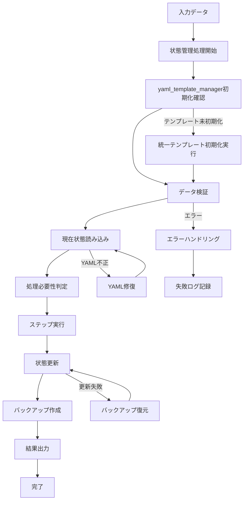
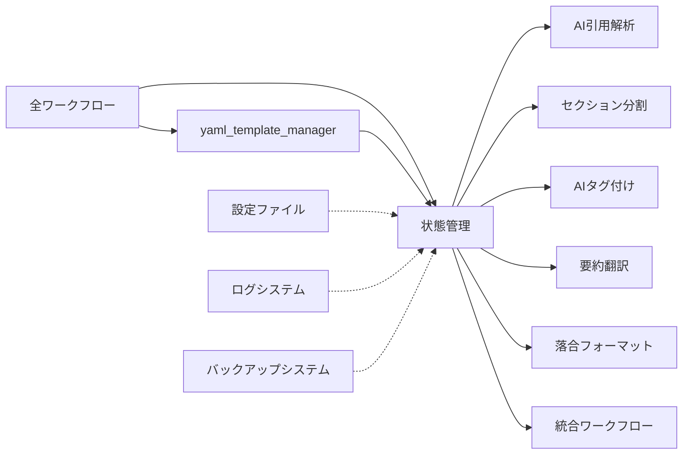

# 状態管理システム仕様書

## 概要
- **責務**: 各論文の処理状態をYAMLヘッダーで管理し重複処理回避を実現
- **依存**: yaml_template_manager → 全ワークフロー（状態管理基盤）
- **実行**: 統合ワークフローで自動実行

## 処理フロー図


## モジュール関係図


## YAMLヘッダー形式

### 入力（統一テンプレート - 初期化状態）
```yaml
---
# === システムメタデータ ===
citation_key: smith2023test
workflow_version: '3.2'
last_updated: '2025-01-15T09:30:00.123456+00:00'
created_at: '2025-01-15T09:00:00.123456+00:00'

# === 処理状態管理セクション ===
processing_status:
  # 基本ワークフロー（部分完了状態）
  organize: completed
  sync: completed
  fetch: pending
  
  # AI機能ワークフロー（初期状態）
  section_parsing: pending
  ai_citation_support: pending
  tagger: pending
  translate_abstract: pending
  ochiai_format: pending
  
  # 統合処理
  final_sync: pending

# === モジュール専用セクション（初期化状態） ===
citation_metadata:
  last_updated: null
  mapping_version: null
  source_bibtex: null
  total_citations: 0

citations: {}

paper_structure:
  parsed_at: null
  total_sections: 0
  sections: []
  section_types_found: []

ai_content:
  tags:
    generated_at: null
    count: 0
    keywords: []
  abstract_japanese:
    generated_at: null
    content: null
  ochiai_format:
    generated_at: null
    questions:
      what_is_this: null
      what_is_superior: null
      technical_key: null
      validation_method: null
      discussion_points: null
      next_papers: null

execution_summary:
  executed_at: null
  total_execution_time: 0
  steps_executed: []
  steps_summary: {}
  edge_cases: {}

error_history: []
backup_information:
  last_backup_at: null
  backup_location: null
  recovery_available: false
---
```

### 出力（全ワークフロー完了後）
```yaml
---
# === システムメタデータ ===
citation_key: smith2023test
workflow_version: '3.2'
last_updated: '2025-01-15T11:35:00.654321+00:00'
created_at: '2025-01-15T09:00:00.123456+00:00'

# === 処理状態管理セクション ===
processing_status:
  # 基本ワークフロー（全完了）
  organize: completed
  sync: completed
  fetch: completed
  
  # AI機能ワークフロー（全完了）
  section_parsing: completed
  ai_citation_support: completed
  tagger: completed
  translate_abstract: completed
  ochiai_format: completed
  
  # 統合処理（完了）
  final_sync: completed

# === Citation Management ===
citation_metadata:
  last_updated: '2025-01-15T10:30:00.123456'
  mapping_version: '2.0'
  source_bibtex: references.bib
  total_citations: 2

citations:
  1:
    citation_key: jones2022biomarkers
    authors: Jones
    title: Advanced Biomarker Techniques in Oncology
    year: 2022
    journal: Nature Medicine
    doi: 10.1038/s41591-022-0456-7
  2:
    citation_key: davis2023neural
    authors: Davis
    title: Neural Networks in Medical Diagnosis
    year: 2023
    journal: Science
    doi: 10.1126/science.abcd1234

# === Paper Structure ===
paper_structure:
  parsed_at: '2025-01-15T10:35:00.123456'
  total_sections: 5
  sections:
    - title: "Abstract"
      level: 2
      section_type: "abstract"
      start_line: 15
      end_line: 25
      word_count: 250

# === AI Generated Content ===
ai_content:
  tags:
    generated_at: '2025-01-15T11:15:00.123456'
    count: 15
    keywords:
      - oncology
      - biomarkers
      - cancer_research
      - machine_learning
      - KRT13
      - EGFR
  abstract_japanese:
    generated_at: '2025-01-15T11:20:00.123456'
    content: |
      本研究では、がん研究における先進的なバイオマーカー技術について報告する。
      KRT13およびEGFR遺伝子の発現パターンを機械学習アルゴリズムを用いて解析し、
      診断精度の向上を達成した。
  ochiai_format:
    generated_at: '2025-01-15T11:30:00.123456'
    questions:
      what_is_this: |
        KRT13タンパク質の発現パターンを機械学習で解析し、
        がん診断精度を95%まで向上させた新しいバイオマーカー技術。
      what_is_superior: |
        既存手法と比較してAI画像解析による客観的定量評価を実現。
      technical_key: |
        深層学習ベースのCNNを用いたKRT13発現パターンの定量化。
      validation_method: |
        500例の組織サンプルによる後向き研究。
      discussion_points: |
        サンプル数制限により一般化性能に課題。
      next_papers: |
        1. Jones et al. (2022) - KRT13分子メカニズム
        2. Davis et al. (2023) - 他がん種での類似手法

# === 統合ワークフロー実行記録 ===
execution_summary:
  executed_at: '2025-01-15T12:00:00.123456'
  total_execution_time: 180.5
  steps_executed: ["organize", "sync", "fetch", "section_parsing", "ai_citation_support", "tagger", "translate_abstract", "ochiai_format", "final_sync"]
  steps_summary:
    organize:
      status: completed
      execution_time: 15.2
    ai_citation_support:
      status: completed
      execution_time: 25.3
  edge_cases:
    missing_in_clippings: 2
    orphaned_in_clippings: 1

error_history: []
backup_information:
  last_backup_at: '2025-01-15T11:35:00.123456'
  backup_location: 'backups/smith2023test_20250115_113500.md'
  recovery_available: true
---
```

## 実装
```python
class StatusManager:
    def __init__(self, config_manager, logger):
        self.config_manager = config_manager
        self.logger = logger.get_logger('StatusManager')
        
    def load_md_statuses(self, clippings_dir):
        """全論文の状態を読み込み"""
        statuses = {}
        
        for md_file in glob.glob(os.path.join(clippings_dir, "**/*.md"), recursive=True):
            try:
                yaml_header, _ = self._parse_markdown_with_yaml(md_file)
                citation_key = yaml_header.get('citation_key')
                processing_status = yaml_header.get('processing_status', {})
                
                if citation_key:
                    statuses[citation_key] = {
                        step: ProcessStatus.from_string(status) 
                        for step, status in processing_status.items()
                    }
            except Exception as e:
                self.logger.warning(f"Failed to load status from {md_file}: {e}")
                
        return statuses
    
    def update_status(self, clippings_dir, citation_key, step, status):
        """特定論文の特定ステップの状態を更新"""
        md_file = self._find_markdown_file(clippings_dir, citation_key)
        if not md_file:
            raise ProcessingError(f"Markdown file not found for {citation_key}", 
                                error_code="FILE_NOT_FOUND")
            
        try:
            # 更新前バックアップ作成
            if self.config_manager.get('status_management.backup_strategy.backup_before_status_update', True):
                self.backup_manager.create_backup(md_file, backup_type="status_update")
            
            yaml_header, content = self._parse_markdown_with_yaml(md_file)
            
            # YAML検証
            if self.config_manager.get('status_management.error_handling.validate_yaml_before_update', True):
                self._validate_yaml_structure(yaml_header)
            
            # processing_statusを更新
            if 'processing_status' not in yaml_header:
                yaml_header['processing_status'] = {}
            yaml_header['processing_status'][step] = status
            
            # メタデータ更新
            yaml_header['last_updated'] = datetime.now().isoformat()
            yaml_header['workflow_version'] = '3.2'
            
            # ファイルに書き戻し
            self._write_markdown_with_yaml(md_file, yaml_header, content)
            return True
            
        except ValidationError as e:
            # YAML構造エラー：バックアップ作成後修復試行
            if self.config_manager.get('status_management.error_handling.create_backup_on_yaml_error', True):
                self.backup_manager.create_backup(md_file, backup_type="yaml_error")
            
            if self.config_manager.get('status_management.error_handling.auto_repair_corrupted_headers', True):
                return self._attempt_yaml_repair(md_file, citation_key, step, status)
            raise
            
        except Exception as e:
            # 一般的なエラー：バックアップからの復旧試行
            if self.config_manager.get('status_management.error_handling.fallback_to_backup_on_failure', True):
                return self._attempt_backup_recovery(md_file, citation_key, step, status)
            
            raise ProcessingError(f"Failed to update status for {citation_key}: {e}",
                                error_code="STATUS_UPDATE_FAILED",
                                context={"file": md_file, "step": step, "status": status})
    
    def get_papers_needing_processing(self, clippings_dir, step, target_papers):
        """指定ステップで処理が必要な論文リストを取得"""
        if not target_papers:
            return []
            
        papers_needing_processing = []
        statuses = self.load_md_statuses(clippings_dir)
        
        for citation_key in target_papers:
            current_status = statuses.get(citation_key, {}).get(step, ProcessStatus.PENDING)
            if current_status in [ProcessStatus.PENDING, ProcessStatus.FAILED]:
                papers_needing_processing.append(
                    self._find_markdown_file(clippings_dir, citation_key)
                )
                
        return papers_needing_processing

class ProcessStatus(Enum):
    PENDING = "pending"
    COMPLETED = "completed"
    FAILED = "failed"
    
    @classmethod
    def from_string(cls, status):
        """文字列からProcessStatusへ変換"""
        try:
            return cls(status)
        except ValueError:
            return cls.PENDING
    
    def to_string(self):
        """ProcessStatusから文字列へ変換"""
        return self.value
```

## 設定
```yaml
status_management:
  enabled: true
  auto_backup: true
  backup_retention_days: 30
  yaml_validation: true
  status_consistency_check: true
  error_handling:
    validate_yaml_before_update: true
    create_backup_on_yaml_error: true
    auto_repair_corrupted_headers: true
    fallback_to_backup_on_failure: true
  backup_strategy:
    backup_before_status_update: true
    incremental_backups: true
    compress_old_status_backups: true
```

## 基本原理

### YAMLヘッダー方式の利点
- **永続性**: Zoteroの再生成に影響されない
- **可視性**: 論文ファイルで直接状態確認可能
- **密結合**: 論文ファイルと状態の自然な関連付け
- **編集可能**: 必要時の手動編集が容易

### 状態追跡対象
- **organize**: ファイル整理状態
- **sync**: 同期チェック状態
- **fetch**: 引用文献取得状態
- **section_parsing**: セクション分割処理状態
- **ai_citation_support**: AI理解支援統合状態
- **tagger**: タグ生成状態
- **translate_abstract**: 要約翻訳状態
- **ochiai_format**: 落合フォーマット要約状態

### 状態値定義
- **"pending"**: 処理が必要（初期状態・失敗後）
- **"completed"**: 処理完了
- **"failed"**: 処理失敗（次回再処理対象）

## YAMLヘッダー仕様

### 標準フォーマット
```yaml
---
citation_key: smith2023test
paper_structure:
  parsed_at: '2025-01-15T10:30:00.123456'
  total_sections: 5
  sections:
    - title: "Abstract"
      level: 2
      section_type: "abstract"
      start_line: 15
      end_line: 25
      word_count: 250
citation_metadata:
  last_updated: '2025-01-15T10:30:00.123456'
  mapping_version: '2.0'
  source_bibtex: references.bib
  total_citations: 2
citations:
  1:
    authors: Jones
    citation_key: jones2022biomarkers
    doi: 10.1038/s41591-022-0456-7
    journal: Nature Medicine
    title: Advanced Biomarker Techniques in Oncology
    year: 2022
  2:
    authors: Davis
    citation_key: davis2023neural
    doi: 10.1126/science.abcd1234
    journal: Science
    title: Neural Networks in Medical Diagnosis
    year: 2023
tags:
  - oncology
  - biomarkers
  - cancer_research
  - machine_learning
  - KRT13
  - EGFR
abstract_japanese: |
  本研究では、がん研究における先進的なバイオマーカー技術について報告する。
  KRT13およびEGFR遺伝子の発現パターンを機械学習アルゴリズムを用いて解析し、
  診断精度の向上を達成した。
ochiai_format:
  generated_at: '2025-01-15T11:00:00.123456'
  questions:
    what_is_this: |
      KRT13タンパク質の発現パターンを機械学習で解析し、
      がん診断精度を95%まで向上させた新しいバイオマーカー技術。
    what_is_superior: |
      既存手法と比較してAI画像解析による客観的定量評価を実現。
    technical_key: |
      深層学習ベースのCNNを用いたKRT13発現パターンの定量化。
    validation_method: |
      500例の組織サンプルによる後向き研究。
    discussion_points: |
      サンプル数制限により一般化性能に課題。
    next_papers: |
      1. Jones et al. (2022) - KRT13分子メカニズム
      2. Davis et al. (2023) - 他がん種での類似手法
last_updated: '2025-01-15T10:30:00.654321+00:00'
processing_status:
  organize: completed
  sync: completed
  fetch: completed
  section_parsing: completed
  ai_citation_support: completed
  tagger: completed
  translate_abstract: completed
  ochiai_format: completed
workflow_version: '3.2'
---
```

### フィールド詳細

#### 必須フィールド
- **citation_key**: BibTeXファイル内のcitation keyと同一（ファイル名と一致）
- **processing_status**: 各処理ステップの状態記録
- **last_updated**: 状態最終更新日時（ISO 8601形式、自動生成）
- **workflow_version**: 使用ワークフローバージョン（自動生成）

#### 構造解析フィールド
- **paper_structure**: セクション分割処理結果

#### AI理解支援機能フィールド
- **citations**: references.bibから統合された引用文献情報
- **citation_metadata**: 引用情報のメタデータ（総数、更新日時、ソース、バージョン）

#### AI生成機能フィールド
- **tags**: 論文内容に基づく自動生成タグ
- **abstract_japanese**: 論文abstractの日本語翻訳
- **ochiai_format**: 落合フォーマット6項目要約

## StatusManager クラス設計

### クラス概要
YAMLヘッダーベースの状態管理システムの中核クラス。

### 主要メソッド機能

#### load_md_statuses()
Clippingsディレクトリから全論文の状態を読み込み。
戻り値: `{citation_key: {step: ProcessStatus}}`形式の辞書

#### update_status()
特定論文の特定ステップの状態を更新。
引数: clippings_dir, citation_key, step, status

#### get_papers_needing_processing()
指定ステップで処理が必要な論文リストを取得（エッジケース除外済み論文のみ対象）。
引数: clippings_dir, step, target_papers（必須）

#### reset_statuses()
指定論文の全状態をpendingにリセット。
引数: clippings_dir, target_papers（Noneの場合は全論文）

#### check_consistency()
BibTeXファイルとClippingsディレクトリの整合性チェック（詳細情報付き）。

## ProcessStatus Enum

```python
from enum import Enum

class ProcessStatus(Enum):
    PENDING = "pending"
    COMPLETED = "completed"
    FAILED = "failed"
    
    @classmethod
    def from_string(cls, status: str) -> 'ProcessStatus':
        """文字列から ProcessStatus へ変換"""
        
    def to_string(self) -> str:
        """ProcessStatus から文字列へ変換"""
```

## 状態更新フロー

### 処理開始時
1. **状態読み込み**: `load_md_statuses()` で現在状態取得
2. **処理対象特定**: `get_papers_needing_processing()` で対象論文抽出
3. **処理実行**: 各論文に対して実際の処理実行

### 処理中
1. **状態更新**: 処理開始時に状態を"pending"から"running"へ更新（オプション）
2. **エラーハンドリング**: 例外発生時は"failed"状態に更新

### 処理完了時
1. **成功時**: 状態を"completed"に更新
2. **失敗時**: 状態を"failed"に更新
3. **ログ記録**: 処理結果の詳細をログに記録

## エッジケース処理における状態管理

### 処理対象の限定
ステータス管理システムは、BibTeXファイルとClippingsディレクトリの**両方に存在する論文のみ**を処理対象とします。

#### 処理対象外ケース
1. **missing_in_clippings**: BibTeXに記載されているが.mdファイルが存在しない
   - **状態管理対象外**: YAMLヘッダーが存在しないため状態追跡不可
   - **処理**: DOI情報表示後スキップ
   - **ログ**: WARNING レベルで記録

2. **orphaned_in_clippings**: .mdファイルは存在するがBibTeXに記載されていない
   - **状態管理対象外**: BibTeX参照がないため処理ワークフローの対象外
   - **処理**: ファイル存在通知後スキップ  
   - **ログ**: WARNING レベルで記録

### check_consistency() の拡張
詳細な整合性チェック結果を返します。

### ワークフローとの連携

#### エッジケース除外処理
処理が必要な論文リストを取得する際、事前にエッジケースが除外された有効な論文リストを必須とします。

## エラーハンドリング

### 状態不整合対応
- **欠損状態**: 存在しない状態項目はデフォルト値"pending"で補完
- **不正値**: 不正な状態値は"pending"にリセット
- **形式エラー**: YAML形式エラーの場合は新規作成

### YAML操作安全性
- **バックアップ**: 更新前の自動バックアップ作成
- **原子性**: 更新操作の原子性保証
- **エンコーディング**: UTF-8エンコーディングの一貫性

## データ構造定義

### Section
```python
@dataclass
class Section:
    title: str                 # セクションタイトル 
    level: int                # 見出しレベル (2=##, 3=###, 4=####)
    content: str              # セクション本文
    start_line: int           # 開始行番号
    end_line: int            # 終了行番号
    word_count: int          # 文字数
    subsections: List['Section']  # 子セクション
    section_type: str        # abstract, introduction, results等
```

### PaperStructure
```python
@dataclass  
class PaperStructure:
    sections: List[Section]   # トップレベルセクション
    total_sections: int      # 総セクション数
    section_types_found: List[str]  # 発見されたセクションタイプ
    parsed_at: str           # 解析日時
```

### OchiaiFormat
```python
@dataclass
class OchiaiFormat:
    what_is_this: str            # どんなもの？
    what_is_superior: str        # 先行研究と比べてどこがすごい？
    technical_key: str           # 技術や手法のキモはどこ？
    validation_method: str       # どうやって有効だと検証した？
    discussion_points: str       # 議論はある？
    next_papers: str            # 次に読むべき論文は？
    generated_at: str           # 生成日時
```