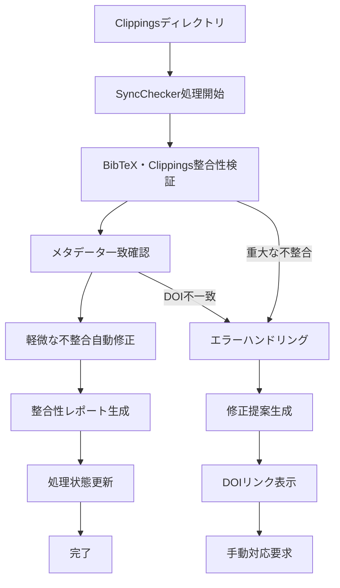
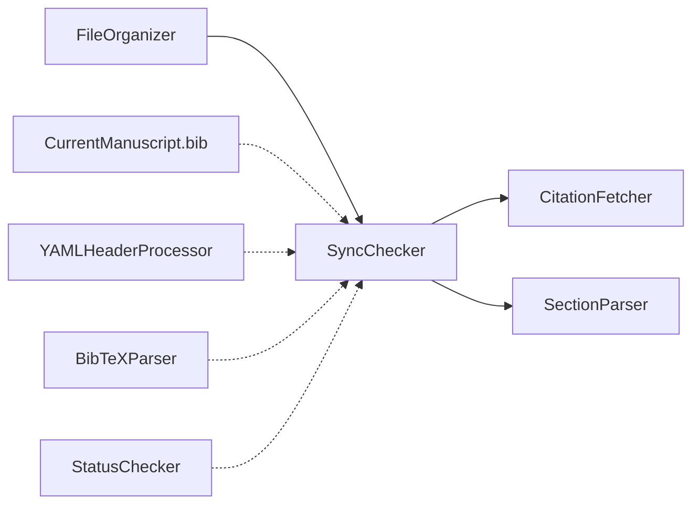

# SyncChecker 仕様書

## 概要
- **責務**: BibTeX ↔ Clippings間の整合性チェック機能
- **依存**: organize完了後の実行（organize → sync → fetch）
- **実行**: 統合ワークフローで自動実行

## 処理フロー図


## モジュール関係図


## YAMLヘッダー形式

### 入力
```yaml
---
citation_key: "smith2023biomarkers"
doi: "10.1038/s41598-023-12345-6"
title: "Novel biomarkers in cancer research"
processing_status:
  organize: completed
  sync: pending
workflow_version: '3.2'
last_updated: '2025-01-15T10:30:00Z'
---
```

### 出力
```yaml
---
citation_key: "smith2023biomarkers"
doi: "10.1038/s41598-023-12345-6"
title: "Novel biomarkers in cancer research"
sync_metadata:
  checked_at: '2025-01-15T10:35:00Z'
  consistency_status: 'validated'
  issues_detected: 0
  auto_corrections_applied: 1
  corrections_applied:
    - type: 'filename_normalization'
      description: 'Renamed markdown file to match citation_key'
      timestamp: '2025-01-15T10:34:00Z'
processing_status:
  organize: completed
  sync: completed
workflow_version: '3.2'
last_updated: '2025-01-15T10:35:00Z'
---
```

## 実装
```python
class SyncChecker:
    def __init__(self, config_manager, logger):
        self.config_manager = config_manager
        self.logger = logger.get_logger('SyncChecker')
        self.bibtex_parser = BibTeXParser(logger)
        self.yaml_processor = YAMLHeaderProcessor(config_manager, logger)
    
    def check_workspace_consistency(self, workspace_path, bibtex_file, clippings_dir):
        """ワークスペース全体の整合性チェック"""
        pass
    
    def check_paper_consistency(self, citation_key, paper_dir, bibtex_entry):
        """個別論文の整合性チェック"""
        pass
    
    def auto_fix_minor_inconsistencies(self, check_results):
        """軽微な不整合の自動修正"""
        pass
    
    def display_doi_links(self, missing_papers, orphaned_papers):
        """不足・孤立論文のDOIリンク表示"""
        pass
```

## DOIリンク表示機能

### 不足Markdown（BibTeXにあるがMarkdownなし）
```
📋 不足Markdownファイル (2件):
┌─────────────────────────────────────────────────────────────────────────────────┐
│ Citation Key: liQ2016Oncotarget                                                 │
│ DOI Link: https://doi.org/10.18632/oncotarget.13175                           │
│ 推奨アクション: Markdownファイルを作成してください                                │
└─────────────────────────────────────────────────────────────────────────────────┘
┌─────────────────────────────────────────────────────────────────────────────────┐
│ Citation Key: lennartzM2023APMIS                                               │
│ DOI Link: https://doi.org/10.1111/apm.13280                                   │
│ 推奨アクション: Markdownファイルを作成してください                                │
└─────────────────────────────────────────────────────────────────────────────────┘
```

### 孤立Markdown（MarkdownにあるがBibTeXなし）
```
🔗 孤立Markdownファイル (1件):
┌─────────────────────────────────────────────────────────────────────────────────┐
│ File: Keratin Profiling by Single-Cell RNA-Sequencing...                      │
│ DOI Link: https://doi.org/10.3390/ijms22158109                                │
│ 推奨アクション: BibTeXエントリーを追加してください                               │
└─────────────────────────────────────────────────────────────────────────────────┘
```

## 設定
```yaml
sync_checker:
  enabled: true
  auto_fix_minor_issues: true
  backup_before_auto_fix: true
  retry_attempts: 3
  display_doi_links: true
  doi_link_format: "https://doi.org/{doi}"
``` 