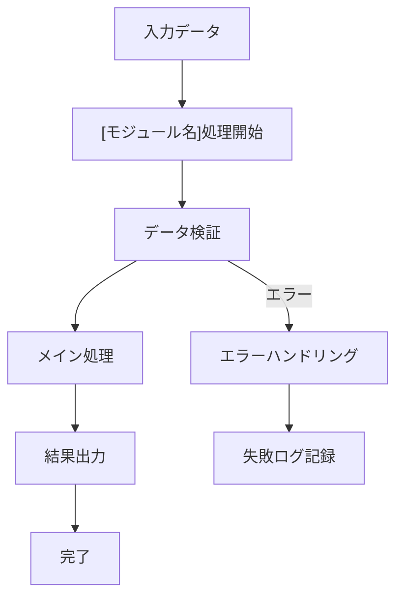
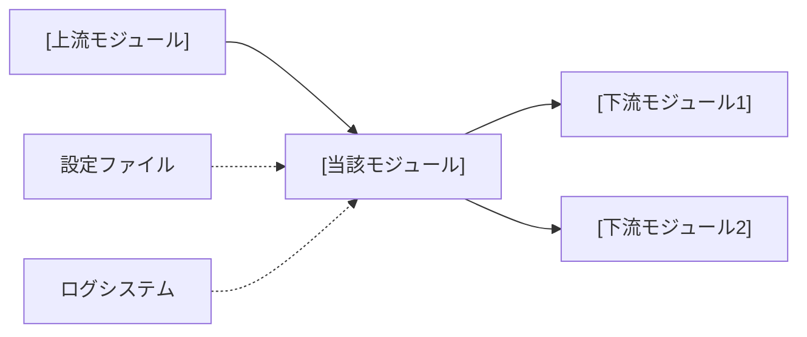

# 仕様書作成・修正専用ルール

## 📋 基本方針

- **対象**: `code/contexts/*.md`, README.md
- **更新**: 実装変更時は必ず仕様書も同期更新
- **データ管理**: YAMLヘッダーベースの状態管理
- **品質**: 簡潔・具体例・一貫性

## 🏗️ 配置ルール

- **統合仕様書**: README.md（システム全体概要）
- **個別モジュール仕様書**: `code/contexts/[モジュール名]_specification.md`

## 📝 統一テンプレート

### 個別モジュール仕様書テンプレート
```markdown
# [モジュール名] 仕様書

## 概要
- **責務**: [具体的機能]
- **依存**: [他モジュールとの関係]
- **実行**: 統合ワークフローで自動実行
- **コード収納場所**: [code/py/modules/{module名}/]

## 処理フロー図


## モジュール関係図


## YAMLヘッダー形式

### 入力
```yaml
---
[identifier]: [value]
[input_field]: [input_value]
processing_status:
  [module_name]: pending
---
```

### 出力
```yaml
---
[identifier]: [value]
[module_output]:
  generated_at: '2025-01-15T10:30:00.123456'
  [output_field]: [output_value]
processing_status:
  [module_name]: completed
workflow_version: 'X.Y'
---
```

## 実装
```python
class [ModuleName]Workflow:
    def __init__(self, config_manager, logger):
        pass
    
    def process_items(self, input_dir, target_items=None):
        pass
```

## 設定
```yaml
[module_name]:
  enabled: true
  batch_size: [n]
  retry_attempts: 3
```
```

## ⚠️ 重要ルール

### 必須事項
- YAMLヘッダー形式遵守
- processing_status記録必須
- 具体的データ例（抽象的NG）
- テンプレート準拠

### 標準YAMLフィールド
```yaml
---
[identifier]: [必須] プライマリ識別子
processing_status: [必須] 各ステップの状態
  [step1]: completed|pending|failed
  [step2]: completed|pending|failed
last_updated: [自動生成] ISO 8601形式
workflow_version: [自動生成] 'X.Y'
---
```

### データ形式基準
- **日時**: ISO 8601形式
- **複数行**: YAML `|` 記法
- **リスト**: YAML `- item` 記法
- **エンコーディング**: UTF-8

## 🔧 作業手順

### 実装変更時の仕様書更新
1. **変更内容確認**: 実装変更点を把握
2. **影響範囲特定**: 対象仕様書を特定
3. **YAMLヘッダー更新**: processing_status・出力フィールド変更
4. **フロー図更新**: 処理変更があれば図を更新
5. **具体例更新**: 新実装対応の具体データ例追加

### 新規仕様書作成
1. **テンプレート適用**: 統一テンプレート使用
2. **モジュール分析**: 実装コード分析で責務・関係性特定
3. **YAML設計**: 入出力データ構造をYAML形式定義
4. **フロー図作成**: mermaid記法で処理フロー可視化
5. **具体例追加**: 実際の値使用（抽象的NG）

---

**重要**: 実装変更時は仕様書同期更新必須、YAMLヘッダー整合性最優先